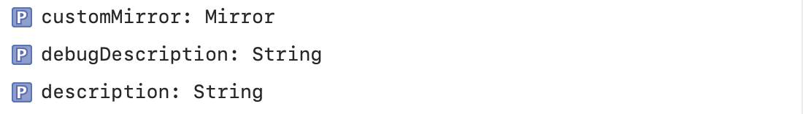
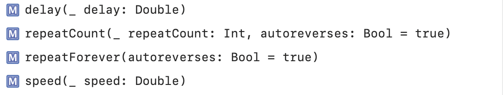
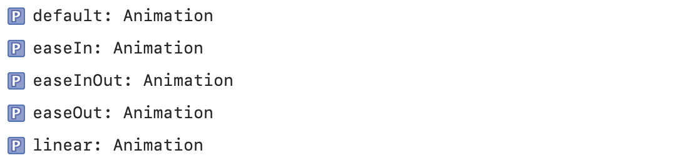
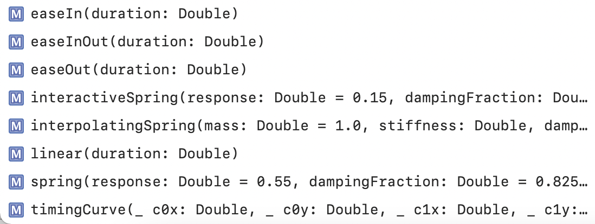
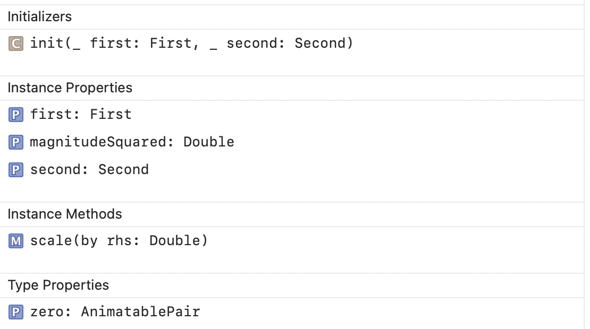
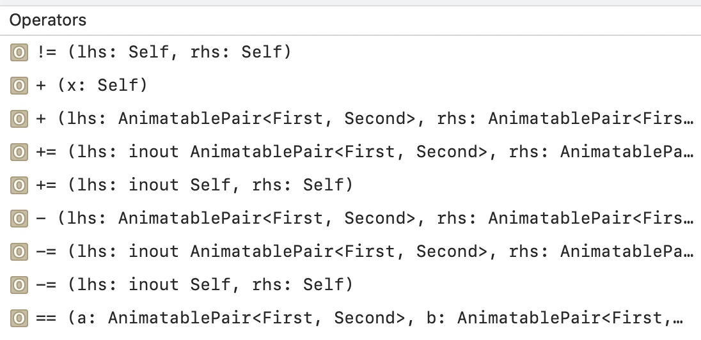
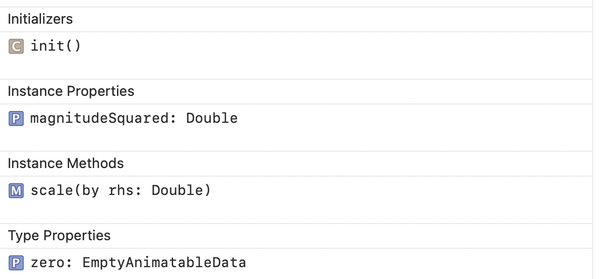
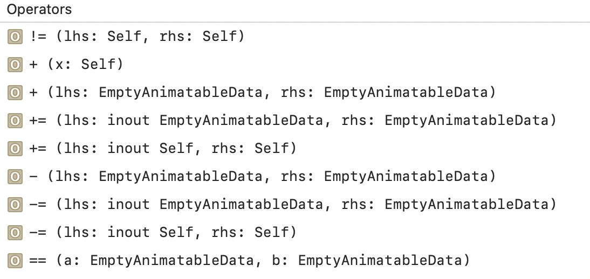
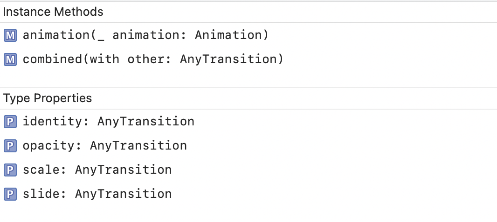
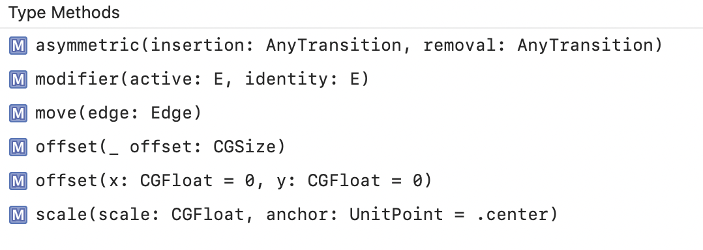

### Animation

Its a struct.

Instance Properties | Instance Methods
--- | ---
 | 

Type Properties | Type Methods
--- | ---
 | 

### Animatable

A protocol type that describes how to animate a property of a view.

```
var animatableData: Self.AnimatableData
```

### AnimatablePair

A pair of animatable values, which is itself animatable.

Initializers, Properties, Methods | Operators
--- | ---
 | 

### EmptyAnimatableData

An empty type for animatable data.

Initializers, Properties, Methods | Operators
--- | ---
 | 

### AnyTransition

A type-erased transition.

Instance Methods, Type Properties | Type Methods
--- | ---
 | 
