#### TapGesture

Creating a Tap Gesture | Performing the Gesture
--- | ---
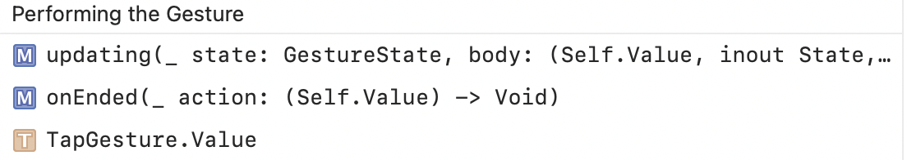 | 

Composing Gestures | Adding Modifier Key, Transforming
--- | ---
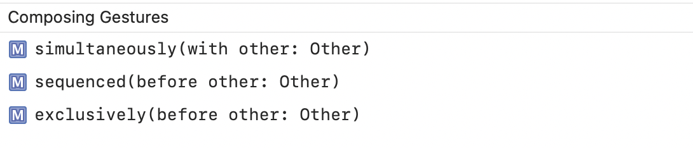 | 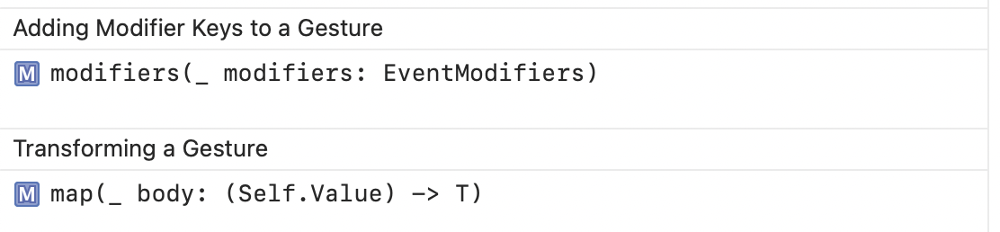

#### LongPressGesture

Its can be created with `init(minimumDuration:)`.

Creating a Long-Press Gesture | Performing the Gesture
--- | ---
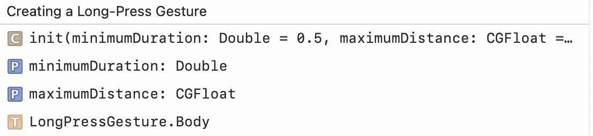 | 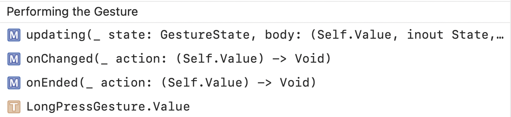

Composing Gestures | Adding Modifier Key, Transforming
--- | ---
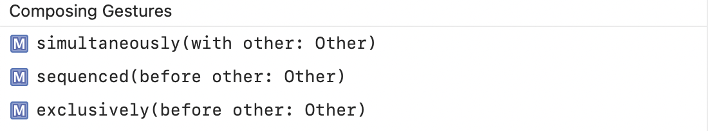 | 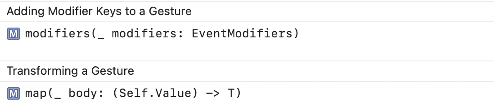

#### DragGesture

Like UIKit swipe gesture.

Creating a Drag Gesture | Performing the Gesture
--- | ---
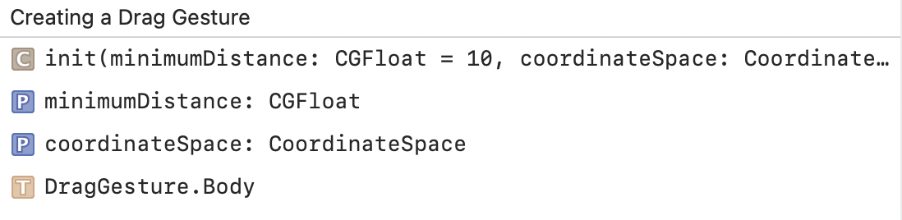 | 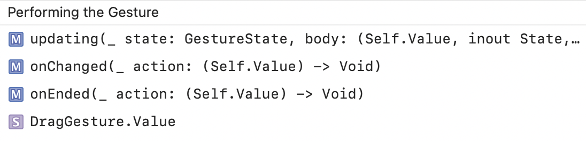

Composing Gestures | Adding Modifier Key, Transforming
--- | ---
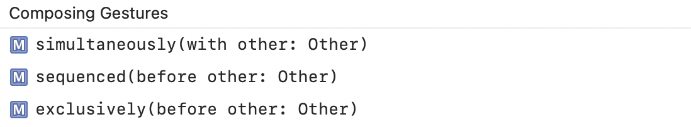 | 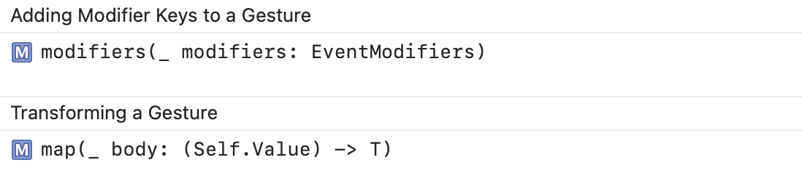

#### MagnificationGesture

A gesture that recognizes a magnification motion and tracks the amount of magnification.

Creating a Magnification Gesture | Performing the Gesture
--- | ---
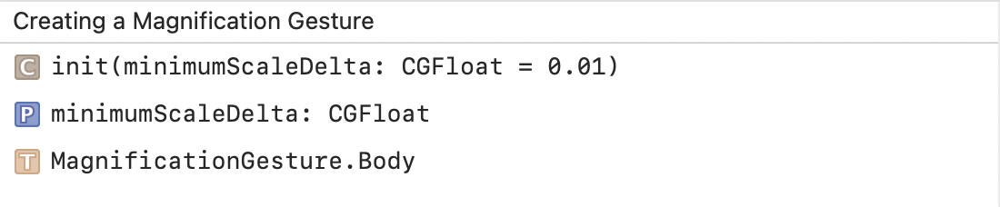 | 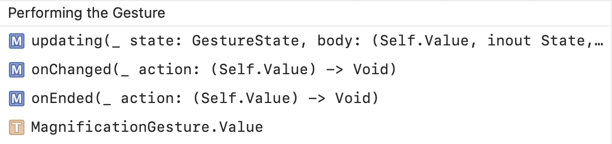

Composing Gestures | Adding Modifier Key, Transforming
--- | ---
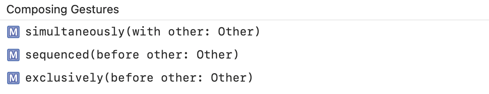 | 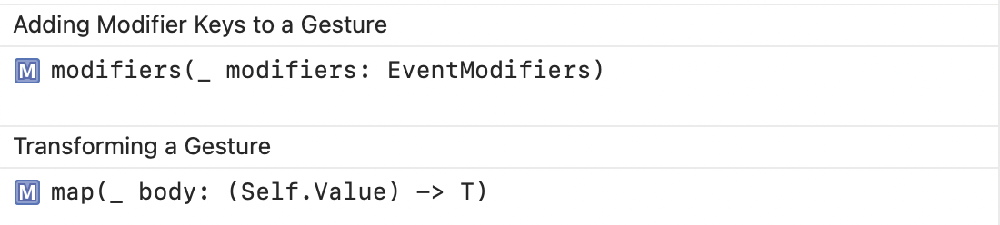

#### RotationGesture

A gesture that recognizes a rotation motion and tracks the angle of the rotation.

Creating a Rotation Gesture | Performing the Gesture
--- | ---
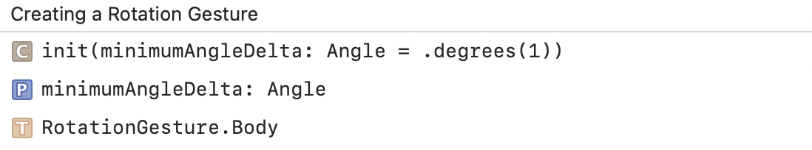 | 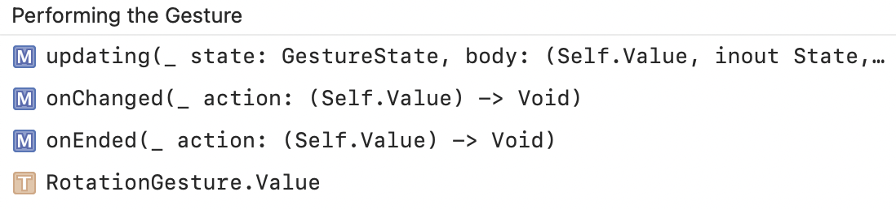

Composing Gestures | Adding Modifier Key, Transforming
--- | ---
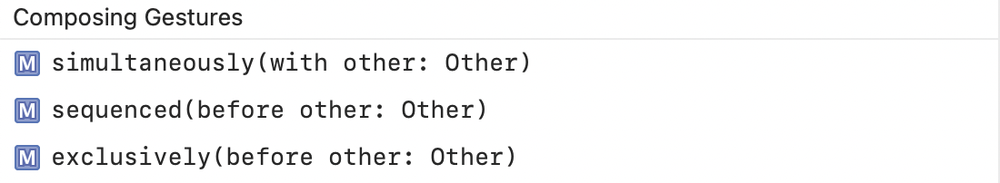 | 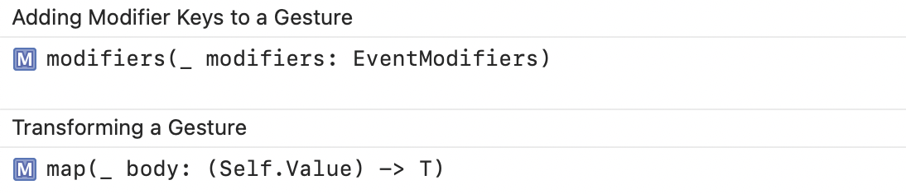a
