#### SequenceGesture

A gesture that’s a sequence of two gestures.

Creating a Sequence Gesture | Performing the Gesture
--- | ---
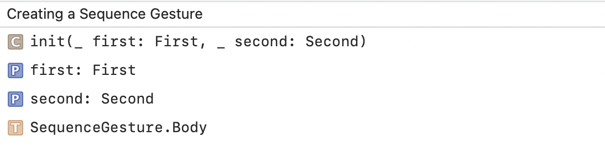 | 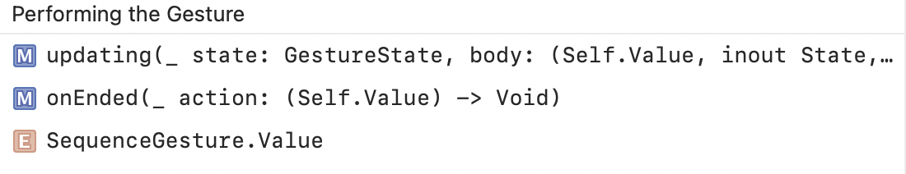

Composing Gestures | Adding Modifier Key, Transforming
--- | ---
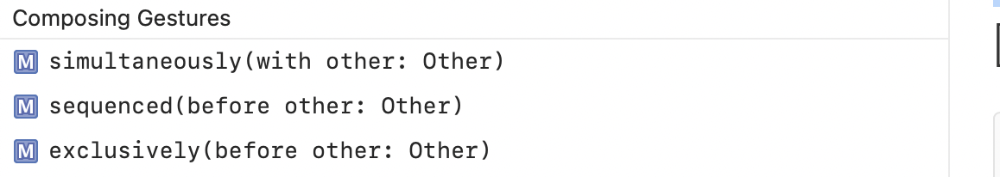 | 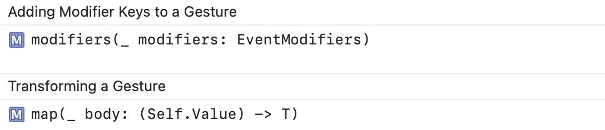

#### SimultaneousGesture

A gesture containing two gestures that can happen at the same time with neither of them preceding the other.

Creating a Simultaneous Gesture | Performing the Gesture
--- | ---
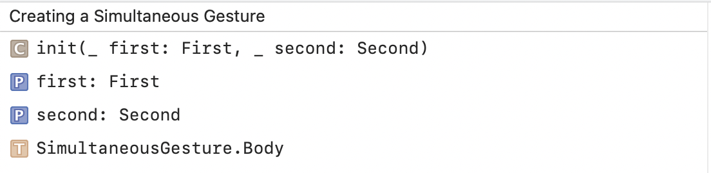 | 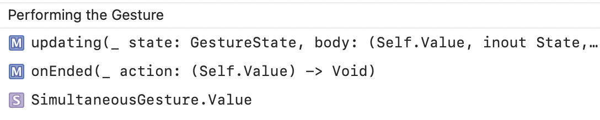

Composing Gestures | Adding Modifier Key, Transforming
--- | ---
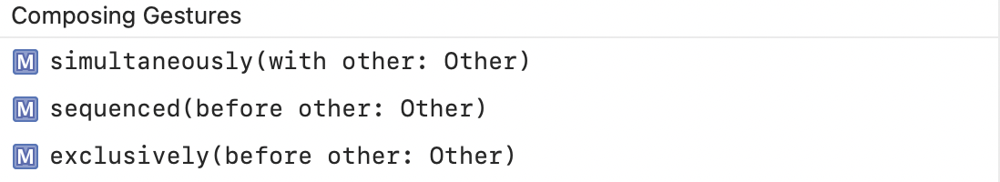 | 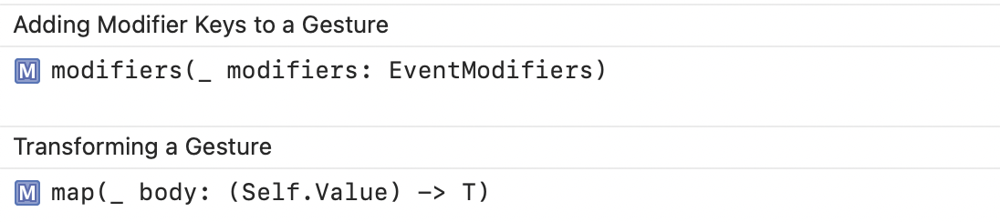

#### ExclusiveGesture

A gesture that consists of two gestures where only one of them can succeed.

Creating a Exclusive Gesture | Performing the Gesture
--- | ---
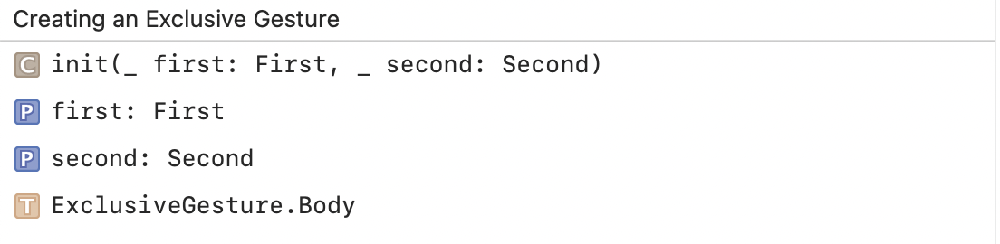 | 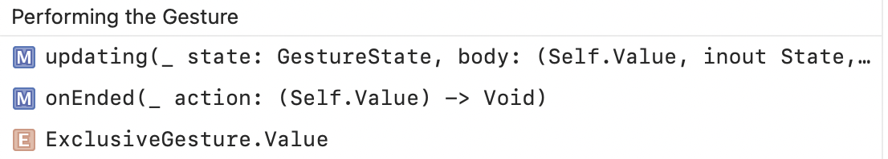

Composing Gestures | Adding Modifier Key, Transforming
--- | ---
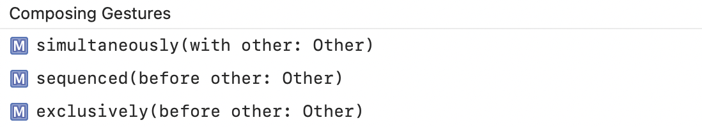 | 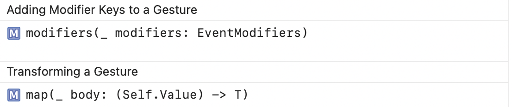
