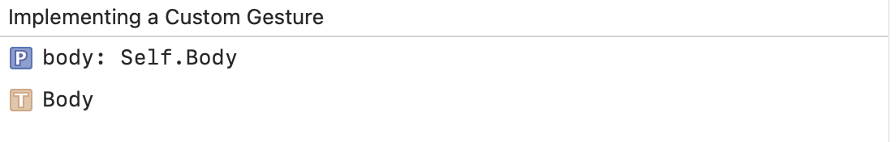
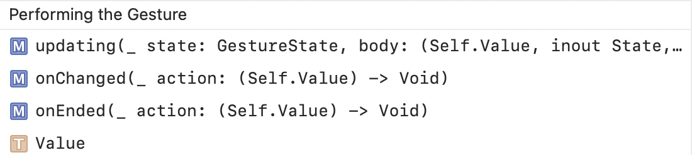
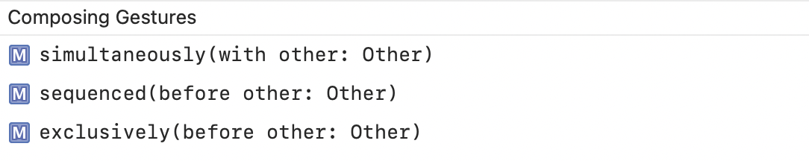
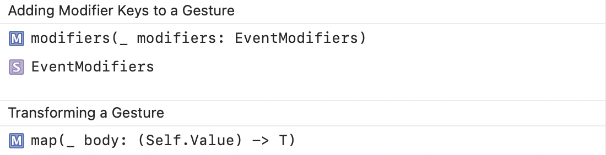

#### Gesture protocol

An instance that matches a sequence of events to a gesture, and returns a stream of values for each of its states. Custom gestures can be created by declaring types that conform to the Gesture protocol.

Implementing a Custom Gesture | Performing the Gesture
--- | ---
 | 

Composing Gestures | Adding Modifier Key, Transforming
--- | ---
 | 

#### AnyGesture

Its just a type-erased gesture. Probably has the same set of methods as other usual gestures.
