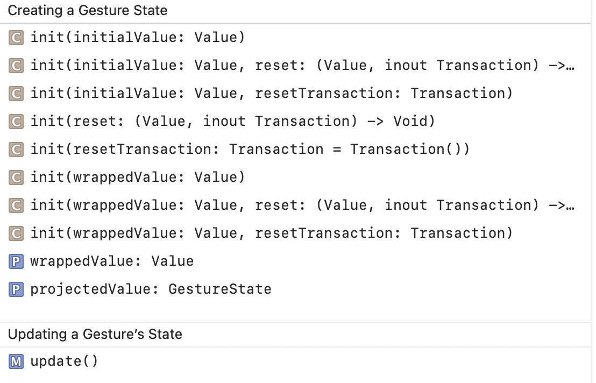
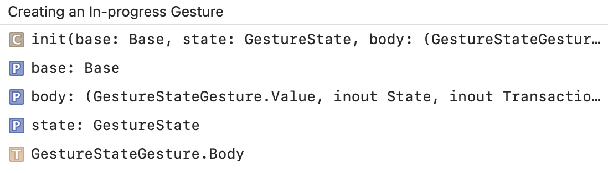
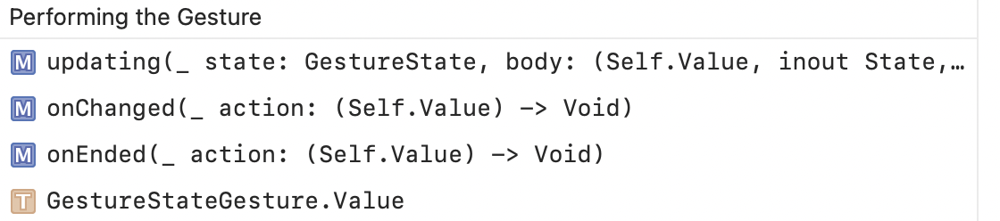
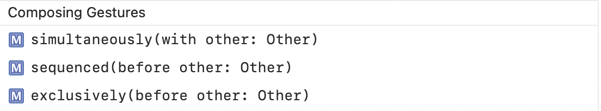
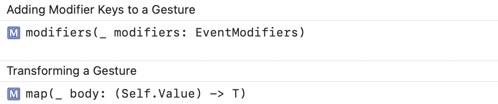

#### GestureState

A property wrapper type that updates a property while the user performs a gesture and resets the property back to its initial state when the gesture ends.

#### GestureStateGesture

A gesture that updates the state provided by a gesture’s updating callback.

Creating an In-progress Gesture | Performing the Gesture
--- | ---
 | 

Composing Gestures | Adding Modifier Key, Transforming
--- | ---
 | 
