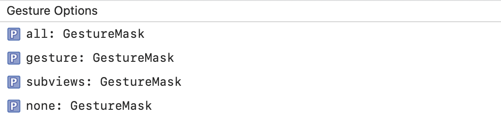
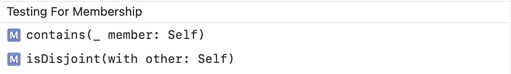
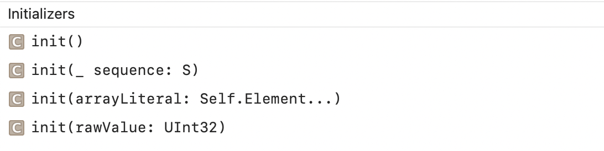
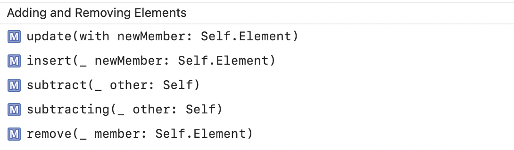
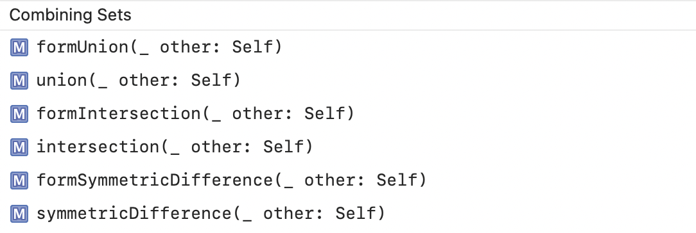
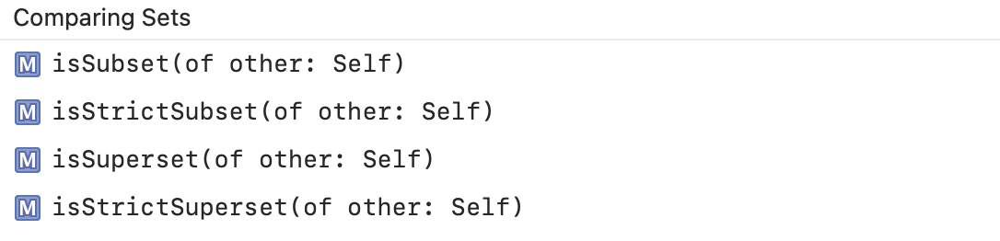

#### GestureMask

Options that control how adding a gesture to a view affect’s other gestures recognized by the view and its subviews.

Gesture Options | Testing for Membership
--- | ---
 | 

Initializers | Adding and Removing Elements
--- | ---
 | 

Combining Sets | Comparing Sets
--- | ---
 | 
