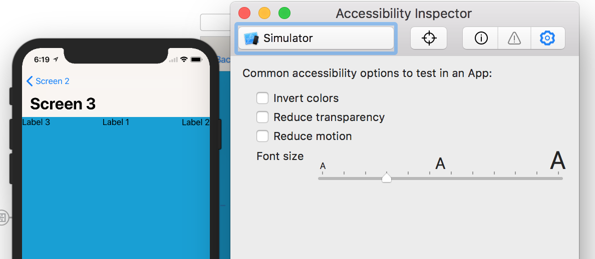
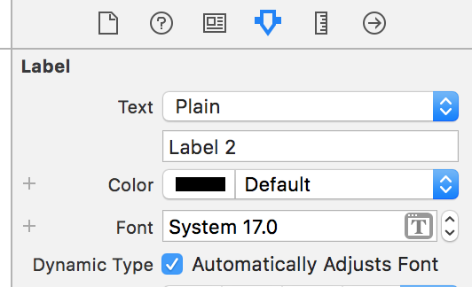
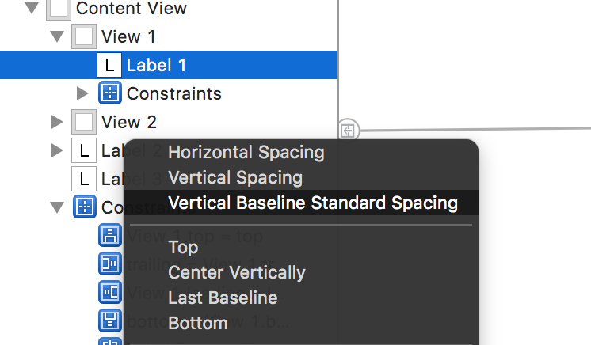

###### Dynamic types

Xcode 9 onwards, the dynamic text size can be changed form the accessibility inspector itself. It does happen, but have not been able to get dynamic fonts for UILabel working yet. Just checking that checkbox alone for UILabel in storyboard does not seem to be helping.

###### Storyboard option for enabling dynamic fonts for UILabel in Xcode 9 -

'Vertical baseline standard spacing' constraints -

While creating vertical constraints between items in Xcode 9, there is a new option called 'Vertical baseline standard spacing' constraint. With this option, the constraint constant is automatically adjusted based on font size, etc.

