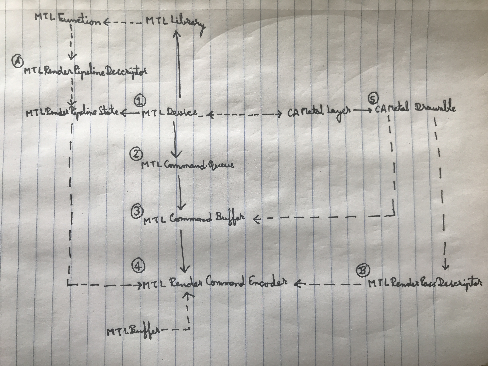
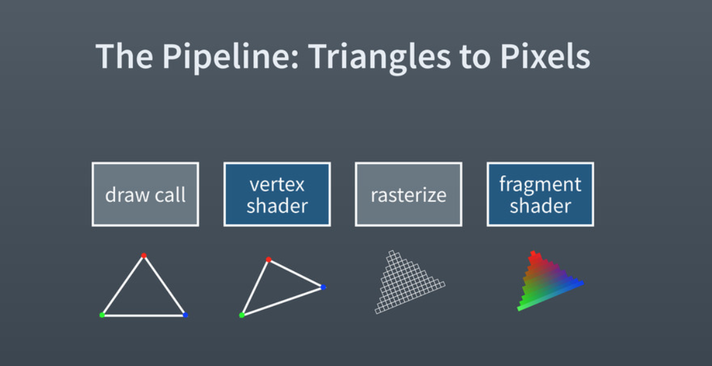
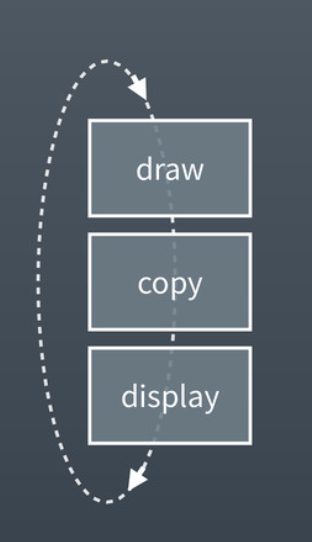

######  The general flow -  
 

******************

######  The pipeline -

GPU does graphics calculations, so it is the thing that tells what is the light intensity, etc. and accordingly renders it to the screen. Traditionally, they operated in a fixed-pipeline state. What it means is that the hardware (i.e. GPU) could be configured (i.e. minor tweaks such as altering a light value) but were not programmable (i.e. making major changes to how they affect rendering). Now however programmable pipelines is possible. The rendering can be overridden altogether. These functions are called shaders and they of course run directly on GPU.

The way it goes is - There are triangles that you have earmarked. Each of them gets passed to vertex shader which provides texture for the vertices. And that gets rendered to the screen (or may be later on). Then rasterization happens where all the pixels in the fragment are identified. And then the fragment shader runs on each of these pixels and assigns them a color value which finally gets rendered. Keep in mind that rasterization is not programmable, its a fixed function in the pipeline and the hardware determines which are the pixels in the fragment itself (you don't get to customize that, you are not expected to need to do that customization yourself either).

Now to me it seems that when a draw call happens, the vertices do not get passed to it one by one. Instead all the vertices data (i.e. position and an initial color) are passed together. And then the shaders get applied on them one by one.

******************

###### Swap chain -

Almost all the graphics systems (including Metal) operate on something called a swap chain. One buffer gets shown while at the same time any drawing happens on another backing buffer. And once the drawing is done, that buffers gets shown. All this happens through simple pointer indirection and this is what keeps the UI from having any jarring effect.

Metal in fact operates on 3 different buffers. One is drawn onto, another is where the finally drawn thing gets copied and third is what gets shown on screen. Again these too happen through pointer indirection. It isn't that 'copy' buffer gets copied to 'display' buffer. Or that the same buffer is always used for 'display'.

******************

Descriptor objects are essentially bags of properties that are used to create immutable instances. They act as a blueprint.
