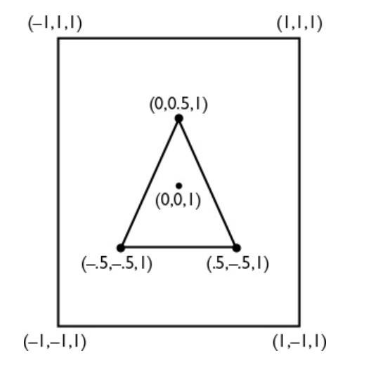
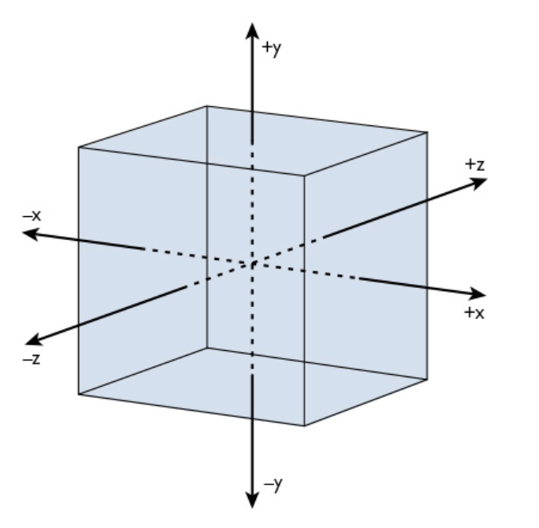

Metal defines its Normalized Device Coordinate (NDC) system as a 2x2x1 cube with its center at (0, 0, 0.5). The bottom left x, y is -1, -1. The top right for x, y is 1, 1. So vertically the center is at 0.5, which direction does it increase in?

Right hand and left hand rules. Complying 3D coordinate systems.

Metal has two coordinate systems.

One applies to the 3D world space and the other applies to the rasterized 2D projection space.

In the 3D coordinate system, both the x and y axes run from −1 to 1, making those coordinates two units long. z-axis runs only from 0 to 1.

The 2D coordinate system is the same as one used by Core Graphics. Its origin is in the upper-left corner of the projection space. The x value is the distance across the space that an object appears, and the y value is the distance down the space that the object appears. 

All a vector indicates is the movement from one point to another.

Both vectors and points are indicated in float4 type. If the 4th component is 1 it indicates a point and if it is 0 it indicates a vector. In case of a vector, the remaining 3 components together indicate the distance to move (along with the respective directions along each of the 3 axes).

The dot product of two vectors is found by multiplying the x component of each vector and adding it to the product of the y component of each vector. Its used to determine how light interacts with an object.

The cross product is used to find the axis of rotation between two vectors.
