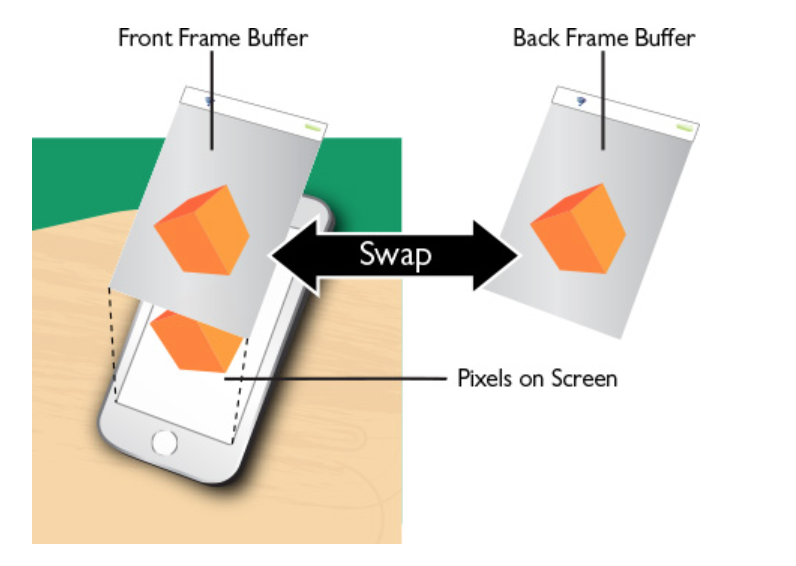

Basics -

Commands are encoded in command buffers. Once all commands are enqueued, buffer is committed and submitted to command queue. (How does a command buffer know that all the commands have been enqueued?)

Steps taken -
	1. Data processing for GPU
	2. Vertex processing
	3. Primitive assembly
	4. Fragment shading
	5. Raster output

Configuring state/rendering pipeline -

MTLRenderPipelineState protocol - A protocol that defines the interface for a lightweight object used to encode the state for a configured graphics rendering pipeline.

MTLRenderPipelineDescriptor - Configures render pipeline state (MTLRenderPipelineState) object. Sets a prevalidated state.

What kind of things are typically included in a state.
	1. Specifying render functions
	2. Attaching color, depth, stencil data
	3. Raster and visibility state
	4. Tessellation state

MTLRenderPipelineState - Gets passed to command encoder. Assumed to be valid since that point.

Preparing data for the GPU -

Typically you work with Maya or Blender assets. These contain a list of vertices (i.e. points), their position and color and also how are they connected to generate 3D meshes. If the file is supported by Model I/O framework, the model is imported using the framework. Else, it has to be manually parsed.

Commands can be encoded in 4 different ways -
	1. MTLRenderCommandEncoder
	2. MTLComputeCommandEncoder
	3. MTLBlitCommandEncoder
	4. MTLParallelRenderCommandEncoder

Vertex and fragment buffers need to be created and sufficient memory needs to be allocated to them.

Clippping -

Anything that does not appear in screen is culled. This process often results in retriangulation. The code should take care of rendering only what is necessary. Terms like world space and camera space (must be same as screen space) are used.

Primitive assembly -

After vertex shader has precessed the data, it needs to be assembled into primitives.

Metal has 3 types of primitives.
	1. Point (one vertex)
	2. Lines (two vertices)
	3. Triangles (three vertices)

In draw call, it can be specified which primitive should be used.

Rasterization -

This accounts for how light gets scattered.

Traditionally, there are two ways of rendering this light data.
	1. Ray tracing - Each pixel in the frame is scanned for everything it has. If an object intersects the ray, the color of object is used.
	2. Rasterization - Primitives are projected to screen and then objets detected instead of scanning from behind.

Is the end result any different in the two?

Fragment shading -

Full intensity is white. No intensity is black. Alpha 1 is completely opaque. Alpha 0 is completely transparent.
Now its said that it applied light effects a well as texture effects. But weren't the light effects applied during rasterization.

Fragment shader is the last stop for modifying image data before it is sent to frame buffer for output.

Raster output -

Before image is finally output to screen, it goes through frame buffer (now what is that?). If this didn't happen and drawing was done directly to screen, there would be flickering and quality would be poor.

There are at least two frame buffers at any point. One is being presented to screen and other is being drawn to. They work together to ensure one is always being presented. So are they essentially trying to show the same scene (looks so). If there weren't multiple frame buffers, then there wouldn't be any work possible on GPU as there wouldn't be any place to put the rendered data.

