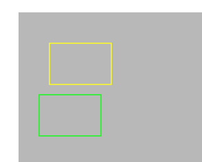
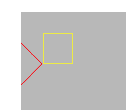
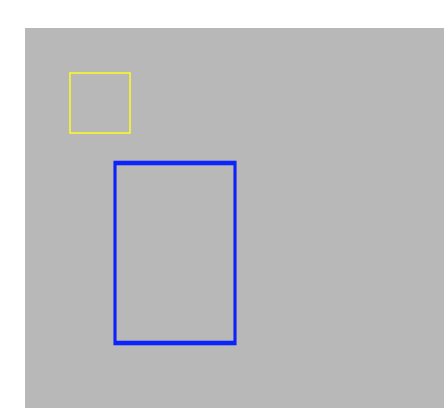

User space
Device space

CTM - Current transformation matrix. It represents the transform currently being used by the context.

The default origin in iOS is at top left.

*****************

Translation moves the origin of the coordinate space.

let path = // some bezier path
UIColor.yellowColor().setStroke()
path.stroke()

let context = UIGraphicsGetCurrentContext()
CGContextTranslateCTM(context!, -10, 50)
UIColor.greenColor().setStroke()
path.stroke()

Here the yellow path is drawn with the default transform matrix. Green path is drawn after the current transform matrix has been translated, i.e. the origin has been shifted. Both the paths are otherwise the same.

*****************

Rotation rotates the entire coordinate space about its origin (i.e. top left corner). Its really as if the entire coordinate space has rotated.

CGContextRotateCTM(context!, CGFloat(M_PI/4))
UIColor.redColor().setStroke()
path.stroke()

Here the red path is drawn after rotating the default transformation matrix by 90 degrees. It can be visualized as if the entire gray space rotated about the top left corner and then the path was drawn in the rotated gray space.

*****************

Scaling scales (i.e. multiplies) the units of the coordinate space. Every unit on each of the axes multiplies by the specified scale.

CGContextScaleCTM(context!, 2.0, 3.0)
UIColor.blueColor().setStroke()
path.stroke()

Here the blue path is drawn after scaling the coordinate space 2 times on x axis and 3 times on right axis.

*****************

Concatenation allows to combine multiple operations together.

In the below line the passed context is scaled as mentioned.
CGContextConcatCTM(context!, CGAffineTransformMakeScale(2.0, 2.0))
Now it could also be done using a simple scale function.
CGContextScaleCTM(context!, 2.0, 2.0)

However a scale function (or any other standard function such as rotate or translater for that matter) would only be able to do that specific kind of operaton. Whereas the concat function can apply any passed transform (a custom or variable one even) to the context.

It is also possible to just make affine transforms which can later be applied on contexts. By itself these functions do not change anything, they just return a transform (i.e. matrix).
CGAffineTransformMakeRotation(CGFloat(M_PI/4))
CGAffineTransformMakeScale(2.0, 2.0)
CGAffineTransformMakeTranslation(50.0, 50.0)

*****************

CGAffineTransformInvert is used to get something which is like the opposite of the passed transform and then this opposite can be concatenated with the CTM (i.e. existing transform) to just reverse the effect.

Something like this.

CGContextTranslateCTM(context!, 50.0, 50.0)
CGContextRotateCTM(context!, CGFloat(M_PI/4))

let invertTransform = CGAffineTransformInvert(CGAffineTransformMakeRotation(CGFloat(M_PI/4)))
CGContextConcatCTM(context!, invertTransform)

UIColor.redColor().setStroke()
path.stroke()

Although this is practically not really needed as the restoring of CTM is normally achieved using save and restore of graphics state (the graphics state includes CTM too? Need to try this.)

*****************

CGPointApplyAffineTransform returns a point that would represent a point that passed point would be if the passed transform is applied to it.

CGPointApplyAffineTransform(CGPointMake(30, 70), CGAffineTransformMakeTranslation(0, 100)) // This would return (0, 170) point

CGSizeApplyAffineTransform returns a sizethat would represent a size that passed size would be if the passed transform is applied to it.

There are also functions such as CGPointApplyAffineTransform , and CGRectApplyAffineTransform which  (i.e. the point/size, not the coordinate space).

CGSizeApplyAffineTransform(CGSizeMake(50, 50), CGAffineTransformMakeScale(1, 2))           // This would return a (50, 100) size. Not a (50, 50) size. The coordinate space is not being scaled, the size dimensions are instead being scaled.

CGSizeApplyAffineTransform(CGSizeMake(50, 50), CGAffineTransformMakeRotation(CGFloat(M_PI/2))) // This would return a (-50, 50) rect.
How can width be -ve. Well it can be, keep in mind that as per the reference a CGSize can sometimes also represent a distance vector. Here -50 indicates that the width will be in opposite direction. (Still need to understand it better.)

CGRectApplyAffineTransform returns the smallest rectangle that contains the transformed corner points of the rectangle passed to it.

CGRectApplyAffineTransform(CGRectMake(0, 0, 50, 50), CGAffineTransformMakeRotation(CGFloat(M_PI/4))) // This would return (-35.35, 0.0, 70.71, 70.71).

*****************

CGContextGetCTM gets the CTM of the passed context.

CGAffineTransformEqualToTransform is used to check if two transforms are equal.
CGAffineTransformIdentity represents the identity transform. This is the default CTM of a context and it does not have any scaling, translation or rotation.

*****************

Getting affine transform to convert between device space and user space.

CGContextGetUserSpaceToDeviceSpaceTransform
CGContextConvertPointToDeviceSpace
CGContextConvertSizeToDeviceSpace
CGContextConvertRectToDeviceSpace

And similar functions for converting to user space.

(Try these)
