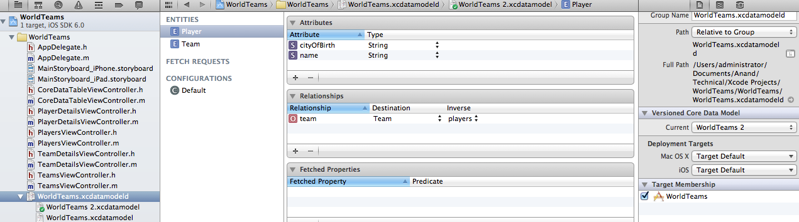

A Core Data store can only be opened using the model that was used to create it.

A versioned model (.xcdatamodeld) consists of more then one versions of a managed object model (.xcdatamodel). Any of them can be marked as the current version in Utilities section (it is done through a Utilities option of the .xcdatamodeld file). New version for a versioned data model file (.xcdatamodeld) is added using the menu option Editor -> Add Model Version.

When the model is changed, the managed object classes must be changed as well (either by just manually updating the properties in the existing subclasses or by regenerating the managed object subclasses).
The format of an existing store needs to be changed to a new format to make it correspond to the new model. This process is known as migration. To perform migration, Core Data requires both the model versions (i.e. previous as well as current) and sometimes also the instructions on how to perform the migration which is typically done using a mapping model (.xcmappingmodel file).

For two models to be compatible the following rules are applied -
1. userInfo and classname of entity are not compared.
2. Validation predicates of the attributes are not compared.
Core Data creates a 32-byte hash value of various components in the model and compares these hashValues for equality while comparing models. These hashes are included in the persistent store's metadata. Programmatically they can also be accessed using versionHash property of NSEntityDescription and NSEntityDescription. (Usually, there is no need to work with these values in the code. However, when for any reason two models need to be treated differently even if they actually aren't, hash value of one can be changed for them to be treated differently.)

For simple changes, there is no need to create a mapping model as Core Data can perform the required migration itself out of box. Such migration is known as lightweight migration.

Lightweight migration can handle below kind of changes - 
1. An attribute being added or removed
2. The optionality of an attribute being changed
3. A default value being assigned to an attribute
4. An entity or attribute being renamed *
5. A relationship being added or removed
6. A relationship's type (on-one, one-many, etc.) being changed
7. Entity hierarchies being edited by adding or removing entities **

* If an entity or attribute is renamed in a new version, for the lightweight migration to handle it the entity or attribute should specify the Renaming Identifier in Utilities - Data Model Inspector as the name of the entity or attribute which was there in the source version.

** If entities are merged, that cannot be handled by lightweight migration. Other things such as adding or removing entities from an existing entity hierarchy, moving entities within a hierarchy can be handled.

Lightweight migration is done by passing NSInferMappingModelAutomaticallyOption key and NSMigratePersistentStoresAutomaticallyOption key with value YES for both of them in the options dictionary of addPersistentStoreWithType:configuration:URL:options:error: method while adding a persistent store to a coordinator.
NSMigratePersistentStoresAutomaticallyOption - If its value is set as YES and if the version hashes between the model and the store do not match, Core Data attempts to locate the source and the mapping model in the application bundles and perform a migration.

NSInferMappingModelAutomaticallyOption - If its value is YES and NSMigratePersistentStoresAutomaticallyOption has also been set as YES, the coordinator attempts to infer a mapping if a mapping model is not found.
It is better to perform lightweight migration whenever possible (even if the mapping model that you may create is trivial) as it has performance benefits. 

While performing migration, Core Data attempts to find the source and destination model in the application bundles. However if these models are placed in a different location which are not checked by Core Data during automatic discovery, then the inferred model needs to be specifically generated and the migration initiated from the code using NSMappingModel method +inferredMappingModelForSourceModel:destinationModel:error: and the NSMigrationManager method -migrateStoreFromURL:type:options:withMappingModel:toDestinationURL:destinationType:destinationOptions:error:.
