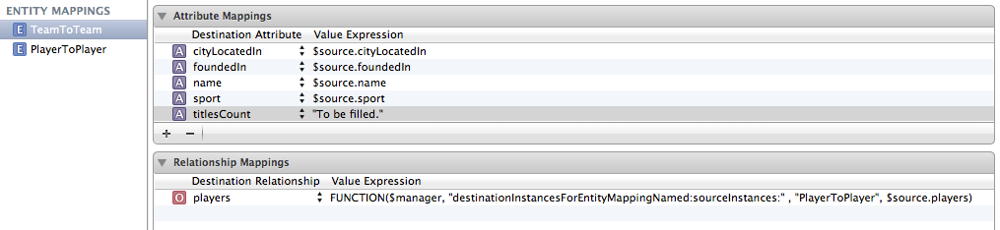

Just like with data model classes, there are mapping classes corresponding to model (NSMappingModel), entity (NSEntityMapping) and property (NSPropertyMapping).

A NSEntityMapping specifies the source entity, destination entity and mapping type (add, remove, copy as is, transform).
A NSPropertyMapping specifies the name in source and destination and a value expression to create the value in destination entity.

Mapping Model and Value Expressions -

In a mapping model, the value expression for even a relationship that has not changed across the models is shown as something as cumbersome as in below. It needs to be deciphered in below way - 
The relevant entity mapping is PlayerToPlayer, the objects in the relationship can be read from players relationship of source entity (i.e. $source.players). $manager represents the migration manager.

There are 6 predefined keys that can be referenced in custom value expressions. To access them in custom value expression strings in mapping model editor in Xcode, the corresponding keys can be used.

NSMigrationManagerKey : $manager
NSMigrationSourceObjectKey : $source
NSMigrationDestinationObjectKey : $destination
NSMigrationEntityMappingKey : $entityMapping
NSMigrationPropertyMappingKey : $propertyMapping
NSMigrationEntityPolicyKey : $entityPolicy

If a constant string has to be given in a value expression, it can be given in quotes as shown for the titlesCount attribute above.
Arithmetic modifications can also be done for numeric attributes in the below way.
($source.temperature - 32.0)/1.8

There are certain reserved keywords in value expressions (SIZE, FIRST, LAST) hence if these words need to be used they must be escaped (i.e. prefixed) with #.

Migration Process - 

Migration process is performed by an instance of NSMigrationManager. It requires several things such as the model for destination store (which is same as model of coordinator), model that can be used to open existing store, a mapping model (unless it is a lightweight migration).

If the new model simply adds entities or properties, there is no need to write any custom code. If the transformations are more complex, there may be a need to create a subclass of NSEntityMigrationPolicy.

During migration Core Data creates two stacks, one for the source store and one for the destination store. It then fetches objects from the source stack and inserts into the destination stack.

Before the migration starts, the two stacks are set up, the validation rules in the models are disabled and the class of entities is changed to NSManagedObject. The migration is then done turn by turn for each entity mapping in the mapping model in 3 stages - 

1. The destination instances are created based on source instances. In this stage, only attributes (not relationships) are set in the destination objects.
2. The relationships are recreated.
3. The validation rules in destination model are applied to ensure data integrity and consistency, and then the store is saved.
Before a cycle starts, the migration policy responsible for current entity is sent a beginEntityMapping:manager:error: message. At the end of the cycle, it is sent endEntityMapping:manager:error: message. Both of them can be overridden to perform any set-up or clean up activities that may be needed.
Core Data maintains 'association tables' that tell which objects in destination store is the migrated version of which object in the source stack and vice-versa.

Roughly this is how the migration related classes in Core Data are structured -

