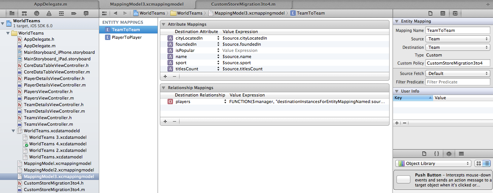

Using Custom Migration Policy -

When the migration process needs to be customized so much that the default mapping model editor in Xcode is not enough, a custom migration policy needs to be used.

This is done by creating a subclass of NSEntityMigrationPolicy and putting the required logic in one of its methods. This class name is then mentioned in the custom policy field of the concerned entity mapping of the relevant mapping model (it can also be done from code).

One of the common NSEntityMigrationPolicy methods that is implemented in the custom subclass is createDestinationInstancesForSourceInstance:entityMapping:manager:error:. This method creates the destination instance(s) for a given source instance and is automatically invoked by the migration manager on each source instance. This method is the place where usually the code for custom migration is put. Following is a sample implementation of this method.

```
- (BOOL)createDestinationInstancesForSourceInstance:(NSManagedObject *)sourceInstance
                                      entityMapping:(NSEntityMapping *)entityMapping
                                            manager:(NSMigrationManager *)migrationManager
                                              error:(NSError * __autoreleasing *)error {

    NSArray *properties = [entityMapping attributeMappings];
    NSExpression *isPopularExpression;
    NSInteger titlesCountValue = [[sourceInstance valueForKey:@"titlesCount"] integerValue];

    for (NSPropertyMapping *property in properties) {
        if ([[property name] isEqualToString:@"isPopular"]) {
            if (titlesCountValue > 0 ) 
                isPopularExpression = [NSExpression expressionForConstantValue:@"Yes"];
            else
                isPopularExpression = [NSExpression expressionForConstantValue:@"No"];
            [property setValueExpression:isPopularExpression];
        }
    }
    return [super createDestinationInstancesForSourceInstance:sourceInstance
                                                entityMapping:entityMapping
                                                      manager:migrationManager
                                                        error:error];
}
```




Performing Custom Migration -

Custom migration is when you do not use NSMigratePersistentStoresAutomaticallyOption and hence the addPersistentStoreWithType:configuration:URL:options:error: method does not get any instruction to perform migration on the data store in case the persistent store version does not match with the current model version. In such a case, the store migration is done manually using NSMigrationManager, etc. before adding the store to the coordinator.

There are 3 steps to it - 

1. Check if persistent store and current model are not compatible and if migration is needed at all. This is done by calling the isConfiguration:compatibleWithStoreMetadata: method of the current managed object model. The version in the persistent store is passed in the 2nd argument which is formed using metadataForPersistentStoreOfType:URL:error: method of NSPersistentStoreCoordinator. The next steps are performed only if migration is needed, else the store can straight away be opened using the usual addPersistentStoreWithType: method of NSPersistentStoreCoordinator.

2. Initialise a NSMigrationManager class using the initWithSourceModel:destinationModel: method. The destination model is the one tied to the coordinator and the source model for the existing store can be found using mergedModelFromBundles:forStoreMetadata: method of NSManagedObjectModel.

3. Perform the migration using migrateStoreFromURL:type:options:withMappingModel:toDestinationURL:destinationType:destinationOptions:error: method of NSMigrationManager. If there are multiple mapping models involved, this method needs to be called for each of them by turn. The mapping model can be found using mappingModelFromBundles:forSourceModel:destinationModel: method of NSMappingModel. However, this method can be used when there is just one mapping model in the bundle. If there are multiple mapping models, then they can be found using URLForResource:withExtension: method of NSBundle. The argument to be passed for extension is cdm (i.e. the file extension of mapping models). The file name of the mapping model file should be known and passed in the first argument.

If the migration happens successfully, delete the old store and rename the newly created store to the usual name of the store. Then add the store to the coordinator with the usual addPersistentStoreWithType: method.

Here is a sample code from the point it has been determined that migration is needed (i.e. point 2 onwards).

```
NSManagedObjectModel *sourceModel = [NSManagedObjectModel mergedModelFromBundles:nil forStoreMetadata:storeMetadata];
        if (sourceModel == nil) {
            abort();
        }
        NSMigrationManager *migrationManager = [[NSMigrationManager alloc] initWithSourceModel:sourceModel destinationModel:[self managedObjectModel]];
        NSMappingModel *mappingModel = [NSMappingModel mappingModelFromBundles:nil forSourceModel:sourceModel destinationModel:[self managedObjectModel]];
        if (mappingModel == nil) {
            NSLog(@"No mapping model found");
            abort();
        }
        NSURL *temporaryMigratedStoreURL = [[self applicationDocumentsDirectory] URLByAppendingPathComponent:@"WorldTeams-6.sqlite"];
        BOOL migrationPerformed = [migrationManager migrateStoreFromURL:storeURL
                                                       type:NSSQLiteStoreType
                                                    options:nil
                                           withMappingModel:mappingModel
                                           toDestinationURL:temporaryMigratedStoreURL
                                            destinationType:NSSQLiteStoreType
                                         destinationOptions:nil
                                                      error:&error];
        NSLog(@"migrationPerformed statement finished");
        if (migrationPerformed) {
            [[NSFileManager defaultManager] removeItemAtURL:storeURL error:&error];
            [[NSFileManager defaultManager] moveItemAtURL:temporaryMigratedStoreURL toURL:storeURL error:&error];
            if (![_persistentStoreCoordinator addPersistentStoreWithType:NSSQLiteStoreType configuration:nil URL:storeURL options:optionsDictionary error:&error]) {
                NSLog(@"Unresolved error %@, %@", error, [error userInfo]);
                abort();
            }
        }
```

The entire process is also explained in this [link](http://stackoverflow.com/questions/5995231/example-or-explanation-of-core-data-migration-with-multiple-passes) very well.

The thing to understand is that it is not that custom migration is done when any conditional logic is needed during creation of records at destination. For that a custom NSEntityMigrationPolicy subclass needs to be created and that can be specified in the mapping model Xcode utilities itself. Custom (or manual) migration is needed when something else in the migration process needs to be modified, such as doing the migration in batches when there are too many records. In such a case, the entity mappings can be split into multiple mapping models and then the migration for them done one by one.
 
If the store is iCloud enabled, the migration can be done only using automatic lightweight migration.
