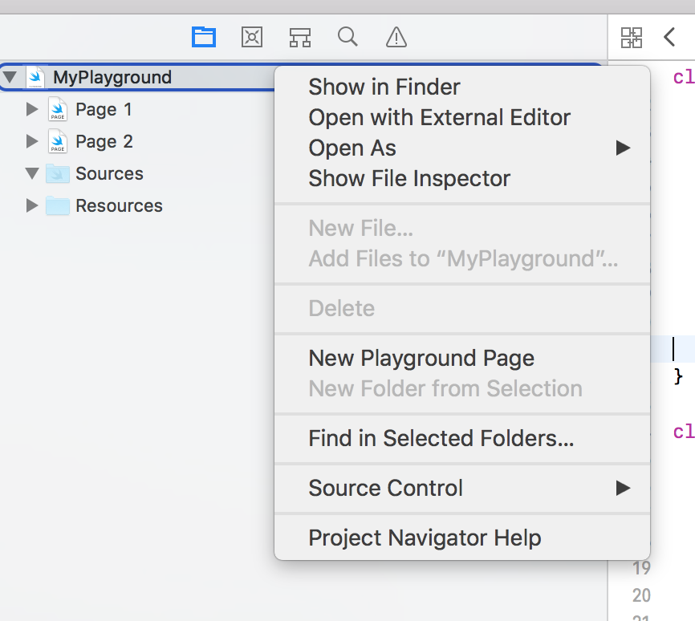
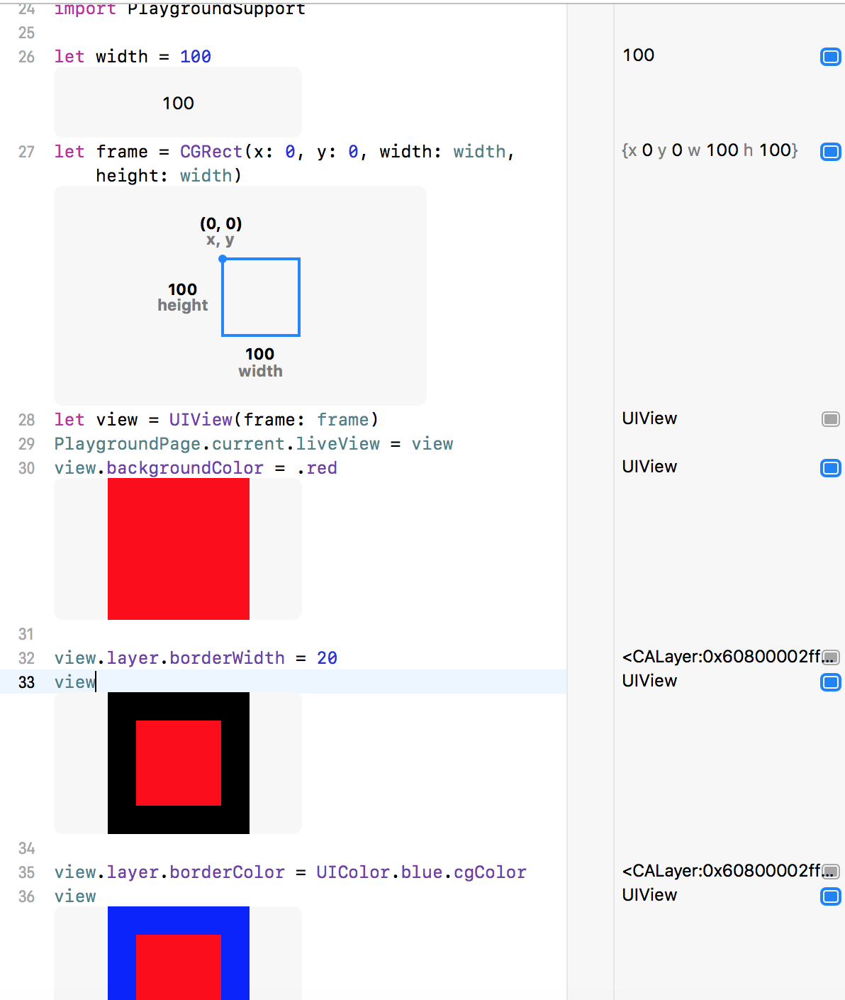
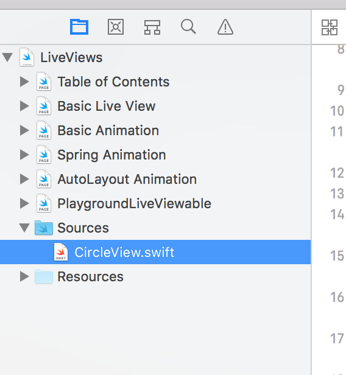
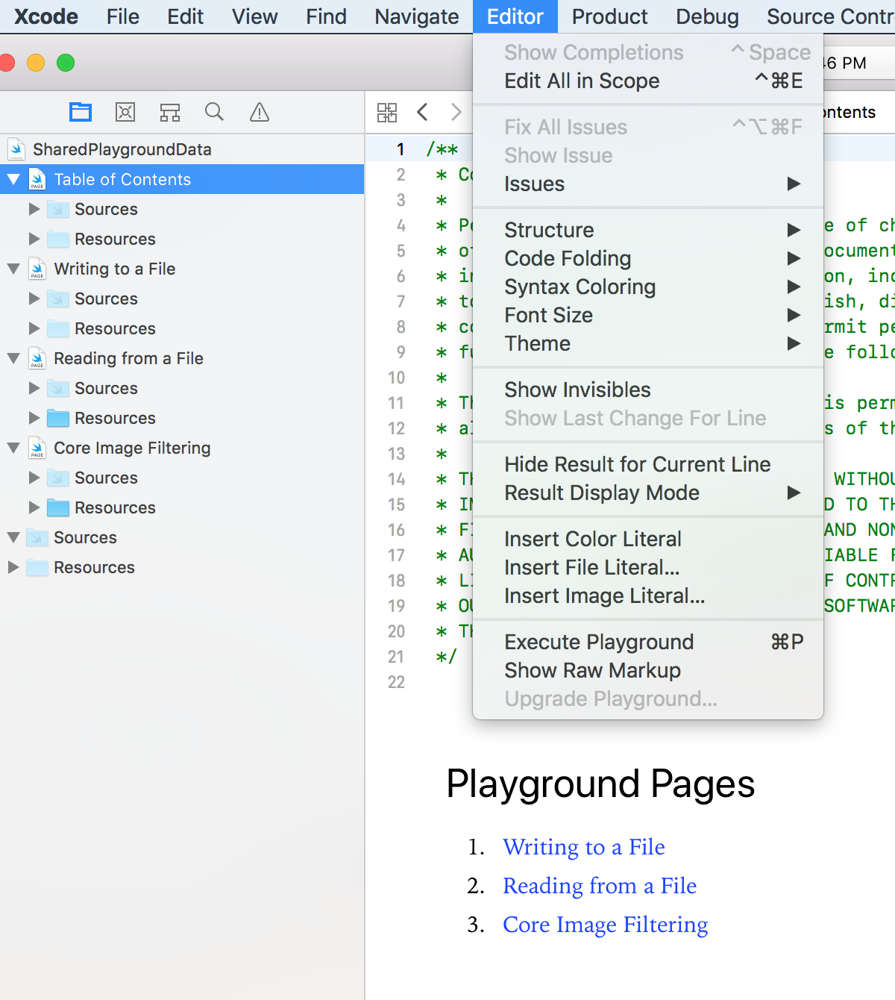

###### What all can be done in Playgrounds
A lot of things can actually be tried in Playgrounds itself. This includes animatable and interactive views, gesture recognizers, UIKitDynamics, view controllers, file operations, network calls, CoreImage operations, etc.

For most of the things, first `PlaygroundSupport` needs to be imported.
`import PlaygroundSupport`

Also, by default a playground runs only for 30 sec. This could previously be tweaked from timeline view (not finding this option in Xcode 9 though.)

###### Enabling Indefinite Execution

The way Playgrounds' default concurrency is setup, even simple async operations by default may not execute. The below needs to be done for the async operations to run.

```
PlaygroundPage.current.needsIndefiniteExecution = true
```

And once indefinite execution is not needed, ideally it should be set back to false. Typically, this is done inside a callback once that thing has executed.

```
PlaygroundPage.current.finishExecution()
```

###### Adding new pages

A new playground book already comes with one playground page included in it.

Since Xcode 9, the only way to add a new playground page to an existing playground (book) is through the context menu on the book in the project navigator.



###### Quicklook Inline

It's possible to inspect various variables or views at various points in the code by enabling inline quicklook for the ones you are interested in.




###### Sharing code across pages

Code that needs to be shared across various playground pages can be put in `Sources` folder.




###### Markup formatting

It's possible to write a kind of markup/markdown if you want to provide some documentation. The playground can be shown in 'Show Rendered/Raw Markup' mode through a menu option.



[Here](xcode playground how to open in documentation mode) is the markup syntax.

All the markup needs to be encapsulated in `/*:  */`.

Its also possible to have hyperlinks to other playground pages. <br>
`1. [Text to display](Page%20Name)`
