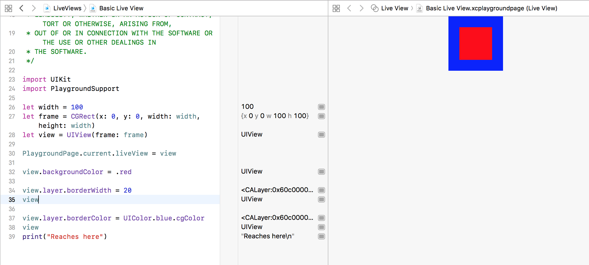
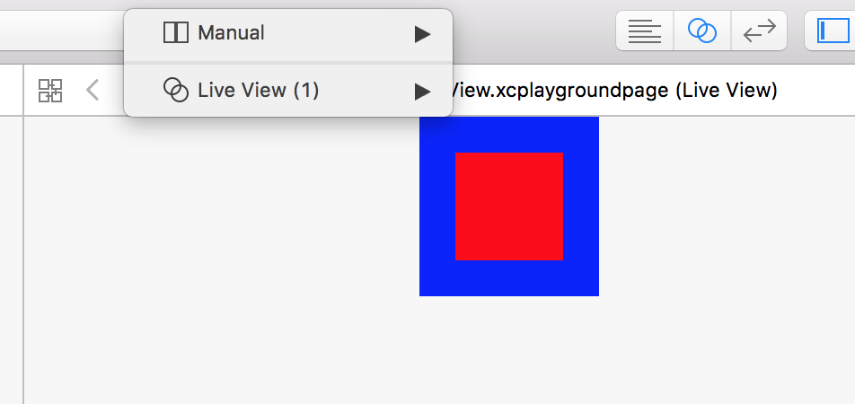

###### Testing views using Live View

A view can be programmatically created and assigned to `liveView` property and then the view shows up in Live View in assistant editor.

```
PlaygroundPage.current.liveView = view
```



In fact view controllers too can be live tested in the same way. That is, create a view controller programmatically and then assign it to `liveView` property. Do note though that this also often also requires `needsIndefiniteExecution` to be set as true.

While there is no storyboard to create and test constraints, its totally possible to create constrains programmatically and test. However do set `translatesAutoResizingMaskIntoConstraints` as false.

Also, sometimes the assistant editor shows the Manual View instead of Live View, so you need to change it to Live View yourself.


