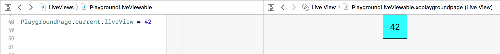

###### PlaygroundLiveViewable protocol

`PlaygroundLiveViewable` protocol can be used to get any variable to show up in the live view.

Any type that conforms to it needs to return a `PlaygroundLiveViewRepresentation` enum case, which can be a `UIView` or a `UIViewController`.

```
extension Int: PlaygroundLiveViewable {
  public var playgroundLiveViewRepresentation: PlaygroundLiveViewRepresentation {
    let intView = self.toLabel()
    return .view(intView)
  }
}
```

And there can be a live view representation generated for that type.



###### Using playgrounds in existing projects/workspaces

Using playgrounds can also help in existing workspaces as the entire project need not be built for simple things. Just the playground's inline viewer can be quickly used instead. The key though is to create the playground as a new file (if you are using it in a xcodeproj, and not a xcworkspace). Also, the code that it needs from the workspace should be in a shared library/framework that has already been built for that simulator.
______

Can't get timeline selection going in Xcode 9, it was possible until Xcode 8.

What exactly are color literal, file literal.
