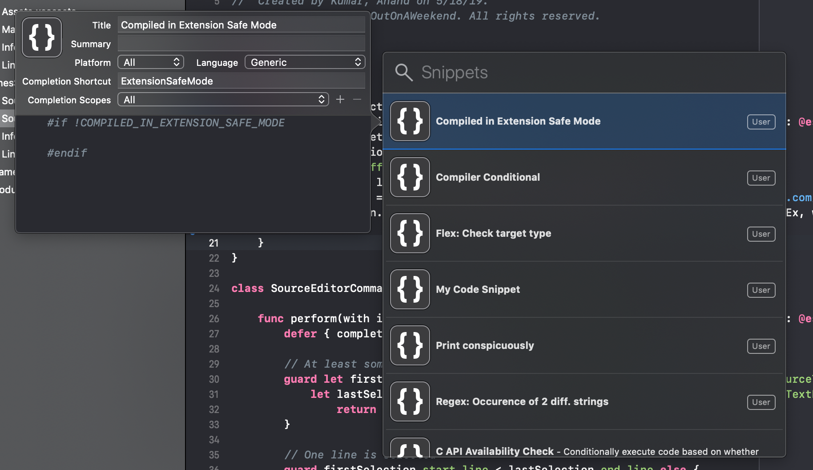
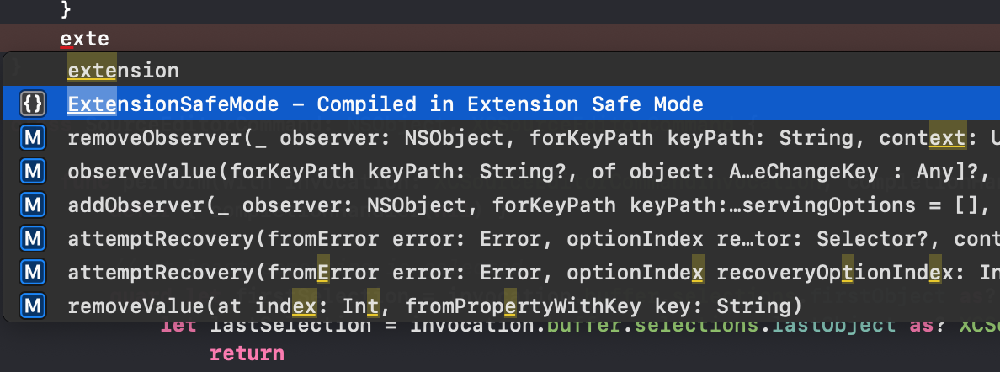

#### Schemes, Run Destinations, Actions

`Test` - Cmd U  
`Clean` - Cmd Shift K  
`Clean Build Folder` - Cmd Option Shift K  
`Clear Debug Console` - Cmd K  

`Switch between schemes` - Cmd Ctrl [/]  
`Switch between run destinations (i.e. devices, simulators)` - Cmd Option Ctrl [/]  

`Edit Scheme` - Cmd Shift ,  
`Edit Scheme before performing an action` - Option Action's shortcut  
> For example, Option Cmd R shows edit scheme modal before running the scheme. Works for all actions other than Build).

#### Debugging

`Activate/Deactivate breakpoints` - Cmd Y  
`Add/Remove Breakpoint at current line` - Cmd \  
`Debug Continue` - Cmd Ctrl Y  
`Debug Step Over` - F6  

#### Navigators, Inspectors, etc.

`Navigator` - Cmd 0  
`Inspectors` - Cmd Option 0  
`Debug Console` - Cmd Shift Y  

`Documentation` - Cmd Shift 0  
`Organizer (Archives, Crash Logs, Energy Logs)` - Cmd Shift 1  
`Devices and Simulators` - Cmd Shift 2  

`File Inspector` - Cmd Option 1  
`Quick Help Inspector` - Cmd Option 2  
`Identity Inspector` - Cmd Option 3  
`Attributes Inspector` - Cmd Option 4  
`Size Inspector` - Cmd Option 5  
`Connections Inspector` - Cmd Option 6  

`Standard Editor` - Cmd Enter  
`Assistant Editor` - Cmd Option Ctrl Enter  

`Code Snippet code (when in code)` - Cmd Shift L  
`Object Library (when in xib)` - Cmd Option Shift L  
`Media Library` - Cmd Shift M ??  

`Add code snippet` - Xcode 10 onwards its a Menu option  

#### Navigation

>  Xcode preferences -> navigation -> optional navigation. There are options here to specify how the below navigations happen when `Option` is also pressed. The options are same tab, new tab, etc.

`Jump to definition` - Cmd Ctrl Click  
`Jump to definition in assistant editor` - Cmd Option Ctrl Click  

`Open current file in new tab` - Cmd T  
`Open current file in new tab in new window` - Cmd Shift T  

`Go back and forward` - Cmd Ctrl Left/Right  
`Switch between .h and .m file` - Ctrl Cmd up/down  

`Open quickly` - Cmd Shift O  
`Jump to line no.` - Cmd L  

`Go to next issue` - Cmd '  
`Go to previous issue` - Cmd "  

`Show related files` -  Ctrl 1  
`Show previous history` -  Ctrl 2  
`Show next history` -  Ctrl 3  
`Show group files` -  Ctrl 5  
`Show document items` - Ctrl 6  

`Reveal in Project navigator` - Cmd Shift J  
`Search Navigator` - Cmd Option J  
`Go to line number` - Cmd L  

#### Code modification

`Edit All in Scope` - Cmd Ctrl E  
`Edit Multiple Lines` - Cmd Shift click  

`Indent the selected lines left or right` - Cmd [/]  
`Move the selected lines up or down` - Cmd Option [/]  

`Update frames of selected views in xib` - Cmd Option =  
`Show all views at a given point in xib` - Shift Right click  

`Add Documentation` - Cmd Option /

#### Find operations

`Search in all files` - Cmd Shift F  

> The below is applicable when 'Find navigator' or 'find in file' are already visible.

`Insert selected text in find textfields (does not modify clipboard)` - Cmd E  

`Go to next occurrence for find in file` - Cmd G  
`Go to previous occurrence for find in file` - Cmd Shift G  

`Go to next occurrence for find navigator` - Cmd Ctrl G  
`Go to previous occurrence for find navigator` - Cmd Ctrl Shift G  

#### Creating shortcuts for custom code snippets

Just select the code and use the menu option 'Create Code Snippet'. The snippet can the be given a custom name and even used in code completion. To remove a code snippet, just go to Code Snippets library and hit delete on that snippet.

