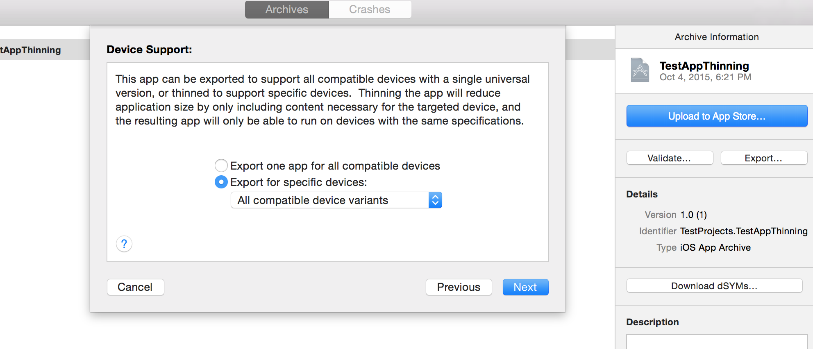
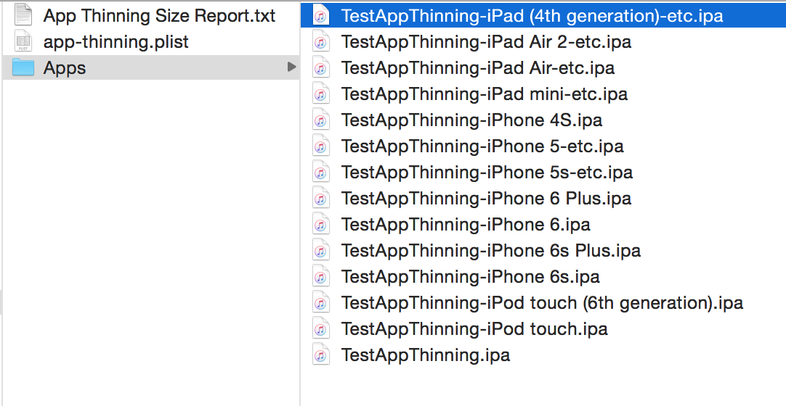

App Thinning is the process of creating optimal binaries customized for different devices. There are separate ipa files for 6S, 6, iPad Air and so on (even if its a universal app). This allows faster downloads as well as minimum disk space consumption.

Some possible criterions on which resources and other binary contents can differ.
Architecture - 32 bit/64 bit, armv7/armv7s/arm64
Screen resolution - asset images 1x/2x/3x
Device type - iPad/iPhone
Texture compression - OpenGL ES/Metal
Audio bitrates -  96 kb/192 kb

Slicing -

Slicing is the exact process which creates different binaries, called variants. A variant contains only the executable architecture and resources that are needed for the target device. Xcode slices the app when it is built and run on a device. When an archive is created, Xcode includes the full version of app but allows to export variants from the archive.

Xcode 7 is needed. For images slicing is done only for images in xcassets file. Also in case of iOS, iOS 9 is needed.

App thinning is automatically done during build and run as well. This can however be controlled from ENABLE_ONLY_ACTIVE_RESOURCES build setting. This thinning is especially useful when building content heavy apps.

If 'include manifest for over-the-air installation' is checked when creating ipa files a manifest list is also generated which contains URLs for each of the app variants that it produces. But this requires download URLs to be given before hand, how can that be done (esp. with something like TestFairy).

Named data is a new data class. It allows to store arbitrary file contents (even images?). They can be classified according to hardware capabilities. NSDataAsset class can then be used to retrieve content.

Bitcode -

Bitcode is something that if enabled allows Apple to re-optimize the app binary in future without the need to submit a new version of your app to the store. (What it exactly does is not very clear to me.)
Slicing does not require Bitcode.

For iOS apps, bitcode is default,but optional. If it is enabled, all apps and frameworks in the app bundle need to include bitcode. For watchOS apps, bitcode is required.

On-demand resources -

There is another very interesting thing called on-demand resources that has been introduced in iOS. These are resources such as images and sounds that can be tagged with keywords and requested in groups, by tag. What it means is that the app size can become smaller thereby improving first time download experience. This is particularly useful for gaming apps and apps with in-app purchases that may divide resources into levels and request the next level of resources only when the app anticipates that the user will move to that level. The OS purges on-demand resources when they are no longer needed and disk space is low.

Its probably even possible to load some resources only for the first time (such as tutorials) if tagged appropriately.

On-demand resources are not stored in the main ipa in App Store and even after being downloaded on a device it is not stored in app bundle or even the app's iCloud content but stored somewhere else which the OS caches automatically.

**********

In case of 'include manifest for over-the-air installation', the ipa download URL needs to be given before-hand. How can this be done when using something like TestFairy?

How are assets classified universal? Probably through attributes inspector, but need to understand this better.

On-demand resources configuration settings is mentioned in On-Demand Resources Guide and NSBundleResourceRequest Class Reference.

WWDC 2015 video: 404 - App Thinning in Xcode

Portions to be revisited -
18:16 - Sprite atlases. A combination of sprite assets and asset catalogs.
35:00 - Xcode server

Asset Catalog help
