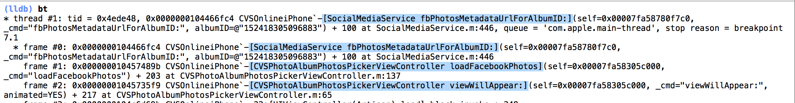
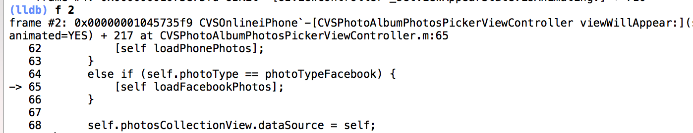
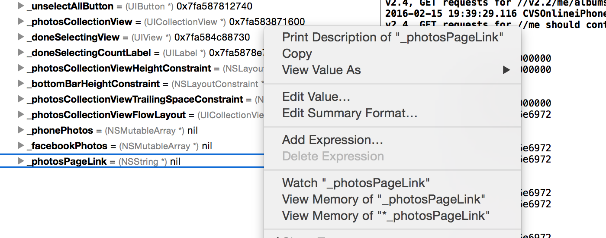
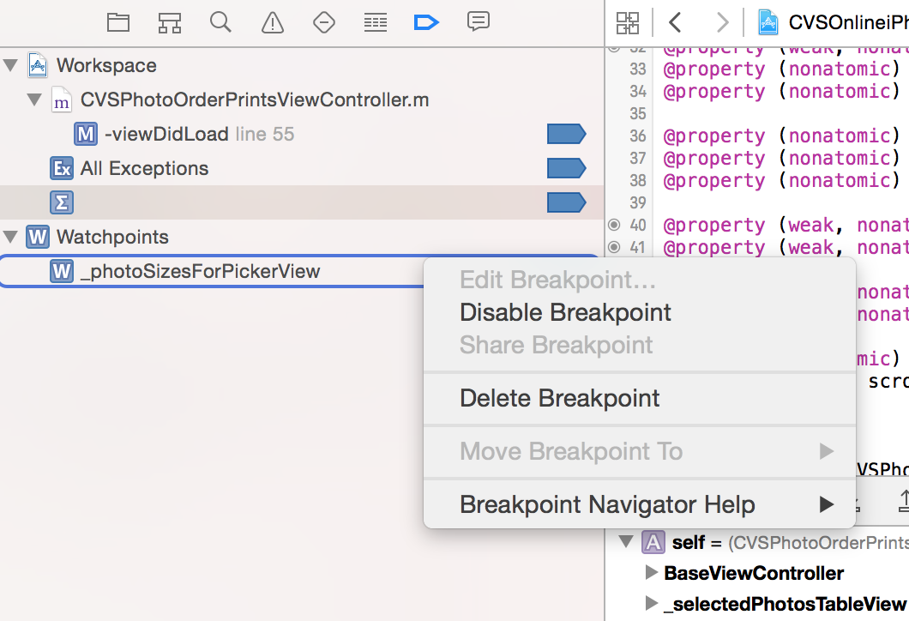

#####  Executing expressions

While printing values in a debug session, method arguments should be explicitly type-casted to what the method returns (even though it can be inferred lexically).
```
po [[response filteredArrayUsingPredicate:(NSPredicate*)[NSPredicate predicateWithFormat..
```
This even holds true when putting conditions in breakpoints.
```
(BOOL)[(NSString*)[item valueForKey:@"ID"] isEqualToString:@"93306"]
```
However if the return type inherits from NSObject, you can even just use “id” (at least in LLDB).

`po` is actually an alias for `expr -O`  <br>
`expr -O -- [SomeClass returnAnObject]`

`expr` can be used to assign values to variables (or even add code) on the fly during a debug session.
```
(lldb) expr dictionary = @{@2:@9}
```
`expr` stands for expression and is termed 'evaluating expression'.

##### Stack trace

`bt` is a lldb alias which amounts to thread backtrace. bt is useful in the sense it gives the sequence of methods that were called to call the current method.

Anytime a stack trace is examined, first of all the thread name is shown and then the sequence of methods called in it.



Even a frame can be printed in a debug window, meaning the exact frame (or in simpler language, method) that you are interested in and even shows the code snippet of a few lines surrounding it. Technically this is called selecting a different stack frame by index for the current thread.



up and down show the stack frames above and below the current stack frame, i.e. the frame that was called by the current frame and the frame that called the current frame.
Increments such as `f 2` and `down 2` are also possible.

##### Watchpoints

A watchpoint allows you to know whenever an instance variable (or a property for that matter) changes in anyway. To set the watchpoint, you need to be paused in the debugger within a stack frame that has the variable you want to watch in scope and then add it either through a command or using the context menu option 'Watch' on that variable name in Variables view.

In the below example, a watchpoint is set for `_photosPageLink` instance variable
```
watchpoint s v _photosPageLink
```



Currently only 4 watchpoints are supported at a time. All the current watchpoints can be seen using 'watch l' command.
If watchpoint is set through variables view they can be seen in breakpoint navigator. However, things such as 'continue automatically after evaluation' etc. cannot be configured for watchpoints.



Every time the variable being watched changes, the watchpoint is hit and the debug console shows the old and new value of the variable.
```
Watchpoint 1 hit:
old value: 0x0000000000000000
new value: 0x00007fb43f0f0760
```

Now this is useful when the variable being watched is a scalar such as an int as then the values are actually meaningful but in case of objects the pointer address is shown which does not seem to be of any use. (How to get the value in those address?)

##### Commands

`po` <br>
`expr <any expression and do not need a semi-colon>` <br>

`bt` <br>
`bt all` (Gives the backtrace of all threads) <br>
`bt -c 5` or `bt 5` (Backtrace the first five frames of the current thread) <br>
`f 2` or `fr s 2` (Printing a particular frame based on its index in the frame stack) <br>
`up 2` (Go up the stack, i.e. the frame that was called by the currently selected frame) <br>
`down 2` (Go down the stack, i.e. the frame that called the currently selected frame) <br>

`watchpoint s v _photosPageLink` (Set a watchpoint for a instance variable) <br>
`watch l` (list of all watchpoints) <br>

##### Printing CPU registers -

(What exactly is a CPU register here?)

When a program suspends, there are ways to inspect the state the CPU (i.e. the machine code?) was in when the crash occurred.

For example when an application crashes at `objC_msgSend()` method (which is Objective-C's low level method invocation function), by printing the values of the CPU register in the debug console, information regarding the exact method that was invoked can be extracted. These are the commands to be typed in the debug console.

`x/s $ecx` - Prints name of the selector that was invoked which caused the crash (for iOS simulator) <br>
`x/s $rl` - Prints name of the selector that was invoked which caused the crash (for iOS device) <br>

When a crash happens with objc_exception_send, following can be typed in GDB to get the message of the exception. <br>
`po $eax` - For iOS simulator <br>
`po $r0` - For iOS device <br>

##### Journal -

Its even possible to write python commands in debug console and let them do customized things when a breakpoint, etc. is hit.

What really are registers?  <br>
The entire LLDB list - Apple link
