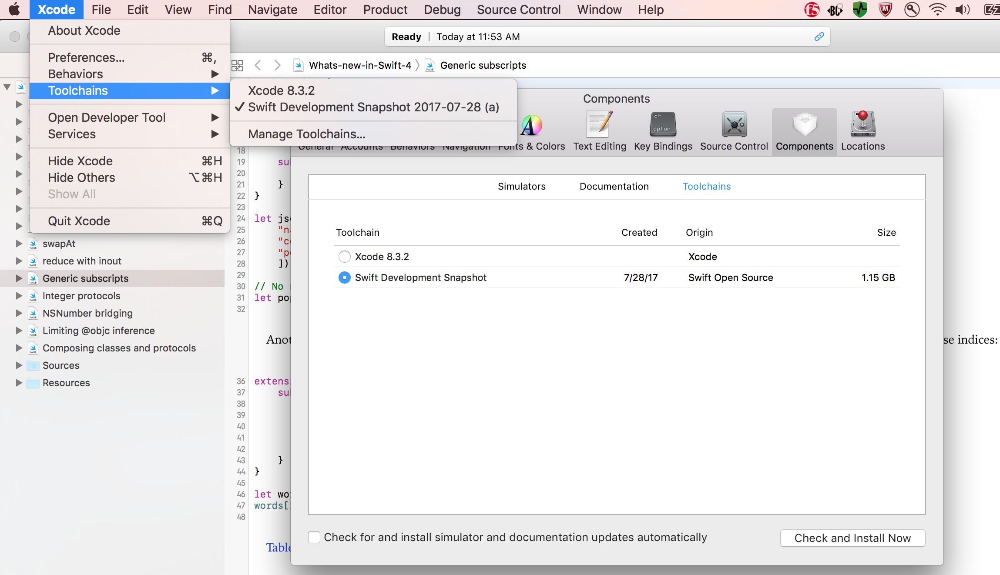

##### Xcode toolchains

Toolchain is the language, environment, etc. that Xcode uses. By default Xcode has one toolchain (with same name as Xcode and its version number). To try out things from a newer feature of say a language which is still in beta, its corresponding toolchain can be installed.

###### How to install -

New swift version toolchains can be installed from the official Swift page ([link](https://swift.org/download/#releases)). Swift 4.0 toolchain for instance was available as a link named Xcode when I tried. It downloads a package installer which can then be used to install the toolchain.

###### How to switch between toolchains -

It can be done from Xcode preferences -> components as well as menu option. Typically there is no need to restart Xcode after changing the toolchain.

> Seeing if it works.  
I tried a Swift 4 playground page On Xcode 8.3.2 with the default toolchain, it gave errors. When I switched to Swift 4 toolchain (called Swift development snapshot), it worked. So yes, it works.
