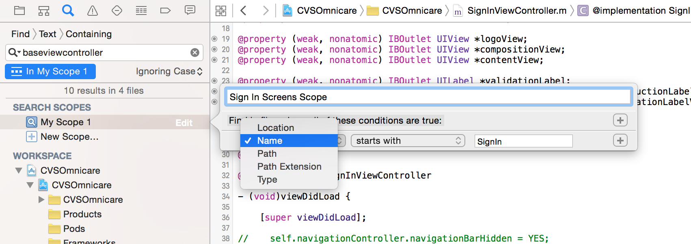
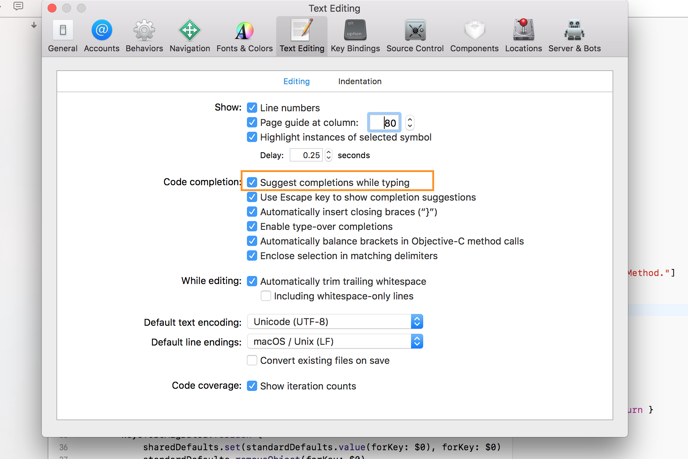

###### Image and Color literals

In source code image and color literals can be inserted. Just start typing `image/color` or even `literal` and auto-completion inserts them. Then double tap on them to select the image (from asset catalog) or color (from color palette).


It actually gets represented like this in the code (viewable in a simple text editor).
```
let _ = #colorLiteral(red: 0.0862745098, green: 0.568627451, blue: 0.007843137255, alpha: 1)
```

###### Custom color palettes

A custom color palette can be created by going to color palette and tapping on gear icon in one of the table there. Colors can then be added there and given custom names.

This creates a `.clr` file in `Library/Colors` directory on the Mac and it then automatically shows up in color palettes in storyboards, etc. This file can just be placed in the same location in other Macs to have the same color palette be readily available.

###### Copying image assets file -
Icons set can easily be ported from one project to another. Go to the Images.xcassets file in Finder for one project and then copy paste on to the Images.xcassets file in Finder for the other project. It should be done separately for the Images.xcassets file for each target. That’s it.

###### Copying storyboard -
It is possible to copy the storyboard file as well from one project onto another. The only thing to keep in mind is that the storyboard should be named appropriately for the destination project. If the storyboard is the main interface of the destination project, then the storyboard name can also be specified in destination project’s general settings - main interface option.

###### Disabling ARC for selected files -
Go to that file in the compile sources in the applicable target and add the compiler flag `-fno-objc-arc`.



###### Custom search scope in Search navigator -
A custom scope can be created so that the search is not done across the entire workspace. Even groups to search for can be selectively identified by tapping on the appropriate group in the workspace.

###### Fixing auto-completion and Jump to Definition -
If this is not working and even cleaning derived data, relaunching the app and then waiting for indexing to finish has not worked, then this simple trick helps. Uncheck below option, quit Xcode and relaunch. And then re-enable this option the first thing.


