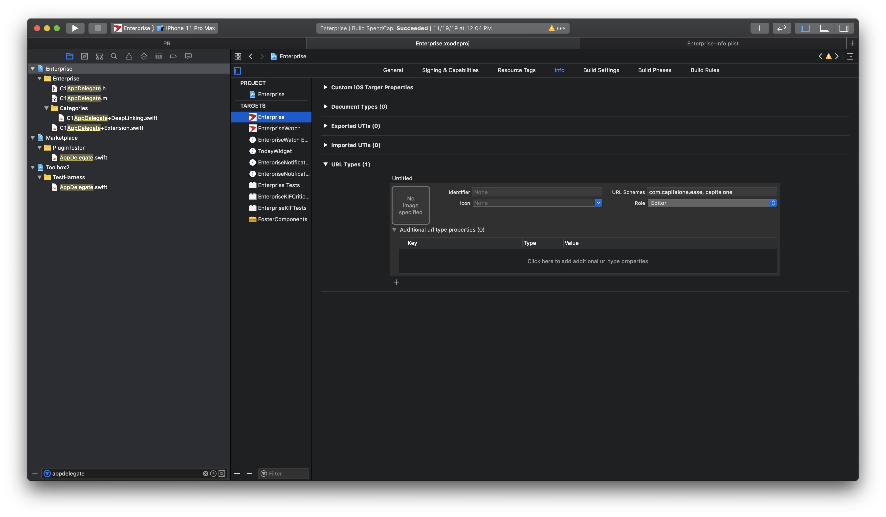
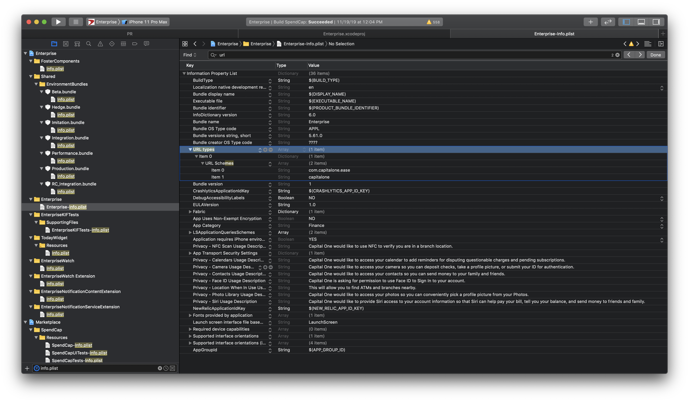

#### URL Schemes

Registering a URL scheme is pretty simple. The URL scheme needs to be specified in the target's Info section.



And this then also shows up in the Info.plist. Name of the Info.plist key is `CFBundleURLSchemes` (`URL types -> URL Schemes`)



> Still not quite clear on what the roles imply. Possible values are `Editor, Viewer, None` and they all seem to be working. The documentation says `Viewer` should be specified if the app observes a scheme, but does not define it. So may be what it means is that if there are multiple apps having the same scheme, the precedence is given to the one that is having `Editor` role.

> Similarly what is the point of having the identifier there. The documentation says it can be used to distinguish apps which have same URL scheme registered. But how to trigger the unique one then.

The app is then launched and `application(_:url:options:)` in app delegate is called.
```
func application(_ app: UIApplication, open url: URL, options: [UIApplication.OpenURLOptionsKey : Any] = [:]) -> Bool {
```

[Apple Documentation link](https://developer.apple.com/documentation/uikit/inter-process_communication/allowing_apps_and_websites_to_link_to_your_content/defining_a_custom_url_scheme_for_your_app)

> In general, url schemes are not recommended because of above limitations (no good way to specify a unique scheme that no other app can define). Also if the app is not already installed, the UX breaks and there isn't even a way to tell the user to install the app. Instead, universal links must be used.

#### Universal links

So when app is installed, iOS checks with app's web server that iOS is allowed to directly open the app from universal link.
Every time a universal link is triggered, the request first goes to web server?
