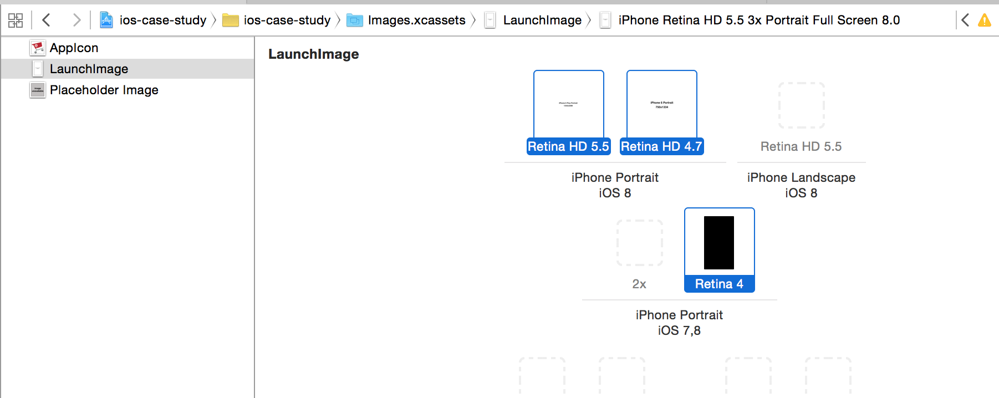
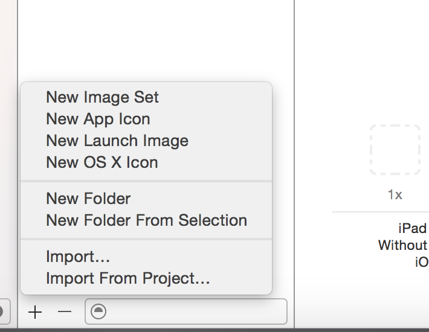
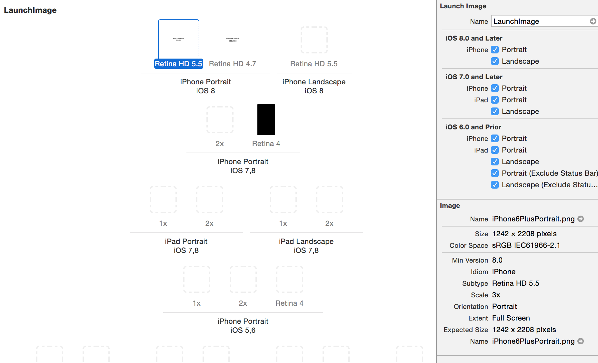
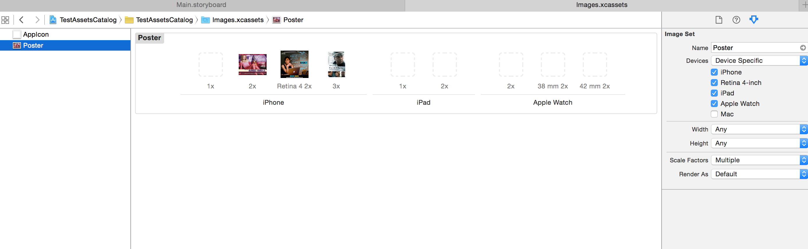
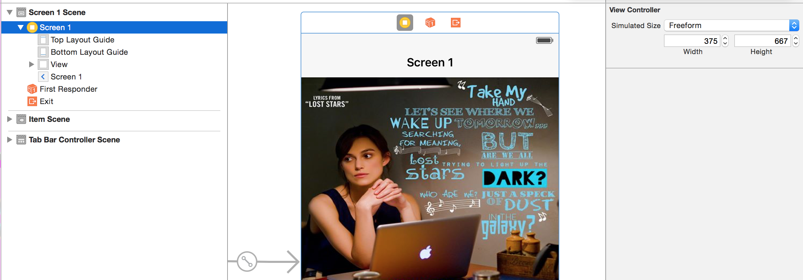
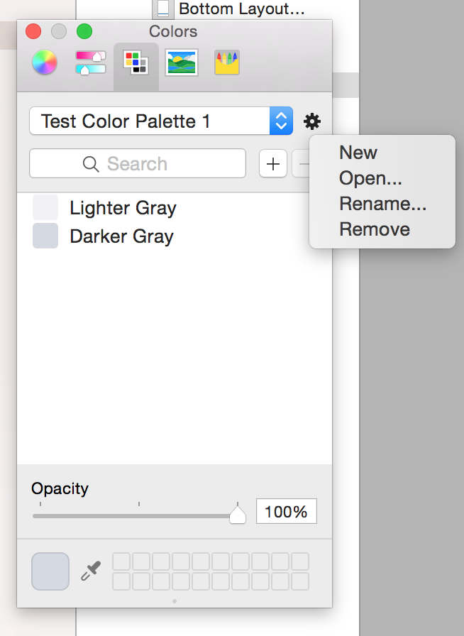

In Xcode 6, app icon should be of the required specifications and should be added to the 'AppIcon’ set in the xcassets. Also if icons are added, all the required icons (i.e. including spotlight icons) should be added else the app will not compile.

Launch image and simulator dimensions -

When an app is run on simulator, regardless of the simulator selected in Xcode, the dimensions of the simulator (i.e. iPhone 5S dimensions or iPhone 6 dimensions or something else) that is finally used depends upon the launch images added to the project. If there is no launch image added for 6 or 6 Plus, then even if they are selected, 5S dimensions are used. This can in fact be cross checked using the resolution markers while capturing screenshot with Cmd + Ctrl + Shift + 4 as well. (Keep the simulator in correct looking scale though, usually its Cmd + 2).

The launch images being added should also be of required dimensions. Also, the right way to add them is through New -> Launch Image in xcassets file. (I have a folder downloaded from net called 'iPhone6LaunchBlanks' which has sample launch images of correct dimensions for 6 plus, 6 and 5S.) Hence it is important that the correct launch images are added for the correct simulator dimensions to be used for testing. Also, these launch images must be specified in the lunch images source option in project settings.

Xcode 6 onwards, the simulator size does not seem to be correct for 6 Plus and 6S Plus devices even if the correct launch images have been added. The size is still correct for 6S and other devices. (This seems to have been corrected in Xcode 7.)

However if the LaunchScreen.storyboard is used and also specified in the Launch Screen File option in project settings, then the images mentioned in Launch Images are ignored. This is a pretty clean way as it seems to be automatically taking care of various possible screen sizes for simulator as well. (link)

Assets Catalog file -

When a new image set is added, only the 1x, 2x and 3x images are shown. However, if you select 'Device Specific' in Devices dropdown in Utilities and select all other devices a lot more options are shown in then.
Here is the probable legend on what icon is used for what kind of device.

3x - iPhone 6S Plus, 6 Plus
Retina 4 2x - iPhone 6S, 6, iPhone 5S, 5C, 5
2x - 4S, 4
1x - iPhone 3GS, 3G, 2G

(It isn't clear, iPhone 6S and 6 may be 2X.)

If all images are not given, then the OS automatically selects the best suited image. Also, its better to have all images in png.

Test project - 16. Assets Catalog/TestAssetsCatalog

What are the other things such ad 'Width', 'Height', 'Scale Factors' and 'Render As'?

App icons, etc. recommended resolution (Apple link)
Assets Catalog Documentation (Apple link)

It is recommended to use pdfs as assets now as then Apple automatically takes care of generating various dimensions. (Link on how to add pdfs in assets file).

Possible items in assets catalog -

Image sets
iOS app icons
Launch images
Data sets
Folders
OS X icons
Sprite Atlas
Watch complications
watchOS app icons

Instead of a set of launch images, if the app targets at least iOS 8 (i.e. app's deployment target is iOS8?) just one launch screen file can be used. It is an xib file that can adapt to any screen size or orientation.

Screen size in interface builder -

When using storyboard it is not fixed and in fact can be changed from view controller's size inspector simulated size -> freeform. This can help visualize the subviews better during design time itself. This can even be done while using adaptive layouts.

(How to do it in xib though.)

Saving a custom color in interface builder and making it available across projects -

Go to color picker -> color palettes, click on the gear icon and add a new color palette (and rename it). Then select the appropriate color from any of the options (color wheel, color slider, etc.) and add it to the custom color palette (using the color box in bottom right). This color will then be available even across projects.

Will custom palettes added this way even get pushed when using version control.
Is there a way to programmatically access custom color palettes.

**************

Super Retina display of iPhone X actually comes into effect only if the app has been built on iOS 11 SDK and a launch screen storyboard is also there.
