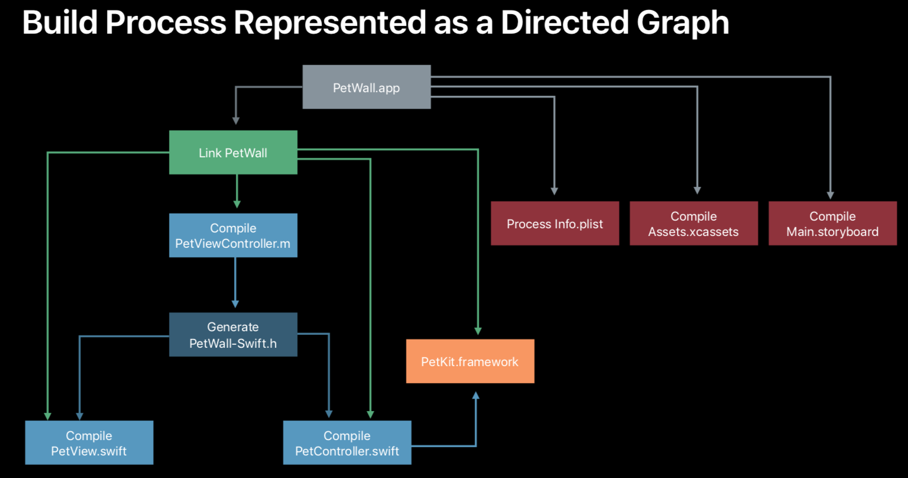
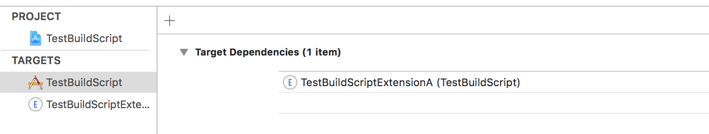
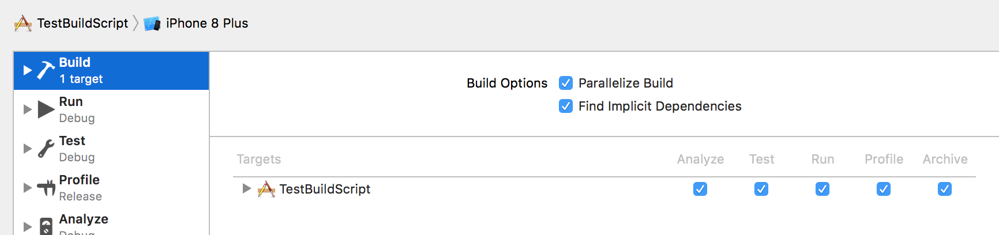
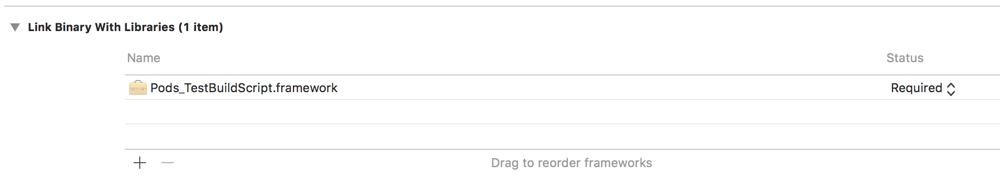
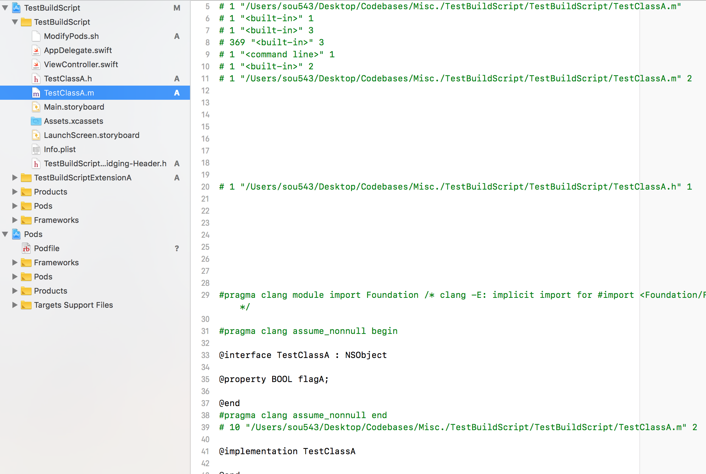
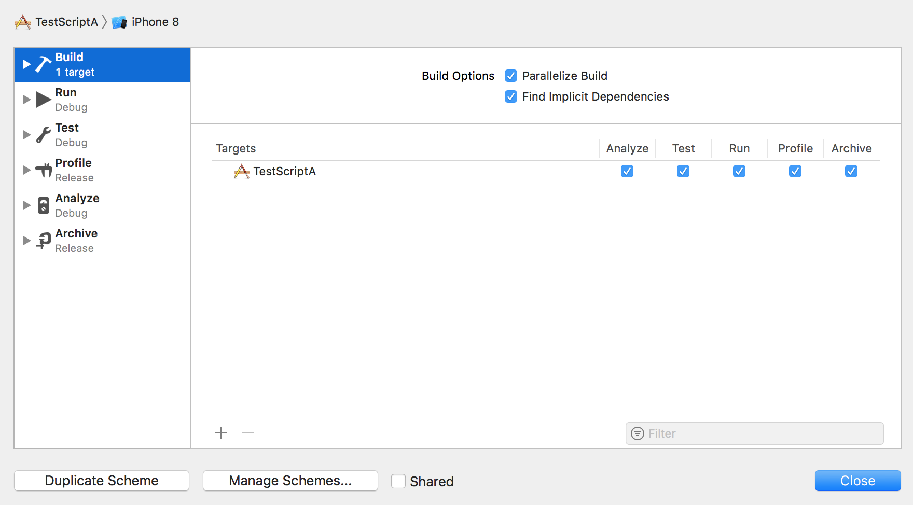

Compilers too have a front end and a back end. <br>

`Clang` is the compiler front end for C based languages, which includes Objective-C and C++. Its back end is `LLVM`. <br>
Swift has its own compiler whose front end is known as `Swift compiler` and whose back end is `LLVM` too. However, even Swift compiler uses Clang behind the scenes.<br>

So `makefile` is a file used by the system tool `make` that automates certain tasks. It is typically used to generate targets during build/compilation but can apparently also be used for simpler things like generating documentation.
> So if I want to use `make` in Xcode, will it be a new run script with the shell being `/usr/bin/make`?

`ACTool` is the Apple utility that compiles asset catalogs during building. `IBTool` is the utility that compiles storyboards and xibs

##### Dependency Order and Directed Graph

The order in which build tasks are executed is
determined from the dependency information of the tasks, i.e. the
tasks' inputs and outputs.<br>
For example, a compilation task consumes a source code file like
`xyz.m` and produces an object file like
`xyz.o`. A linker task consumes a number of object files produced by the compiler in previous tasks and produces and executable or library
output.

The build system uses dependency information to
determine the order in which tasks should be run and which tasks can be run in parallel. This is known as `dependency order`.

While building with Xcode the first step is to look at the build description, i.e. the project file. Keep in mind that it contains information about everything including build settings, files in the project, etc. All this is taken into account and a tree-like structure known as `directed graph` generated. It represents the dependencies across all files in tasks, not just the dependencies across tasks.



The low level execution engine (known as `llbuild`) then looks at this directed graph and executes it. Interestingly new dependencies can even be found during execution. This information is probably used in next build.

> `.d` files for instance are generated by clang which lists all the header files referred in an Objective-C file. This is then used for more intelligent incremental builds next time round. `.d` is in fact a standard file format in the world of `make`.

Each task in the build process has an associate signature which is the sort of hash that's computed from various information related to that task. This information includes things like what are its input tasks, what compiler version was used during last compilation. The build system keeps track of these signatures for both the current and the previous build. And that's how it knows what tasks to perform during incremental builds.

##### Different kind of dependencies

Target Dependencies are what are typically known as `Explicit Dependencies` as they need to be explicitly specified and cannot be inferred using any build setting, etc.

Frameworks are typically specified in `Link Binary with Libraries` phase. And if the `Find Implicit Dependencies` option in that scheme's settings is turned on (which it is by default), then these libraries are treated as implicit dependencies for that target by the build system.

Explicit dependencies | Implicit dependencies
--- | ---
 |  <br><br> 

`Build phase dependencies` are the other dependencies imposed by the details provided in Build Phases. The build system associates tasks for each of them and usually tries to run them in the listed order.

`Scheme order dependencies` are the dependencies imposed by the order in which the targets are listed in the build action of the scheme. However if 'Parallelize Builds' is turned on, this order does not matter.

##### Headermaps and Clang modules

The build system deals with something called `headermap files` (is it just for C language family files, or even for Swift files). These files have a mapping for all the header files and their actual location. I think inside every framework, the build system looks for the header file in these locations - `$(SDKROOT)/usr/include` and `$(SDKROOT)/System/Library/Frameworks`. The latter is expected to have headermaps for custom headers used by the framework.

> With C based languages, Xcode even gives an option to view the pre-processed file. `Product > Perform Action > Preprocess..`. The preprocessed file looks like this.



`Clang modules` allow the build system to find and parse the headers once per framework and then store that information on disk so its cached. This improves build times. Internally it is mainly defined using `modulemap` file which has information such as what headers are part of the module, what modules it depends upon, etc.

A modulemap typically looks like this.
```
framework module FrameworkModule {
  umbrella header "FrameworkModule.h"

  export *
  module * { export * }
}
```
The modules are serialized to disk into something called `module cache`.

Xcode 10 build system also uses something called `Clang Virtual File System` when building custom frameworks (as opposed to system frameworks).

Since in Swift interface and implementation are a part of the same file, all the files need to be parsed during compilation of frameworks/modules. Unlike clang and C based languages, where the public interface and implementation are separated in different files.

Until Xcode 9, a Swift file was always compiled at least twice. Once to generate the object file (`.o`) and once to generate the public interface. Some improvements have been made with this in Xcode 10 by combining some related files into groups, somehow it helps.

If a Swift module itself uses some Objective-C code, the Swift compiler (i.e. `swiftc`) uses `Clang` to import those Objective-C files.

##### Parallelized Builds

Xcode 10 onwards its possible for multiple targets to build in parallel even if there is some explicit dependency between them (typically specified in `Target Dependencies`). For this to happen `Parallelize Builds` option must be enabled (which it is by default) in the corresponding scheme's settings.

> What this probably means is that if TargetA needs to be built but has an explicit dependency on TargetB, then TargetA build can already be started even if TargetB build has not been completed yet. It's only that the static linking phase of TargetB (which maybe happens alongside its Link Binary with Libraries phase?) will not be started until TargetA build has been completed.



However any run script phase in the dependency target should also be finished before the dependent target's linking phase starts.

If TargetA did not have any dependency in TargetB then of course with the 'Parallelize Builds' option enabled, those two targets can be built in parallel without any inter-dependency happening at any stage.

> With Parallel Builds enabled, it also makes sense to split the codebase (esp. test targets) into as many distinct targets as possible. As then there is lesser dependency across targets and parallel builds are that much more possible.
