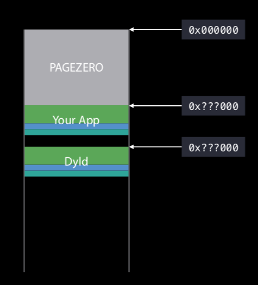
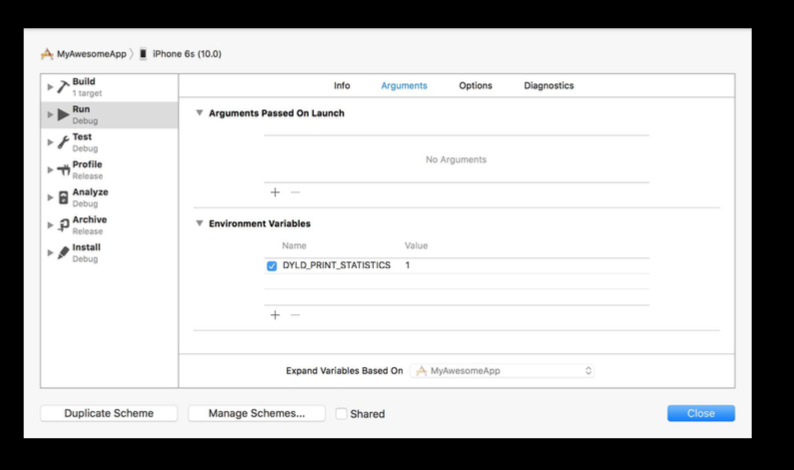
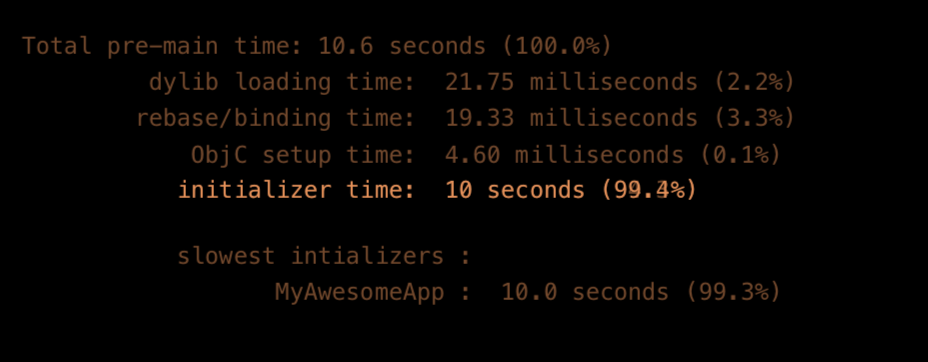

##### exec

So there are things that happen even before an app's `main` function is called. When you start an app, the first thing that happens is that system calls the `exec` function.

The kernel wipes the entire address space and maps in that executable you specified. For ASLR it maps it in at a random address. The region from the beginning of that page up to that address is made inaccessible and this inaccessible region is known as `PAGEZERO`.

Then `dyld` is loaded into that process at another random address. Dyld's job is then to load all the dylibs
that you depend on and get everything prepared and running.

exec | Things then done by `dyld`
--- | ---
 | 

##### Things `dyld` does

`Loading dylibs` - `dyld` first reads main executable's header, as it already has a list of all the dependent libraries. It then finds each dylib, does some validation on each and loads them by actually calling mmap at each segment in that dylib. It then keeps on doing the same for any further dylibs that those dylibs may be depending upon.

`Fix-ups (Rebasing and Binding)` - Once all the dylibs have been loaded, they still need to be to be binded together. That's called `fix-ups`. This can be done using `rebasing` or `binding`. In rebasing there is a pointer that's pointing to within your image. Binding is if you're pointing something outside your image.

`Notifying ObjC Runtime` - A few extra steps need to be taken for notifying Objective-C runtime. For example, ObjC run time has to maintain a table of all names of which class that they map to.

`Initializers` - And finally all the initializers for various objects/dylibs(?) need to be called.

> Once all this is done, only then does `dyld` call the executable's `main`.

##### Measuring app startup time

An env variable `DYLD_PRINT_STATISTICS` needs to be set with the value being `1`. It then prints the metrics in the debug logs.

Env variable `DYLD_PRINT_STATISTICS`| Logs
--- | ---
| 

##### Ways to improve app startup time

As a good rule of thumb, is 400 milliseconds is a good launch time. 20 sec is the limit. It's also very important to test on your slowest supported device.

`Warm launch` is when an app is already in memory, because it's been launched and quit previously, and it's still sitting in the disk cache in the kernel.  
`Cold launch` is when it's not in the disk cache. It is the one that is generally the more important to measure.

To reduce the app startup time -  

Use as few dylibs as possible. A good number is 6-8.  
Use Swift. Swift structs especially tend to use less data and cause less work during fix-ups.  
Do not use explicit initializers (`+load`, etc.) Instaed use call site initializers (`dispatch_once`, `pthread_once`).  

> What exactly are these call site initializers, and how can dispatch_once, etc. be used for initialization.

> Actually try to test and measure if using fewer frameworks, or using static library instead really reduces the startup time significantly.
