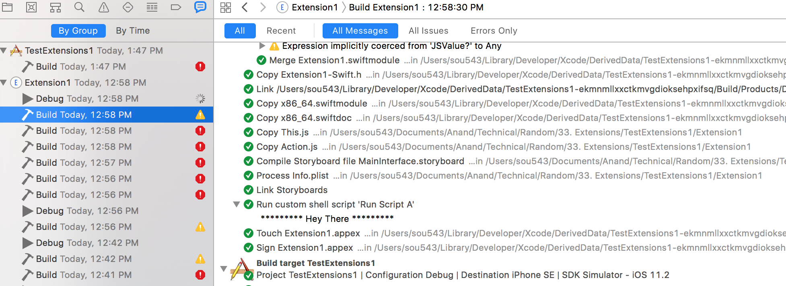

##### You can always check Build Logs

Every time the app is run, first build logs are generated and then the debug (i.e. run) logs. They can be viewed in Xcode's Report Navigator.



##### Environment variables

`SRCROOT` and `PROJ_DIR` both refer to the same thing practically, i.e. the current target's directory (link). Do remember to wrap them in parentheses though.
```
"$SRCROOT"/Build-Phases/TestScript.sh
```

##### Improving build times with code improvements

It helps to declare types for complex expressions.

It also helps to reduce declaring types as `AnyObject`, a method called on it is allowed as long as that method is available in any class and exposed to the Objective-C runtime (this ObjC part is there too?). This requires more time in compilation.

Marking outlets and actions as private helps as well, as they then need not be exposed in bridging and generated headers.
