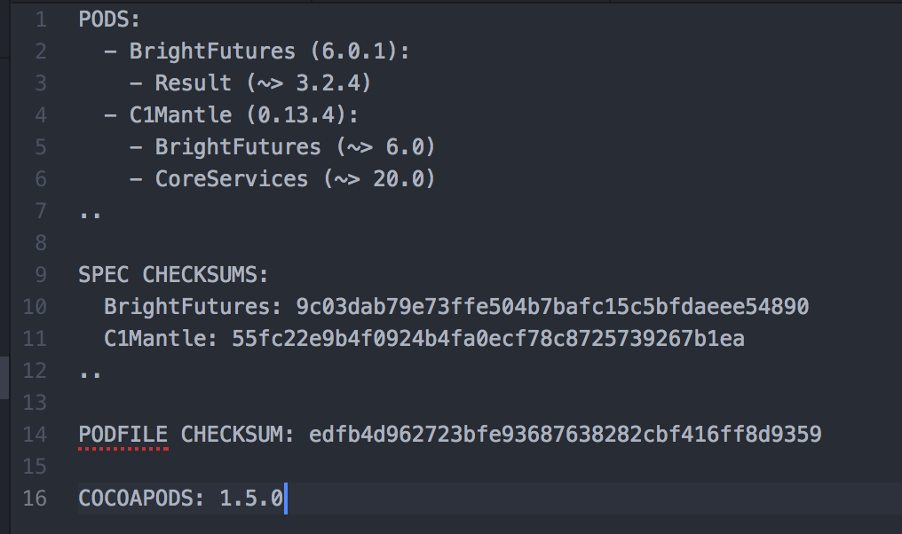
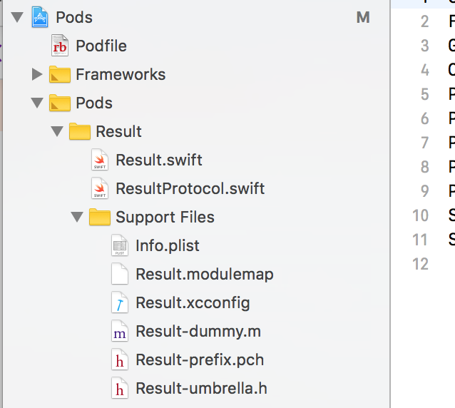
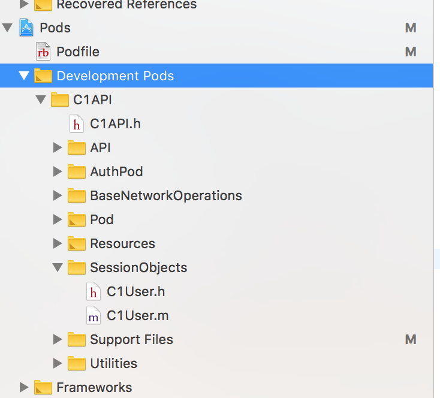

###### Why does it matter -

Well, saves a lot of hassle. You don't need to hunt down the dependency's source code yourself and download. There is no need to follow its integration steps painstakingly and specify the correct build settings yourself. And upgrading it to a new version is hence lot easier too.

###### Its own sourcecode -

Cocoapods is itself written in Ruby and there are 3 important gems (each its own repo) that make it work. -

`CocoaPods/CocoaPod` - Deals with the command line toolset, i.e. nearly all the pod commands. ([link](https://github.com/CocoaPods/CocoaPods))

`CocoaPods/Core` - Deals with the main files providing an interface to Cocoapods, i.e. `podfile`, `podspec`, etc. ([link](https://github.com/CocoaPods/Core))

`CocoaPods/Xcodeproj` - Deals with all project file (pbxproj) interactions. Can hence create it as well. This gem is the one then that specifies the correct build settings for the dependency. ([link](https://github.com/CocoaPods/Xcodeproj))

In fact there are more constituent gems than above.

###### Key files -

`podfile` - The required dependencies are specified here

`podfile.lock` - It is generated every time a `pod install` (even `update`?) is done. Keeps a record of what all dependencies have been installed for what target, and what version of dependency. It has the entire dependency graph as well. Checking in this file in source control also apparently helps in consistency across the team. Philosophically, it is just like Bundler's `gemfile.lock` file.

`manifest.lock` - A copy of `podfile.lock` stored in `Pods` directory. It is generated every time a `pod install` is done. <br>
> If `podfile.lock` and `manifest.lock` are not the same, project does not build and there is an error saying 'the sandbox is not in sync with the Podfile.lock'.  

As there are teams that check in the `podfile` but do not check in the `Pods` directory, this   helps in ensuring that pod install has been done and hence the pods being used are as per the latest podfile.

`podspec` - Specifies everything about the dependency that gets published. Its required compiler flags, other libraries it needs, and lot more. As it has the details of the relevant git tag, it consequently specifies all the source files too. [Podspec syntax](https://guides.cocoapods.org/syntax/podspec.html#specification).


###### Contents of a sample Podfile.lock -



###### Steps during pod install -
<br>
Figure out all explicit and implicit dependencies

Load the sources. The dependencies' podspecs have the respective git tags. Their commit SHAs get stored in the system directory  `~/Library/Caches/CocoaPods`. The required source files then get downloaded to project's `Pods` directory.

`Pods.xcodeproj` gets generated/updated. This likely is the single project that includes all dependencies.

Every dependency gets its own target inside `Pods.xcodeproj`. Each dependency also gets -
1. xcconfig file in the main project (one for every configuration) that has  build settings
1. Private xcconfig file in Pods.xcconfig
1. `prefix.pch` in Pods.xcconfig
1. `dummy.m` in Pods.xcconfig



If any dependency contains a resource bundle, instructions to copy that get added in `Pods-<podname>-resources.sh` file in the pod target in Pods`.xcodeproj`.

There are few more boilerplate files such as `Info.plist`, `markdown` file for licensing, etc.

Once files have been written, `Podfile.lock` and `manifest.lock` get created.


###### Resolving dependencies -

Cocoapods uses semantic versioning naming convention to resolve dependency versions.
> So what happens if both depA and depB have depX as dependency, but they specify different versions of depX.

###### Development pods -

If you want to make some changes in a pod you have pulled in and test it in the consumer app, then the best way is to actually clone that pod, make the changes in the clone and then use this local clone in the consumer code's `podfile`. The syntax is like this. The key attribute is `path`.

```
pod 'C1API', :path => '/Users/sou543/Documents/Anand/2.CommonLibraries/C1API'
```

And then when you do a `pod install`, then the above pod does not get actually copied to the Pods folder. You are just directly working from the pod in above location.

Keep in mind this brings in the `HEAD` branch there. There does not seem to be a way to bring in any other branch. Something like below _does not_ work.

```
XX pod 'C1API', :path => 'someLocalPath', :branch => 'someBranch'
```

Also even though a development pod does not actually get copied into Pods folder, it still does get shown in Xcode's project navigator as a _Development Pod_.



You can then also push this pod to your origin (in a new branch) and then reference that pod in the consumer app's `podfile`like this. Notice that here its possible to specify a branch.

```
pod 'C1API', :git => 'https://github.kdc.capitalone.com/AnandKumar/C1API.git', :branch => 'SharedPersistence'
```
