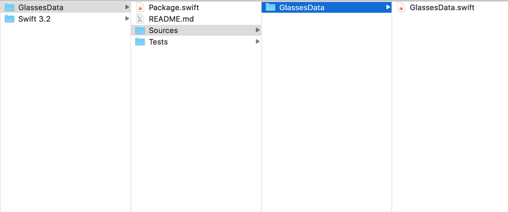
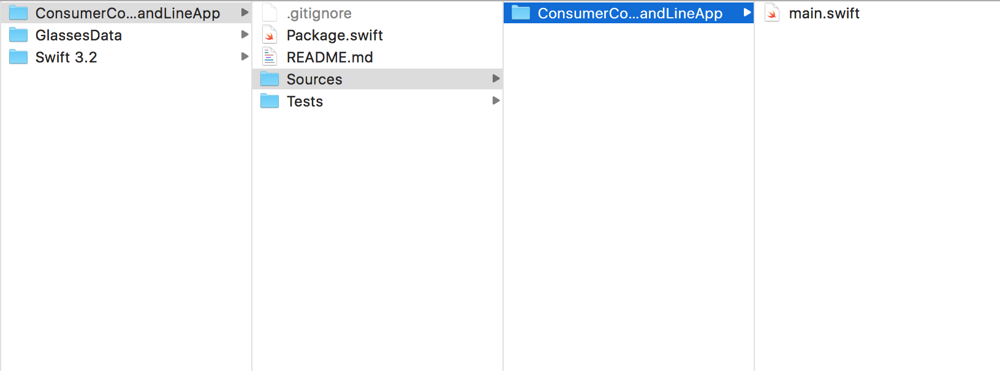
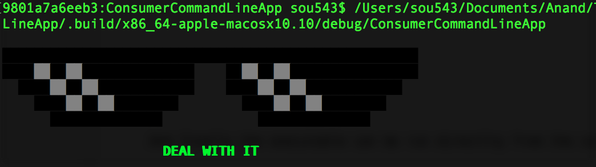

So Swift Package Manager is another dependency manager like Carthage and Cocoapods. However it as of now only supports OS X projects.

So as with any other dependency manager, SPM can be used to create new libraries and then also used in a project to manage its own dependencies.

Here is a typical sequence of commands -

swift package init --type library     // Creates a new library (static?)
swift package generate-xcodeproj      // Creates a new xcodeproj for the library created above
swift build                           // Builds the above library

swift package init --type executable   // Creates a new command line app
swift package generate-xcodeproj       // Adds an xcodeproj file to above command line app
swift build                            // Builds the above command line app
..project_path/.build/something/.debug/command_line_app_name     // Runs the executable in command line

swift package update                   // Updates the dependencies mentioned in a project

******

While creating the library -

"swift package init --type library" creates below structure. There is no .xcodeproj file yet.

"swift package generate-xcodeproj" creates an xcode project.
"swift build" then adds a .build folder as well.

While creating a command line app -

"swift package init --type executable" creates a command line app with below structure. It does not have an xcodeproj file yet.

"swift package generate-xcodeproj" then adds an xcode project.
"swift build" then builds the project with all its dependencies. The dependencies get checked out in .build folder.

And finally the executable can be run directlty from the command line.

