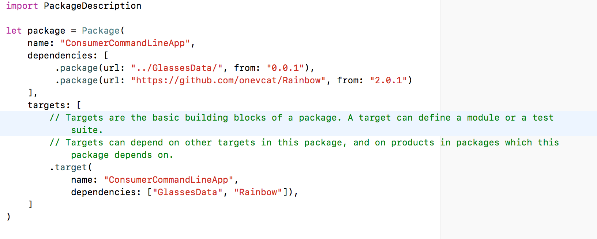
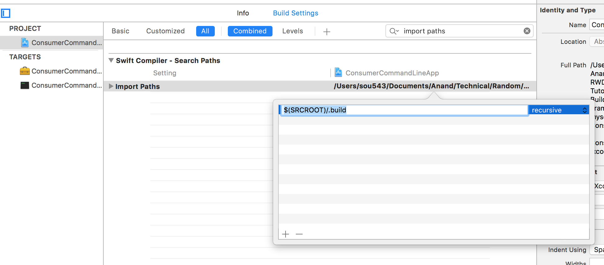

Package.swift -

The depedencies are always specified in the Package.swift file. It typically looks like this. The syntax keeps changing with each SPM release, so be aware of that.

As of now, the dependencies should be specified in each of the targets as well.

*********

Also, its probably important that in the project settings' 'Import Paths' "$(SRCROOT)/.build" recursive is specified.

I don't know why but I could run the consumer app from command line, but while building it from Xcode I kept getting the error "XYZ module" not available when I tried to import it. Even though the XYZ dependency had been build and available in .build folder.

*********

So eventually just keep in mind that code can always be extracted from other places and put in library. A basic fact, independent of what dependencies management system you use.

*********

Official documentation - [link](https://github.com/apple/swift-package-manager/tree/master/Documentation)
Posts in Swift blog - [link](https://swift.org/blog/swift-package-manager-manifest-api-redesign/)

Added an iOS target (iOS Cocoa Touch Framework)
Changed its supported platforms, info.plist
Make scheme shared
Add this dependency in cartfile of GlassesView, update it
