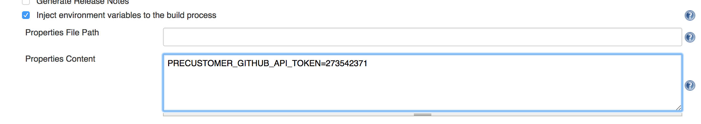
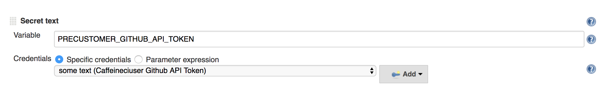
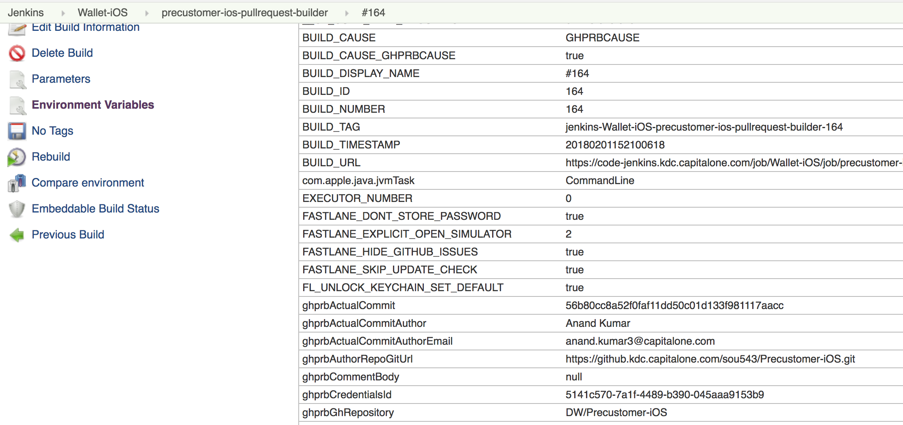

Injecting environment variables from Jenkins -

Jenkins can be used to invoke environment variables to Fastlane.

It can either be done by going to PR builder configuration -> Inject environment variables to the build process.



Or also by going to PR builder configuration -> Bindings -> Secret text. Here the value is actually coming from one level higher.



And then this variable can be used in code like this. "#{}" seems to be the syntax for string interpolation in Ruby and that's why it has been used here.

```
if ENV['PRECUSTOMER_GITHUB_API_TOKEN']
  ENV['FL_GITHUB_API_TOKEN'] = "#{ENV['PRECUSTOMER_GITHUB_API_TOKEN']}"
end
```

*****

Getting it to work with Github -

I used a custom plugin made available by the inhouse Fastlane team. And the way it works is that the below env variables need to be set.

```
FL_GITHUB_API_SERVER_URL    # Something like https://github.kdc.capitalone.com/api/v3/. Typically set in env file.
FL_GITHUB_API_TOKEN
```

And then just calling this method posts the comment. In fact it need not even be run on Jenkins and can be done locally. Its just that the Github API token should be correct. This tpken should typically be fetched from Jenkins though.

```
github_add_pr_comment(repo_name:"DW/Precustomer-iOS", comment_body: commentBody, pull_id: "PR no. such as 32")
```

Github API tokens can be generated from github itself and are of course always tied to the user that generated it.

*****

Common PR related environment variables made available by Jenkins -

Jenkins usually makes these environment variables available through PR builder for all runs of Fastfile. ([link](https://wiki.jenkins.io/display/JENKINS/GitHub+pull+request+builder+plugin#GitHubpullrequestbuilderplugin-EnvironmentVariables))

The complete list can also be seen at PR builder > Build details (the build should have already run) > Environment variables



Here are some of the common variables.
```
ghprbPullId
ghprbPullTitle
ghprbActualCommit
ghprbActualCommitAuthor
```

And then these variables can be accessed in Fastlane like this. This is just the normal Ruby syntax for accessing environment variables.

```
if ENV['ghprbPullId']
  UI.message(ENV['ghprbPullId'])
end
```
