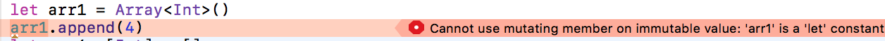
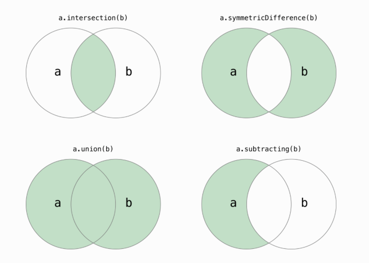

[toc]

Array, Set, Dictionary are collection types.

If it is created as var, the contents are mutable.
If it is created as let, the contents are immutable.



The collection types are value types. So what it means is that if they are assigned to another variable, actually a copy happens. This does not become a performance or memory problem as internally the system actually makes the copies only when copy is actually needed. This is called copy-on-write.

However when declared as a constant (i.e. let), be careful when contents are reference types. The data the references are pointing to may still change. Also, the contents will actually point to the same object in that case (so it will not quite be a copy of the content happening).

Using let and var makes things lot easier than how it was in ObjectiveC, where NSArray and NSMutableArray had to be used. Also they were reference types in there so even if things get assigned to each other, they would both point to same thing.

#### Array

Many ways of creating an `Array`.

###### Creating an array

```
let arr1: [Int] = []        // Shorthand type declaration
let arr2 = [Int]()          // Shorthand initialization
let arr3 = [1]              // Initialization with Array literal

let arr4 = Array<Int>()     // Full initialization
let arr5: Array<Int> = []   // Full type declaration
let arr6 = Array(repeatElement(3, count: 4))    // Initializer method repeatElement:count:
```

It is even possible to create an array with a countable range. Actually an array can be initialized this way using any `Sequence`. Oddly though even Array[1..<5] works here and is actually more often used.
```
let array = Array(1..<5)   // Creates int array with the contents of passed range.
```

###### Modifying array

```
Combining arrays - var arr7 = arr3 + arr4   
Appending an item - arr7.append(9)         
Appending an array - arr7 += arr3           
```

###### Accessing and Iterating array

Any item can be accessed using `subscripts`. The index should however exist or an exception is thrown. - `arr7[1] = 7   `

While iterating using `for-in`, the index no. can also be accessed if the iteration is done on `enumerated()` method. Then every iteration happens on a tuple with first element being index and next element being the item.
```
for (index, item) in arr7.enumerated() {
    print("Item no. \(index) is \(item)")
}
```

> Usually you actually do not need to directly work with array indices, there are so many methods to help you achieve what you want to without needing indices.

Also typically a method should only be used to do what it seems to suggest. For example, `map` should not be used to modify some other variable while browsing through the array.

###### Bridged to C, Objective-C
Swift arrays can be bridged onto C and Objective-C. What it means is that a Swift array can be passed to an API that expects an `NSArray`, etc.

Before Swift 3, there was a limitation to this and the Swift array could not have value types (as NSArray only stores objects). Few exceptions were simple value types such as Bool, Int which have an Objective-C counterpart. Hence, the elements had to be casted to AnyObject before passing onto that API. This limitation was however removed in Swift 3.

#### ArraySlice

`ArraySlice` basically presents a slice of another array. Its type is indeed `ArraySlice` and not `Array`.

It can still be accessed using all the usual array methods but if any modification needs to be done on those elements, a new array needs to be created from it first. An `ArraySlice` does not actually create the new elements by copying elements from the initial array.

```
let arr = [3,2,4]
let arrSlice = arr[1..<3] // Here the array slice is created from elements 1 to 2.

print(arr.startIndex) // Gives 0
print(arr.endIndex) // Gives 3, keep in mind that the endIndex is the index after the last index

print(type(of: arrSlice)) // Prints ArraySlice<Swift.Int>
print(arrSlice.startIndex) // Gives 1 (not 0)
print(arrSlice.endIndex) // Gives 3, keep in mind that the endIndex is the index after the last index

print(arrSlice[1]) // Gives 2
print(arrSlice[0]) // Causes crash, the slice does not have access to index 0
```

> Keep in mind that in an `ArraySlice` the elements are still accessed using their index as in the original `Array`.

#### Sets

###### Elements Must conform to Hashable protocol
A type must be hashable (i.e. must conform to `Hashable` protocol) for it to be stored in a `Set`. All of basic types are hashable. Enums with raw values too are hashable, but enums with associated values are not.

The mandatory requirements in `Hashable` protocol are `hashValue` property. It is an int that during an execution should return the same value for things that are supposed to be equal. The `Hashable` protocol actually itself inherits the `Equatable` protocol. Hence any conforming type must also implement the equals (`==`) operator. Truly speaking, equality should satisfy all these conditions and hence the implementation for `==` should match it too.

	1. a == a is always true (Relflexivity)
	2. a == b implies b == a (Symmetry)
	3. a == b and b == c implies a == c (Transitivity)

```
static func == (lhs: IntegerRef, rhs: IntegerRef) -> Bool {
```

Swift 4.2 onwards `Hashable` protocol has another mandatory requirement, i.e. `hash(into:)` method however it also provides a default implementation of it. This supposedly makes it easier to customize a type's Hashable conformance. There is also a new `Hasher` type which helps in this.

> `hash(into:)` and `Hasher` are explained in Ole's Swift 4.2 playground. Try it.

###### Creating a set
There is no set specific shorthand notation for sets, the array shorthand notation can be used instead if it is already clear in some way that it is being used for a set.

```
let set1 = Set<Int>()   // Full initialization
let set2: Set<Int> = []     // Initialization with an array literal
let set3: Set<Int> = [2, 5, 5]  // Here the duplicate 5 is automatially ignored inside the set.
var set4: Set = [3, 4]  // The element type can be omitted where it is already implied

set1.contains(3)  // Checking if an element is already there in the set.
```

`Set` itself conforms to something called `ExpressibleByArrayLiteral` protocol, which is what allows it to be initialized with array literal.

###### Set operations

`intersection(_:)` <br>
`symmetricDifference(_:)` <br>
`union(_:)` <br>
`subtracting(_:)` <br>



Actually most of set functions i.e. `intersection`, etc. are implementations of functions in `SetAlgebra` protocol.

###### Set membership and equality checks

`==` <br>
`isSubset(of:)` <br>
`isSuperset(of:)` <br>
`isStrictSubset(of:)` <br> `isStrictSuperset(of:)` - The two sets should not be identical <br>
`isDisjoint(with:)`- Checks if two sets have any elements in common

#### Dictionaries

###### Creating a dictionary

A dictionary's key must conform to `Hashable` protocol. A dictionary should not contain duplicate keys in anyway (this can happen if duplicate keys are entered during initialization itself).

`[:]` is the shorthand notation for dictionaries.

```
let dict1: [Int: String] = [:]        // Shorthand type declaration
let dict2 = [Int: String]()          // Shorthand initialization
var dict3 = [1: "One", 3: "Three"]

/* The below will throw a runtime exception.
There should not be any duplicate keys. */
let dict4 = [1: "One", 2: "Two", 2: "Two"]   
```

###### Accessing a dictionary

Subscript syntax returns an optional when used as a getter. <br>
`if let value = dict3[3] { ..`

Iteration can be done with `for-in` loop. Every element is retuned as a tuple in (key, value) format.
```
for element in dict3 {
  	print("Key - \(element.0), Value - \(element.1)")
```

###### Modifying a dictionary

To remove a value the key can either be set to `nil` or `removeValue(forKey:)` method called for it. The difference is that the method also returns the value as an optional.

If  however the values in a dictionary are of optional type and actually a key needs to have nil as its value, it can be done in any of the below ways. If however the key was not even present in the dictionary, the key is not inserted.
```
dictWithNils["Two"] = Optional(nil)
dictWithNils["Two"] = .some(nil)
dictWithNils["Two"]? = nil
```

###### Some more methods and properties
`count` <br> `isEmpty`<br> `updateValue(_:forKey:)`<br> `removeValue(_:forKey:)` <br>


`map` - Keep in mind that it returns an array and not a dictionary (however the order of this array indeterminate.) Executes the passed closure over every key, value pair and returns a new array containing the elements returned by that closure.

`mapValues` - Practical equivalent of Array `map`. Executes the passed closure over every value and returns a new dictionary containing the same keys and the new values. Available  Swift 4 onwards.

`subscript(_:default:)` - A subscript method that gives the value of the specified key if the key exists. If the key does not exist, it returns the specified default value.<br>
```
let abc = dict["keyA", default: "Default value"]
```

#### IndexSet and CharacterSet

`IndexSet` is a set of positive integer values. However its lot more efficient than working with a `Set<Int>` as it internally uses ranges wherever possible.

###### Some of the methods
`insert()` <br> `insert(integersIn:)` <br> `count` <br>
`filter`, etc.

```
indices.insert(integersIn: 1..<5)
indices.insert(18)
let evenIndices = indices.filter { $0 % 2 == 0 }
```

`CharacterSet` is a similarly efficient way to store unicode characters.


#### Range and ClosedRange

Both are separate types with Swift 3. <br>
Not a collection type per se, but is used a lot with them.

```
let range = 1..<10
let closedRange = 1...10
```

It can even be for things such as characters.
```let lowercaseLetters = Character("a")...Character("z")
```

As of Swift 3 previously possible range operators `..` , `<..` have now been decommissioned. Its now only possible to create a half-range where the upper bound is not included and closed-range where both bounds are included. <br>

To create an empty interval, a half-open range needs to be created where both the bounds are same (5..<5).
