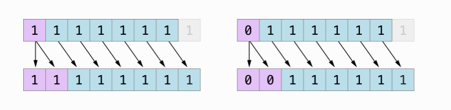
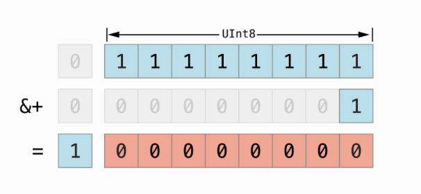

[toc]

###### Nil-coalescing operator<br>

`??`

```
a ?? b (Unwrap optional a if it is not nil, else use b)
```

They can be even be chained. Here if a is nil b is used, if b is nil c is used, and so on. <br>
`print(a ?? b ?? c ?? d ?? 0)`

###### Remainder operator

`%`


###### Bitwise operators

Writing a value in binary -
`let initialBits: UInt8 = 0b00001111` <br>
Writing a value in hexadecimal -
`let pink: UInt32 = 0xCC6699`

`~` - Bitwise NOT <br>
`&` - Bitwise AND  
`|` - Bitwise OR  
`^` - Bitwise XOR

`<<` - Bitwise left shift <br>
`>>` - Bitwise right shift

Bitwise left and right shifts have the effect of multiplying or dividing an integer by a factor of two.

```
let initialBits: UInt8 = 0b00001111
let invertedBits = ~initialBits  // equals 11110000

let shiftBits: UInt8 = 4   // 00000100 in binary
shiftBits << 1             // 00001000
shiftBits >> 2             // 00000001
```

Signed integers use their first bit (known as the sign bit) to indicate whether the integer is positive or negative. A sign bit of 0 means positive, and a sign bit of 1 means negative.

When you shift signed integers to the right, the same rules as for unsigned integers are applied, but the empty bits on the left are filled with the sign bit, rather than with a zero. This action ensures that signed integers have the same sign after they are shifted to the right, and is known as an arithmetic shift.




###### Overflow operators -

If a number is assigned to a integer constant or variable that cannot hold that value, by default Swift reports an error rather than allowing an invalid value to be created. However when an overflow condition should truncate the number of available bits, overflow operators can be used. These operators can also be used for signed integers.

`&+` - Overflow addition <br>
`&-` - Overflow subtraction <br>
`&*` - Overflow multiplication
```
var unsignedOverflow = UInt8.max
unsignedOverflow = unsignedOverflow &+ 1   // This results in 0
```



###### Operator overloading -

Classes and structures can provide their own implementation of existing operators.


Terms used when describing operators -
`binary operator`, etc.
`infix`, `prefix`, `postfix operators
precedence` (which operator operates first),
`associativity` (how operator of same precedence are grouped together, left to right or right to left)

Overloading a prefix operator (postfix is similar and for infix the specifier need not be written). <br>
Compound assignment operators `+=` (the left input parameter must be marked as inout). <br>
Implementation for equivalence operators `(==` and `!=`) can also be provided. (Custom classes and structures do not have a default implementation of the equivalence operators.)
It is not possible to overload the default assignment operator `(=)` and ternary conditional operator (a ? b : c).

```
static prefix func - (vector: Vector2D) -> Vector2D {
static func += (left: inout Vector2D, right: Vector2D) {
static func == (left: Vector2D, right: Vector2D) -> Bool {
static func != (left: Vector2D, right: Vector2D) -> Bool {
```

`Custom operators` can also be defined (there is a list of characters that are allowed as a part of the operator). They need to be declared at global level and  should be marked with `prefix`, `infix` or `postfix` modifiers.

```
prefix operator +++
static prefix func +++ (vector: inout Vector2D) -> Vector2D {
```

Custom infix operators each belong to a `precedence group`. A precedence group specifies an operator’s precedence relative to other infix operators, as well as the operator’s associativity.  

If it is not explicitly specified, then the custom operator is placed into a precedence group is given a default precedence group with a precedence immediately higher than the precedence of the ternary conditional operator. (Understand this better, how to actually define the precedence group).

```
infix operator +-: AdditionPrecedence
```

When resolving overloaded operators, the compiler always favors non-generic over generic overloads.a What this means is that if an operator has been overloaded using non-generic as well as generic functions, then unless specified clearly in some other way the compiler just choses the non-generic implementation. This is done due to some performance reason for compiler.
