[toc]

### Objective-C and Swift interoperability 

#### Calling Objective-C code from Swift

This is done using a **bridging header**.

##### Bridging Header

Its created automatically by Xcode when a new Objective-C file gets added. If not you can also create one yourself and then specify it in Build Settings. 

| Automatic prompt for bridging header creation                | Bridging header specified in Build Settings                  |
| ------------------------------------------------------------ | ------------------------------------------------------------ |
| 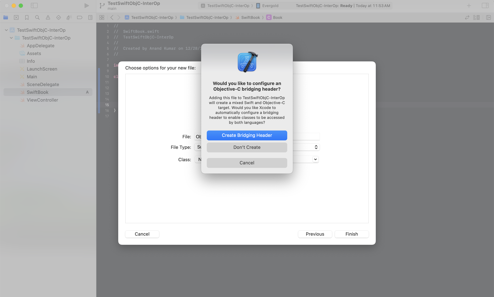 | 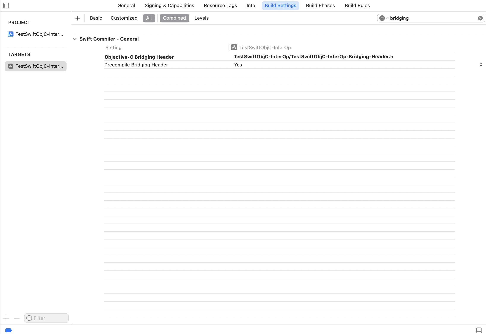 |

Every ObjC file that you want exposed to Swift should be explicitly imported in that bridging header.

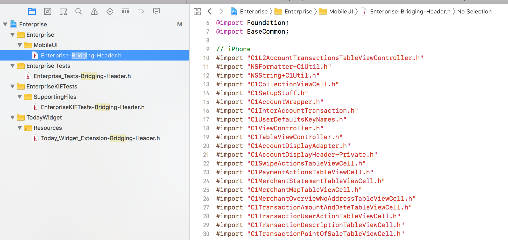

Thereafter the ObjC classes can be used in Swift, there is also no need to import any bridging-header etc. in the Swift file.

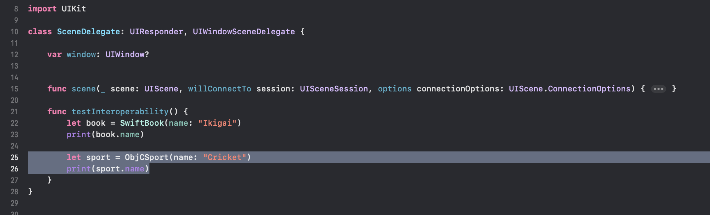

##### Objective-C annotations (NS_ASSUME_NONNULL_BEGIN, NS_AVAILABLE, etc.)

There are various annotations that exist in Objective-C which can modify how the Objective-C gets exposed to Swift. ([ChatGPT link](https://chatgpt.com/g/g-p-6934bcdfcafc819182baa9435e044320-swift-programs/c/69516291-55a8-832a-8ca0-9436d8c65829))

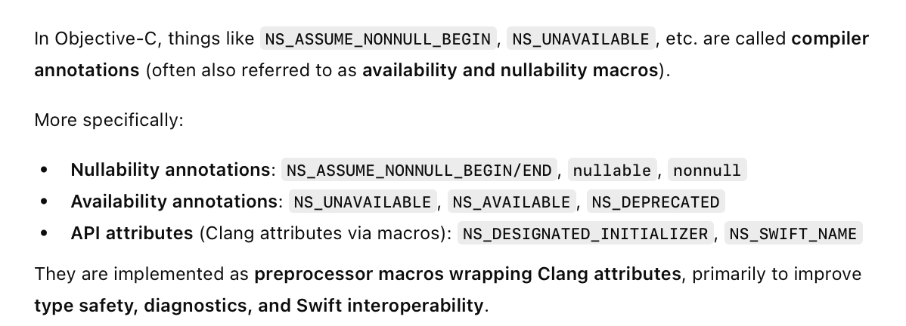

**NS_ASSUME_NONNULL_BEGIN/END** - By default, Swift gets the things exposed from Objective-C as optionals. These markers however, expose the things in between as non-optionals.

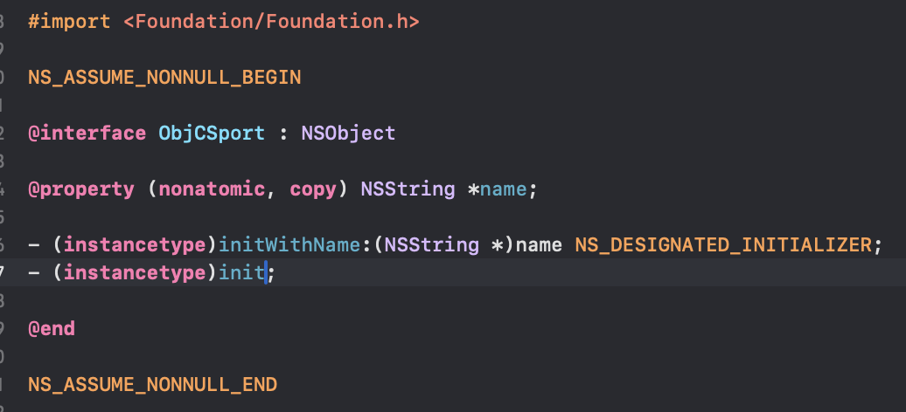

**nullable** - When any propery, method, etc. is annotated with this then it will be exposed as an optional in Swift regardless of NS_ASSUME_NONNULL_BEGIN/END it may be wrapped in.

```
@property (nullable, nonatomic, copy) NSString *name;
```

**NS_UNAVAILABLE** - When any propery, method, etc. is annotated with this then it will not be available in Swift even if the file is there in bridging header.

```	
- (instancetype)init NS_UNAVAILABLE;
```

##### Usage in libraries

There is a bit of catch as libraries/frameworks cannot have bridging headers. In their case then if some ObjC/C code has to be used in Swift, the trick is to include the ObjC/C header file in the umbrella <Target.h> file that gets created everytime a framework target is created. This is an undocumented way but it works.

> Yet to verify the limitation or the workaround.

###### The workaround (using umbrella Target.h)

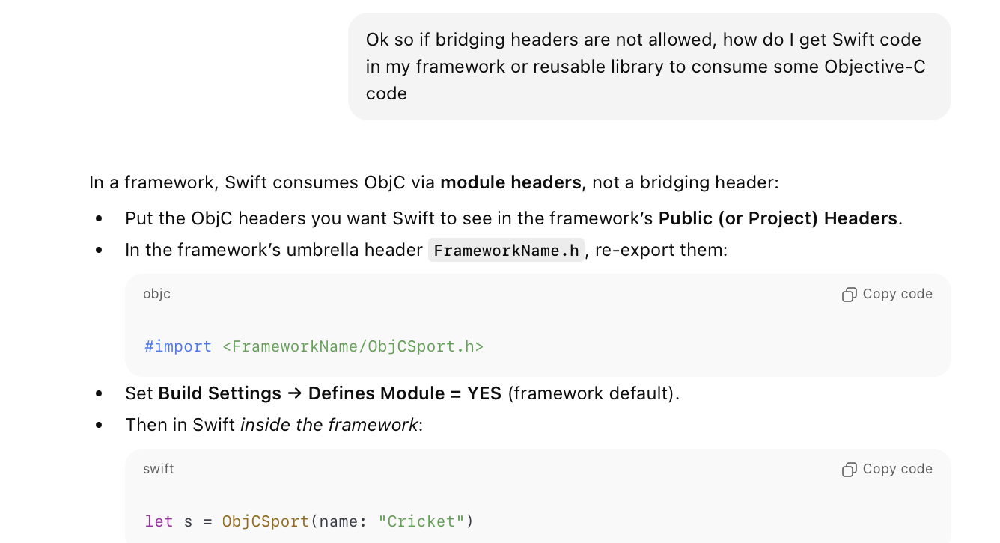

###### The limitation (why frameworks don't have bridging header)

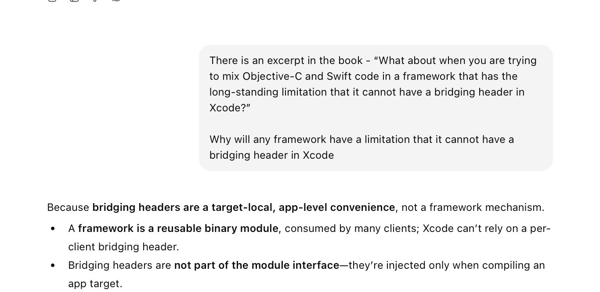

#### Calling Swift code from Objective-C

The Swift type declarations need to be attributed with @objc, etc. and then in the Objective-C file the project-Swift.h file need to be imported.

##### Swift declaration attributes (@objc, @objcMembers, etc.)

The prerequisite is for the relevant Swift element to be prefixed with **@objc**/**@obcMembers** qualifier. Now since this qualifier can be used only for `NSObject` subclasses, the element must be a class and inherit `NSObject`. (So only Swift classes can be exposed to Objective-C?)

```
@objcMembers
class UserDefaultsMigrator: NSObject {
```

If however an `objcMembers` qualifier of a type should not get applied to its extension, then the extension can be prefixed with **@nonobjc** qualifier.

```
@nonobjc extension UserDefaultsMigrator {
```

##### project-swift.h file

And then it eventually gets done by the `project-swift.h` file. This file is generated automatically but does need to be explicitly imported in the required Objective-C file. And probably this file cannot be found in Xcode's file navigator.

`#import "CardCompanion-Swift.h"`

In fact if being done in a library, the Swift element (i.e. class/struct, etc.) should also be qualified as `public`. Strangely, this seems to be necessary only in libraries and not in the app workspace itself.

Its even possible to have a different name for a Swift construct in Objective-C. This is done with `@objc(Name)` qualifier.

```
@objc(ViewControllerA)
class ViewController: UIViewController {
```
In generated Objective-C interface -
```
SWIFT_CLASS_NAMED("ViewController")
@interface ViewControllerA : UIViewController

```

#### Automatic inference by compiler

So there is a build setting called `Swift3 Objc Inference  (SWIFT_SWIFT3_OBJC_INFERENCE)` which can automatically make every internal (and above) property, function, etc. in a Swift class, etc. available to Objective-C as well (even if there is no @objC prefix to it). This was used a lot until Swift 3/Xcode 8 and was turned on by default. In Xcode 9 onwards it became `inferred` by default.

What `default` means is that `@objC` attribute will only be inferred for methods and properties that satisfy NSObject protocol requirements or those that override methods that come from Objective-C.
If its turned off though then of course even above inference would not happen.

> Should try this.

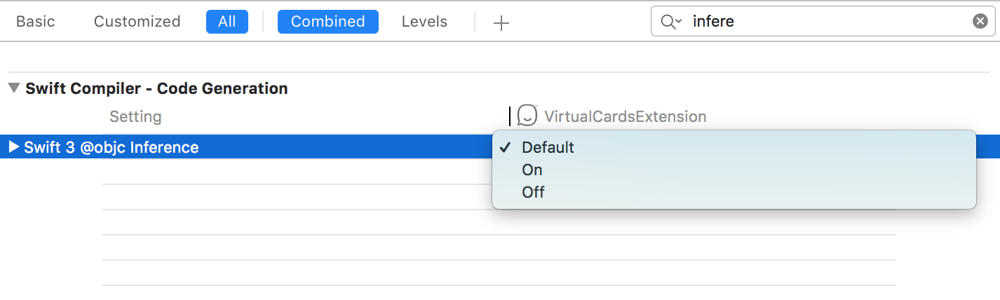

#### dynamic keyword

`dynamic` declaration modifier actually specifies that dynamic dispatch runtime should be used, instead of static or virtual dispatch.
In simpler words this modifier needs to be used whenever you want to use any Objective-C language specific feature.

For example even though Swift provides an API for KVO, it is actually done only through Objective-C behind the scenes. Hence any KVO observed property must be declared with `@objc dynamic` modifier.

Also, `dynamic` is the only way a subclass can override a superclass's method that was originally defined in an extension. The superclass's extension method should be marked as `@objc` dynamic.

`dynamic` modifier actually matters only for class members and not for structs as structs cannot be inherited and anyway only use static dispatch. Structs and enums only use static dispatch.

#### Viewing interfaces

Interesting Xcode gives ways to view public interface for Swift files, and even the equivalent interface made available to Objective-C for Swift files.

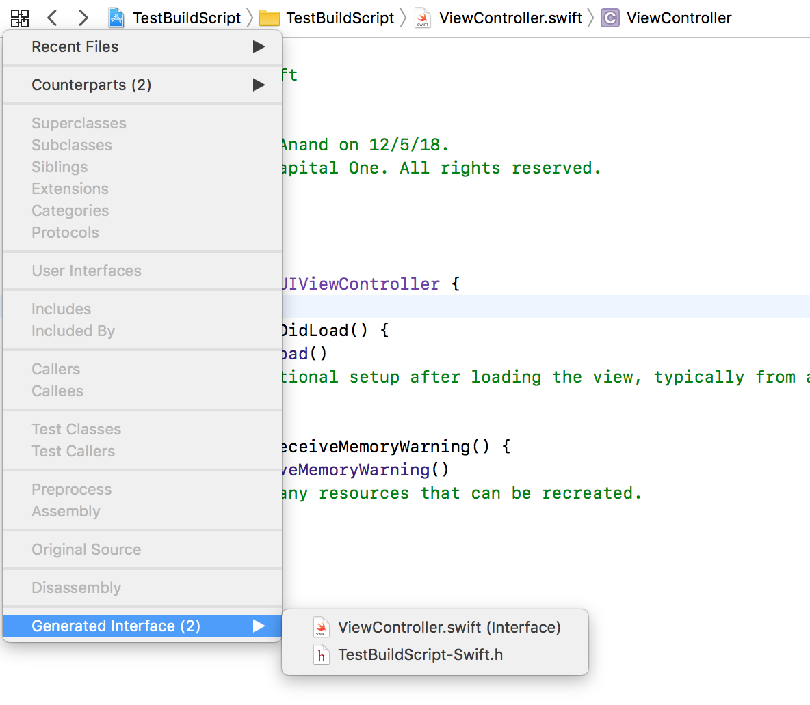

And expectedly also a way to view the Swift interface for Objective-C files.

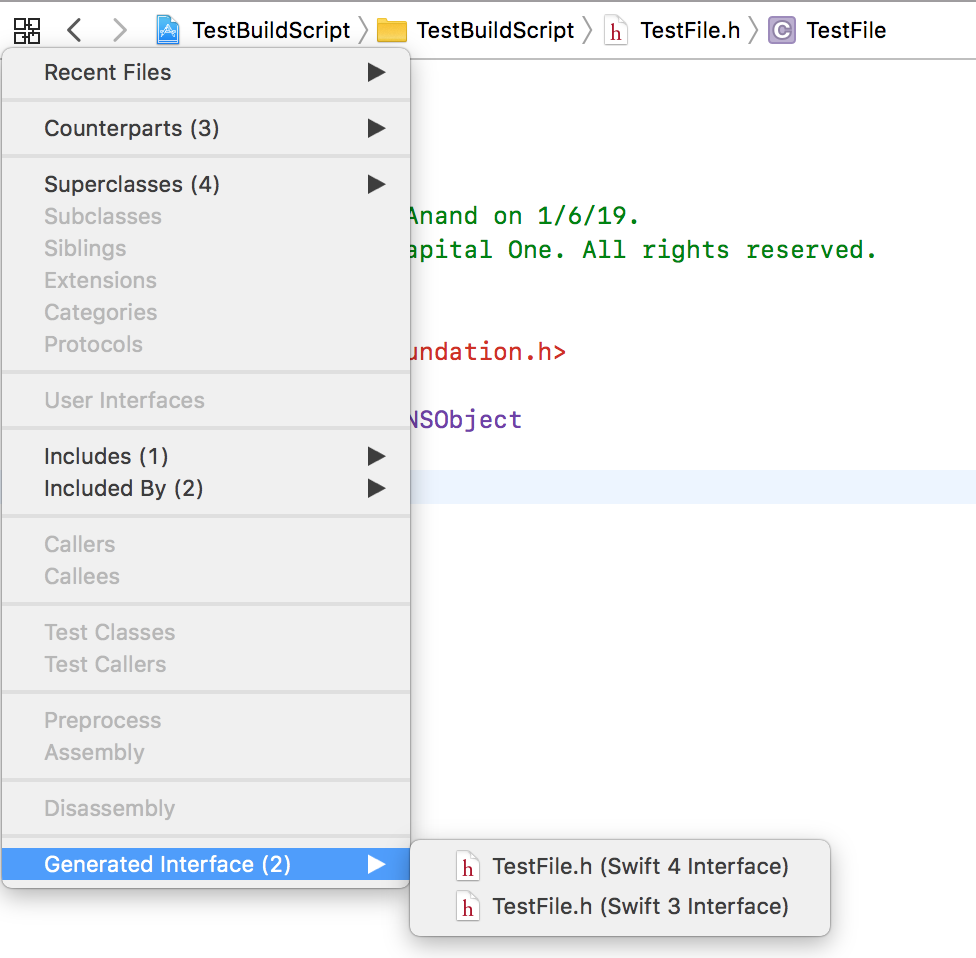

### C and Swift interoperability 

#### Calling C from Swift

Calling C code from Swift is same as calling Objective-C code. Just have the C code's .h file included in the bridging header, nothing else is needed.

| 1. C interface file                                          | 2. C implementation  file                                    |
| ------------------------------------------------------------ | ------------------------------------------------------------ |
| 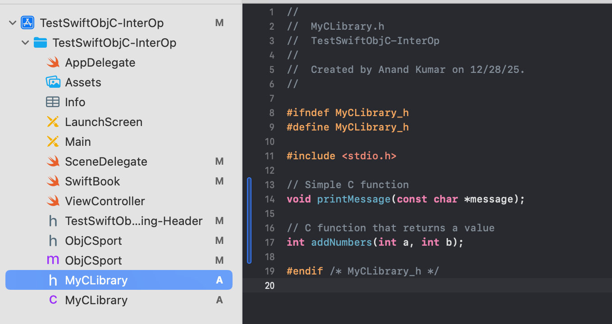 | 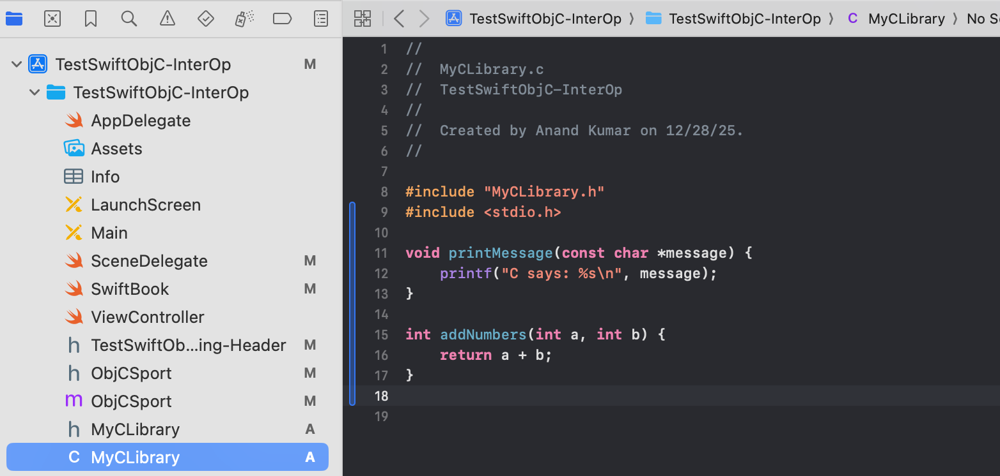 |

| 3. Include .h in bridging header                             | 4. Use C from Swift                                          |
| ------------------------------------------------------------ | ------------------------------------------------------------ |
| 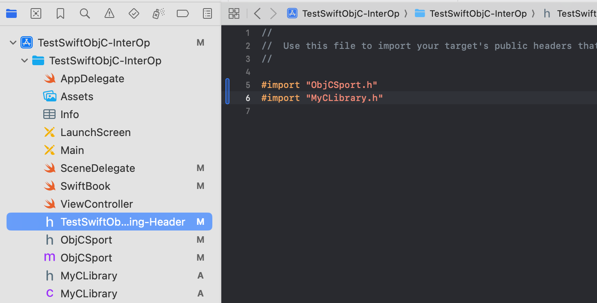 | 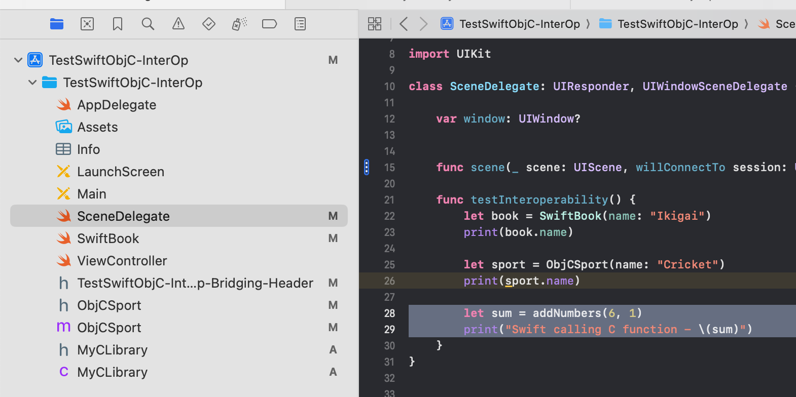 |

#### Calling Swift from C (@_cdecl)

This support does not officially exist (after all even the Swift attribute for ObjC says `@objc` and not `@c`) , however limited Swift things which are C-friendly can be exposed via the private but often-used **@_cdecl ** attribute. ([ChatGPT link](https://chatgpt.com/g/g-p-6934bcdfcafc819182baa9435e044320-swift-programs/c/69516291-55a8-832a-8ca0-9436d8c65829))

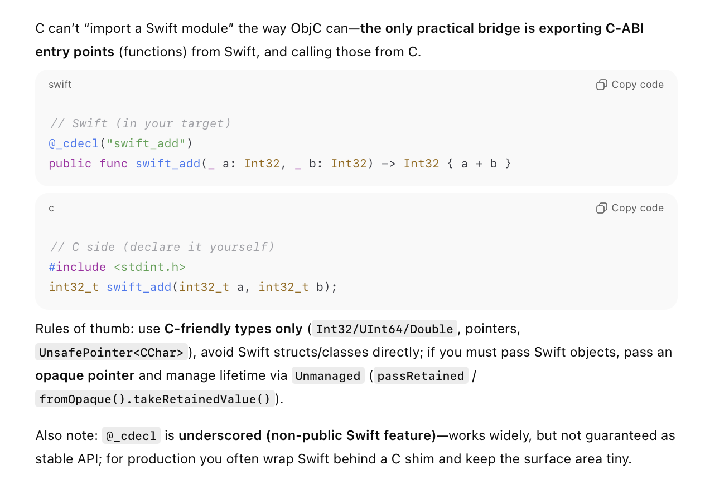


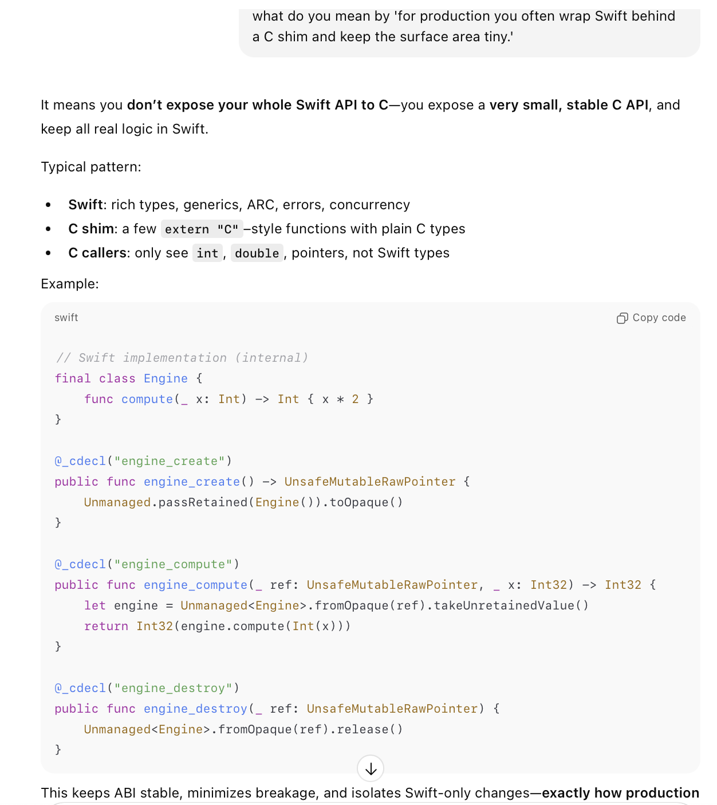

### Using @_silgen_name

It sometimes also so happens that there are some C and Objective-C functions that the system deliberately blocks from Swift or even its header file is not known, so you can put that in your briding header or even call it in the standard funcName() way. 

There is a hack that exists in such cases, they can be wraped with **@_silgen_name** attribute and the function then becomes callable. This is a private API though and is mostly useful for debugging and tooling purposes instead.

> In the below example, both `addNumbers` and `swift_getTypeName` are actual C functions that I am able to invoke from Swift even without putting their header files in the bridging header file. <br><br>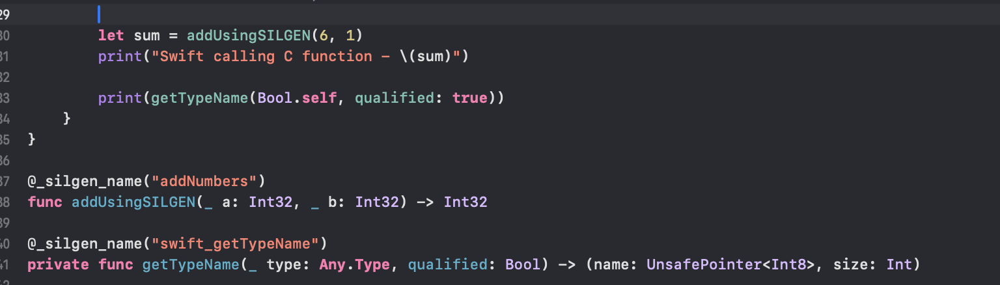


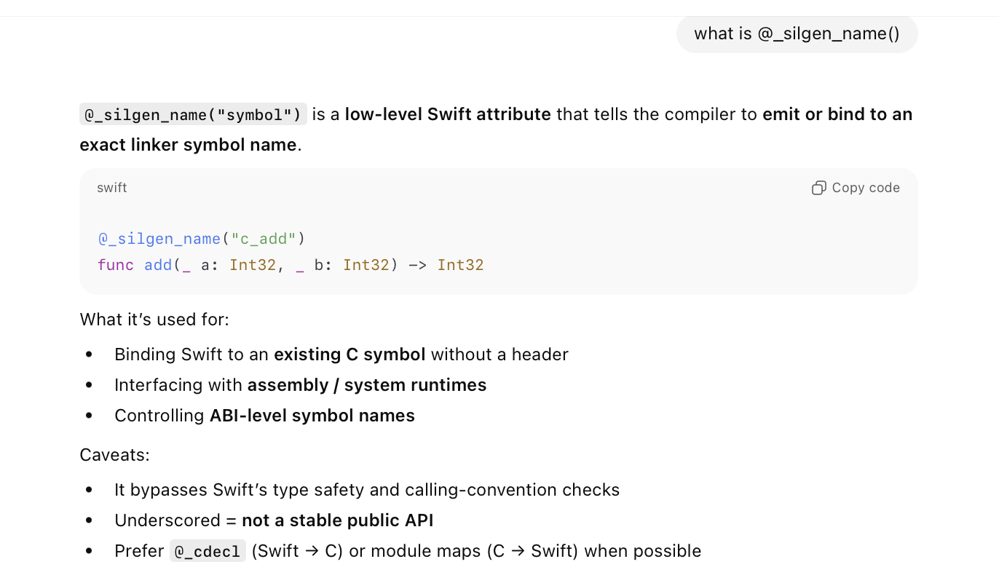


### C and Objective-C interoperability

Pure C works directly with Objective-C, nothing special is needed.

> Does Objective-C too similarly works seamlessly in C?

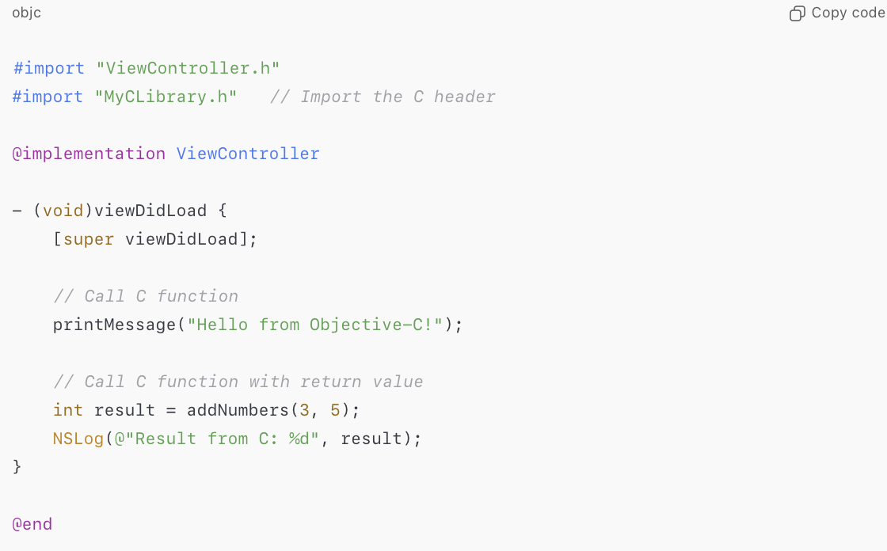

### objc/runtime.h

Clang importer (i.e. C languages' compiler front-end) always imports `<objc/runtime.h>`, its a very powerful thing that exposes a lot of runtime inspection and modification of code. It also allows changing implementation of methods at runtime (i.e. **Method Swizzling**) and that is what makes runtime code injection possible for developer tooling.

### Misc.

There are some internal nuances between how using ObjC in Swift introperability is fundamentally different from using C in Swift. The former uses ObjC runtime and dynamic dispatch, whereas the latter uses Clang modules (C compiler front-end) and imports C through module maps making the C functions/types native Swift.

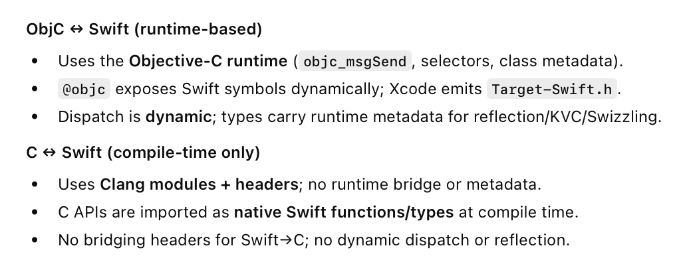

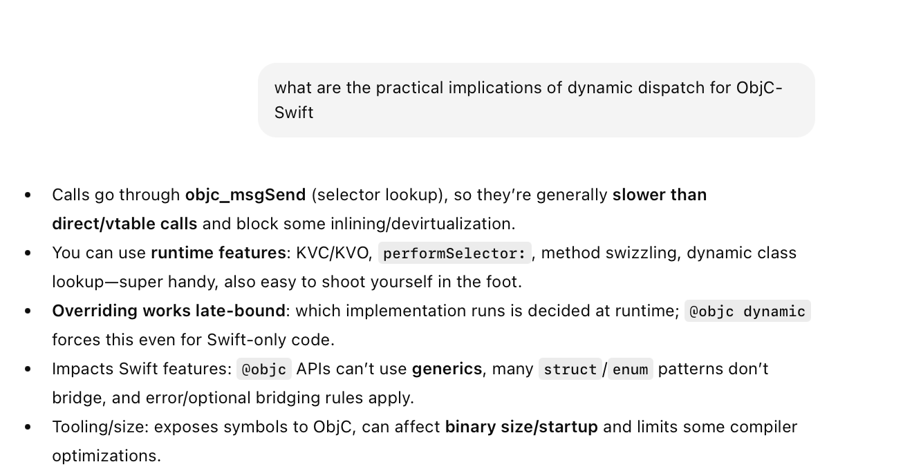

### Resources

WWDC 2020: Refine Objective-C frameworks for Swift ([link](https://developer.apple.com/videos/play/wwdc2020/10680/)) <br>Official developer reference ([link](https://developer.apple.com/documentation/Swift/objective-c-and-c-code-customization)) <br>ChatGPT [link](https://chatgpt.com/g/g-p-6934bcdfcafc819182baa9435e044320-swift-programs/c/69516291-55a8-832a-8ca0-9436d8c65829) <br>

Test project - TestSwiftObjC-InterOp <br>
