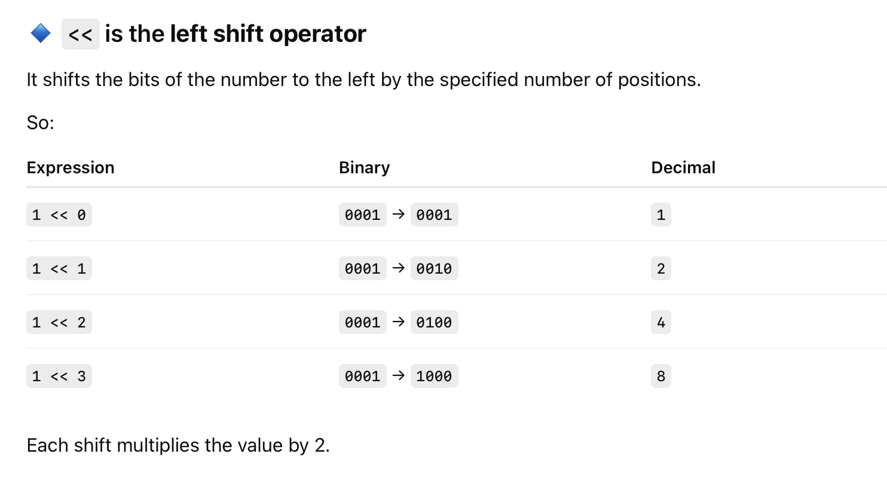
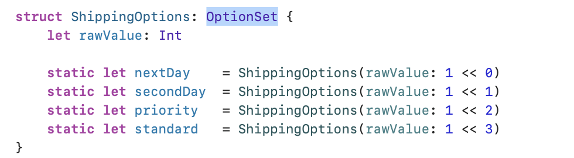
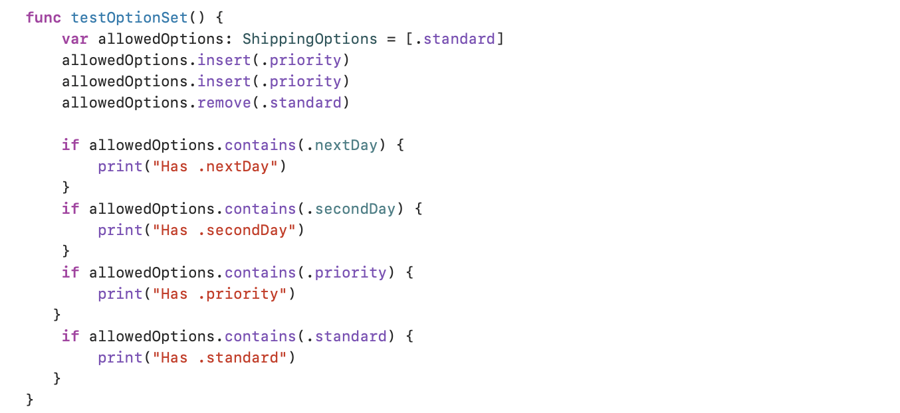

[toc]

##### Bitwise Shift operators

Simply put `x << y` shifts x left by y bits and `x >> y` shifts x right by y bits. x is invariably 1.

##### What is OptionSet

Its not a first class type per se and technically is a protocol, but its safe to think of it as a type. The idea is to bring bitwise types to Swift, the same thing can of course be done with enums, etc. but this is more efficient (when it matters).

###### Declaring a type to be OptionSet compatible

> Its likely important but upto the developer to specify the same number as the starting value for every bitwise operator.

###### And then using it

Look at how even if `shippingOptions` looks like an array because of `[]`, it technically isn't and has the type mentioned as `ShippingOptions`. And then how insert and remove functions are being used.

##### Resources

Official reference ([link](https://developer.apple.com/documentation/swift/optionset))