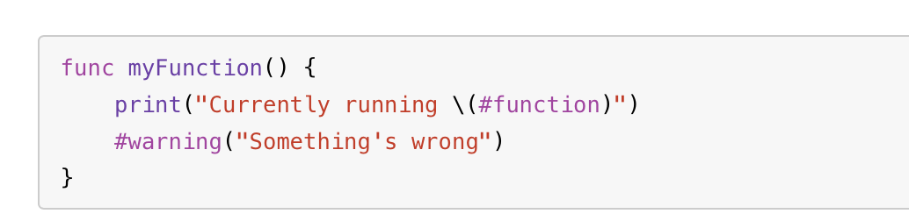
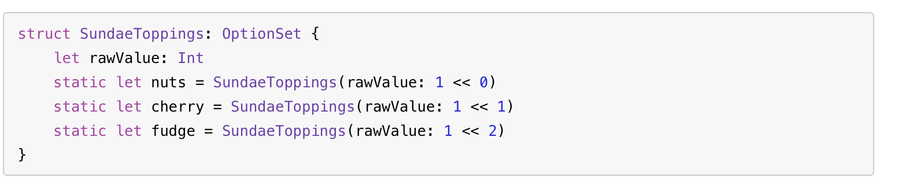
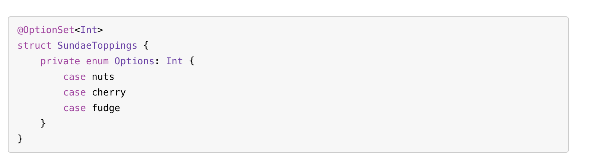
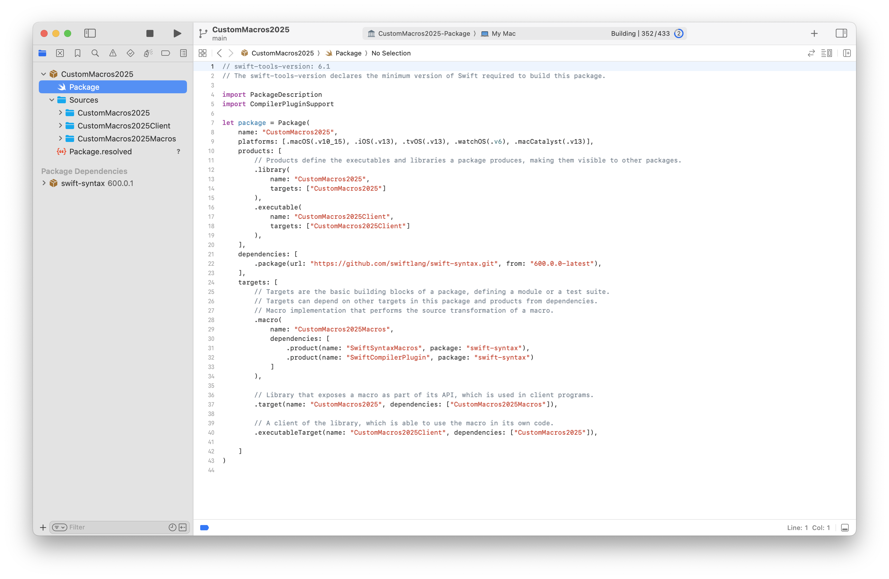
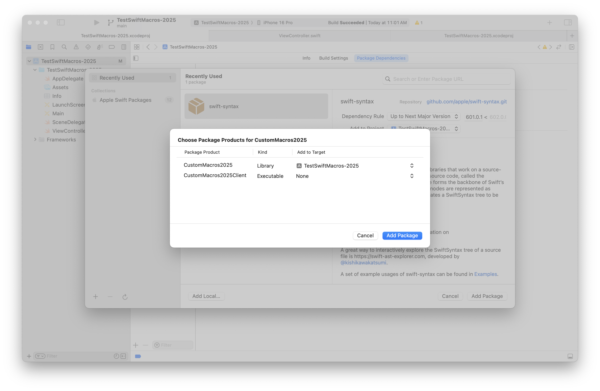

**Freestanding macro** - Appears on its own and not attached to a declaration <br>**Attached macro** - Modifies the declaration it is attached to <br>

Freestanding macros can produce a value, like `#function` does, or they can perform an action at compile time, like `#warning` does.

Freestanding macros are called using `#` and Attached macros are called using `@`.

Code that uses freestanding macros named `function` and `warning`.



| Code that doesn't use macro                                  | Code that uses an attached macro named OptionSet             |
| ------------------------------------------------------------ | ------------------------------------------------------------ |
|  |  |

Freestanding macros conventionally have lower camel case names. Attached macro's names conventionally use upper camel case.

Macros are always declared as public. Because the code that declares a macro is in a different module from code that uses that macro, there isn’t anywhere you could apply a nonpublic macro.

```swift
public macro OptionSet<RawType>() =
        #externalMacro(module: "SwiftMacros", type: "OptionSetMacro")
```

The second line uses the `externalMacro(module:type:)` macro from the Swift standard library to tell Swift where the macro’s implementation is located.

#### Creating Macros

Can be created by creating a new package and then selecting 'Swift Macro'. This automatically takes care of creating the package manifest file correctly. Alternately a new package can also be created manually but its manifest must be similar.

It imports `CompilerPluginSupport`, has `swift-syntax` as a dependency, and probably (as seen below) does need to have an executable product and macOS as a supported platform.

Programmatically, there are 3 targets - 

1. 'PackageName'Macros - The actual implementation of the macros. Type is `.macro`
2. 'PackageName' - A library that clients can import and consume, has the public interface. Type is `.target`
3. 'PackageName'Client - A sample client to test it?. Type is `.executableTarget`

If a separate test target is added, then that will be there too as a 4th target.



Add it like a normal package in the consumer project.



#### Resources

Swift evolution - Macros vision ([link](https://github.com/swiftlang/swift-evolution/blob/main/visions/macros.md)) <br>Van Der Lee article ~ 2023 ([link](https://www.avanderlee.com/swift/macros/))
