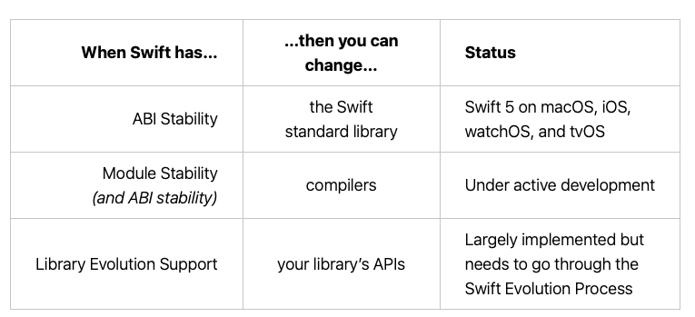
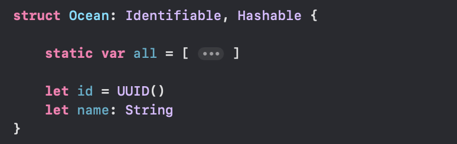

[toc]

### Language Features

#### Type safety

Swift is said to be a `type-safe` language. What it means is that it does not allow a variable of one type to be assigned a value of another type. 

> Such languages are also called `Statically typed or Static languages`. <br>Languages where type can change at runtime are called `Dynamic languages`. Python, and JS are two such dynamic languages.

#### ABI Stability, Library Evolution

(Official swift.org post [from 2019](https://www.swift.org/blog/abi-stability-and-more/), [from 2020](https://www.swift.org/blog/library-evolution/#:~:text=Module%20stability%20allows%20Swift%20modules,binary%20compatible%20with%20previous%20versions.))

`ABI` stands for `Application Binary Interface`, a binary being ABI stable means the makers assure that it will continue to work even for future versions of various platforms where it is used. It can promise so if it gurantees to follow certain standards for that platform.

As of mid-2019 👇



`Swift ABI stability` for apps was introduced with Swift 5. What it means is that an app built with one version of the Swift compiler will be able to talk to a library built with another version of Swift without there being a need to add additional runtime related code in shipped binaries. ABI stability for Apple OSes means that apps deploying to upcoming releases of those OSes will no longer need to embed the Swift standard library and “overlay” libraries within the app bundle, shrinking their download size.

ABI stability is about mixing versions of Swift at run time. As far as compile time is considered, Swift uses an opaque archive format called `swiftmodule` to describe the interface of a library. The library needs to have `module stability` so that clients can use a module without having to care what compiler it was built with. This probably happened in 2020 with Swift 5.1.

when a Swift library changes, any apps using that library have to be recompiled.  `Library evolution` support means shipping a new version of a library without having to recompile its clients. This too probably happened in 2020 with Swift 5.1.

### Advanced concepts

#### Universal `Self`

(This was proposed in [SE-0068 Expanding Swift Self to class members and value types](https://github.com/apple/swift-evolution/blob/master/proposals/0068-universal-self.md) and introduced in Swift 5.1).

If a class property is referred to using `Self` qualifier, then it refers to that property's overriden value (i.e. when the override has happened in a subclass).

```
class NetworkManager {
    class var maximumActiveRequests: Int {
        return 3
    }

    func printDebugData() {
        print("Without using Self: \(NetworkManager.maximumActiveRequests).") // 3
        print("Using Self: \(Self.maximumActiveRequests).")  // 4
    }
}

class ImprovedNetworkManager: NetworkManager {
    override class var maximumActiveRequests: Int {
        return 4
    }
}

ImprovedNetworkManager().printDebugData()   // Prints 3 then 4
```


#### Resilient Types

> When debugging Swift code on Apple platforms, variables with `resilient types` (including Foundation value types such as URL, URLComponents, Notification, IndexPath, Decimal, Data, Date, Global, Measurement, and UUID) are displayed in the Xcode variable view and the frame variable / v command again.
>
> What are they ☝️?

### Misc.

#### Result type

(This is available from Swift 5.0).

```
enum Result<Success, Failure> where Failure : Error {
  case success(Success)
  case failure(Failure)  
}
```

`init(catching: () -> Success)` - Creates a new Result by running the passes closure. Returned value is treated as success case, and any thrown error is treated as failure case.

```
let xyz = Result<String, PlaceholderError> {
    if Bool.random() {
        return "All nice"
    } else {
        throw PlaceholderError()
    }
}
```

`get()`- Returns the value in case of success, else throws an error.

`map()`, `mapError()`, `flaMap()`, `flatMapError()` - Maps (and flattens by one level of unwrap) the success, error.

#### Boolean

`toggle()` is a mutating function for boolean.

#### Nested types

Its possible to define types within other types (nested types). And they can be accessed outside the context they are defined in, by using dot notation.

```
struct Struct1 {
    enum EnumA: Character {
        case ..
    }
    let property1: EnumA, ..
```

In fact until 3.0, it was not possible to create nested types in generic types. But 3.1 onwards it is, in fact even the nested type itself can make use of the generic placeholder.

```
class Class1<T> {
	let a: Int

	class Class2<T> {
```

Its even possible to have functions defined inside functions, i.e. `Local Functions`. However until Swift 5.4, it was not possible to have multiple local functions with the same name (but different argument types/signatures, i.e. function overloading) in the same scope. Its been addressed since.

#### Various protocols

`ErrorType` (has no requirement) <br>
`Equatable` ( == ) <br>
`Comparable` (inherits `Equatable` and has `<` requirement too) <br>
`Hashable` (`hashValue`, `hash(into:)`) <br>
`Sequence` (provides iteration requirements) <br>
`Collection` (inherits Sequence and has index and non-destructive requirements) <br>

Not every type in Swift can be compared with equal to operator (`==`). However there is a protocol called `Equatable`, which requires its conforming types to implement the == and != operators.

##### Hashable

If a custom type needs to be made `Hashable` conformant, it needs to have implementations `hash(into: inout Hasher)`. It also needs `hashValue: Int` property implementation but that has now been deprecated. <br>
(This was proposed in [SE-026 Hashable Enhancements](https://github.com/apple/swift-evolution/blob/master/proposals/0206-hashable-enhancements.md) and implemented in Swift 4.2.)

`hash(into: inout Hasher)` is easier to implement than the previous `hashValue` property. The argument is an inout `Hasher` object. Inside the function `hasher.combine()` can be called for each of the type properties.

```
struct Point {
    var x: Int
    var y: Int
}
extension Point: Hashable {
    func hash(into hasher: inout Hasher) {
        hasher.combine(x)
        hasher.combine(y)
    }
}
```

> Understand `hash(into: inout Hasher)` better. Explained in Ole's 4.2 playground.

##### Identifiable

It denotes types that can hold a value for stable identity (i.e. the value is guranteed to not change no matter what). [Reference](https://developer.apple.com/documentation/swift/identifiable)

Its only requirement is an **id** property and teh simplest way to get any type to conform it is to simply add an id property to it and assign it a `UUID()` ([reference](https://developer.apple.com/documentation/foundation/uuid)).



##### Failable initializers for numeric types

3.1 includes a bunch of failable initializers for numeric types.

`init?(exactly value: Int8)` <br>
`init?(exactly value: Float)`
...

For example, this will fail if `x` is 6.3 but succeed if `x` is 6.0

```
let a = Int(exactly: x)
```

#### Generating random values

It's pretty easy since Swift 4.2.

All number types now have a `random(in:)` method that takes in a range.

```
Int.random(in: 1...1000)
UInt8.random(in: .min ... .max)
Double.random(in: 0..<1)
```

There is more.

```
Bool.random()
collection1.random()!  // Returns optional, as it can be nil if collection is empty
```

`Collection` has a function called `randomElement()`.
Also, `Sequence` has functions called `shuffled()` (for non-mutable sequences) and `shuffle()` (for mutable sequences).

In fact there is even a protocol called `RandomNumberGenerator` which can now be conformed to if a type wishes to provide its own modified behavior of random(). It probably has a next() function. Also, the default system random generator is `SystemRandomNumberGenerator`.

> Need to try `RandomNumberGenerator`.

#### Accessing underlying contents through unsafe pointers

```
withUnsafeBufferPointer
withUnsafeMutableBufferPointer
withUnsafeBytes
withUnsafeMutableBytes
```

Tuples too can be compared (using <, > operators) if their values allow comparison to happen. Tuples are compared from left to right, one value at a time, until the comparison finds two values that aren’t equal. Int and String can be compared (i.e. < or >), but Bool cannot be.

#### Sundries

Getting a Date from unix format  timestamp - <br>
It is as simple as this. Unix timestamp are formats like 181481901.

```
Date.init(timeIntervalSince1970: unixTimestamp)
```

Restricting a property's value to a range -

```
public var imageQuality: CGFloat = 0.9 {
    didSet {
        if imageQuality > 1.0 { imageQuality = 1.0 }
        else if imageQuality < 0 { imageQuality = 0 }
    }
}
```

#### Integer and other data types

`Int` has a method called `isMultiple(of:)` to check if a number is a multiple of some smaller number.

--------


> Swift.org Protocols write-up, Protocols composition

> The `New integer protocols` page in Ole Begemman's Swift 4 playground

>  `@usableFromInline` attributes in Swift 4.2. Ole's playground.

> MemoryLayout offset(of:) introduced in Swift 4.2
