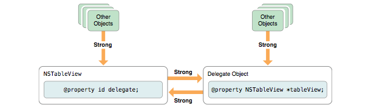
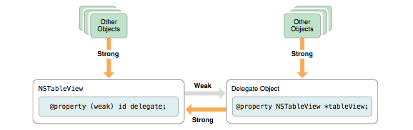

[toc]

#### Classes and Objects

In very simple words, a class is a struct which can have methods in it too. It packages data (instance variables/properties) with behavior (methods). The declaration (or the api) of a class is mentioned in its interface (.h, i.e. header file) and the definition is provided in its implementation (.m file).

When one class inherits from another class, all the properties and methods get inherited. In general, instance variables are internal to an object and can be accessed only through its methods (though using inheritance, subclasses can be given direct access to the instance variables) as methods have automatic access to the instance variables of their class.

Most of the built-in classes eventually inherit from the root class NSObject. While creating a simple custom class as well, it is usually created as a child class of NSObject.

A sample custom class interface - (It inherits from `NSObject`)

```
@interface SuperClass : NSObject

@property (nonatomic, strong) NSString *variableA1;
@property (nonatomic, copy) NSString *variableX1;
@property int index;

@end
```

Creating an object from a class can be as simple as this. (All objects are C pointers.)

```
SuperClass *obj = [[SuperClass alloc] init];
```

Some classes (such as `NSString`, `NSNumber`) define objects that are immutable, i.e. their internal contents must be set when they are created and cannot be changed later on. Some of these immutable classes also offer a mutable version (such as `NSMutableString`), which then obviously allow the internal contents to be changed. Often the mutable class inherits from the immutable class.

Class names must be unique within an app, even across included libraries to frameworks. Hence, it is advisable to prefix names of custom classes with a 3 letter acronym.

A file such as a .h file is made available to other files using `#import` pre-processor directive.
```
#import "SuperClass.h"
```

#### Properties

A property need not necessarily be an object and can also be a simple C type such as `int`, `float`, `char`, `etc`.

Property attributes are specified inside parentheses after the `@property` directive.

Xcode 4.4 onwards, all properties are automatically synthesized and hence there is no need to write the `@synthesize` directive for them. By default, the accessor methods have the names `propertyName` for getter (`isPropertyName` in case of booleans) and `setPropertyName` for setter.


###### Property attributes

`readonly` - Indicates that it is a readonly property and does not have any setter. (default is `readwrite`)

`setter=`, `getter=` - To specify a different name for the accessor methods.

`atomic` - To specify that the value is always retrieved fully by the getter method and set fully by the setter method, even if the accessors are called simultaneously from different threads. The internal implementation and synchronization of atomic accessors is private and the compiler does not allows to combine a synthesized accessor with another custom accessor for a atomic property. Also, properties are atomic by default.

`nonatomic` - The opposite of atomic. Indicates that the synthesized accessors will get or set the value directly with no concerns about what happens if the same value is accessed directly from different threads. Hence, a nonatomic property is faster to work with than atomic property and its also fine to combine nonatomic accessors.

`strong` and `weak` - When an object A depends on another object B and hence that other object B cannot be released (because object A may access object B), the object A is said to have a strong reference to object B.

`copy` - To specify that a copy of the referenced object should be created during an assignment and used by the reference. This ensures that even if the referenced object changes later on, it does not affect the reference. It uses strong attribute by default. If a copy property's instance variable is set directly, for example in an initializer method, a copy of the original object must be set. Any object that intends to use the `copy` attribute, must conform to `NSCopying` protocol.
```
_instanceVar = [passedObj copy];
```


#### Reference Cycles

An object is kept alive as long as it has at least one strong reference from another object.

By default, both properties and variables maintain strong reference to other objects. This usually works well for one-way relationship between objects but can cause issues when a group of objects is connected by a circle of strong relationships and thereby creating strong reference cycles.



The strong reference cycles can be solved by using a `weak` reference for one of them instead of `strong` reference. A weak reference does not imply ownership between two objects and does not keep an object alive.

For example, in the below illustration when the other objects are released and only the table view and delegate objects remain, the delegate object will be deallocated as there are no more strong references to it. And once the delegate object is deallocated, the table view object will also be deallocated.



The concept of strong and weak pointers applies to local-scope variables too and not just properties and their ivars.
Hence, an assignment like below will create a strong reference between `date` and `self.originalDate`.
```
NSDate *date = self.originalDate;
```

If for any reason a variable must not maintain a strong reference, it can be declared as `__weak`.

```
NSDate __weak *date = self.originalDate;
```

Hence, in such a case `self.originalDate` will be deallocated when there are no other strong references to it. However, this obviously also means that the referenced object (`self.originalDate`) has been deallocated while the reference (`date`) may still be in use. So to avoid such a situation of dangling pointer, the reference is automatically set to nil when the referenced object is deallocated.

###### Some best practices while using weak properties

1. Below situations must be avoided as the newly allocated object has no strong reference to it and is immediately deallocated and the reference set to nil.
```
NSObject *obj = [[NSObject alloc] init];
```

2. If a weak property or variable is being used too often, it is better to cache it in a strong variable at the beginning so that the referenced object stays in memory for the required time.
```
NSObject *cachedObject = self.weakProperty;
[cachedObject doSomething];
..
[cachedObject doSomethingElse];
```

3. Before using a weak property it must be checked that it is not nil and here too it must be used by creating a strong cached object first as in a multi-threaded environment the referenced object may get deallocated anytime.

weak references cannot be used for `NSTextView`, `NSFont` and `NSColorSpace`. For them, unsafe references (`unsafe_unretained`, `__unsafe_unretained`) need to be used instead. An unsafe reference is similar to a weak reference, but it would not be set to nil when the referenced object is deallocated and thereby a dangling pointer will result. Sending a message to a dangling pointer results in a crash.

Outlets are usually declared as `weak`.

#### Misc.

Dot syntax on objects is just a convenient way of calling the accessor methods of its properties.

By default, all readwrite properties (not readonly ones?) are backed up by instance variables and the instance variables have the same name as the properties but with a preceding underscore sign.

Although the instance variables can be accessed directly in the methods, it is better to use accessor methods or the dot notation (apart from in the initialization and accessor methods).

The instance variables name can be customized by specifying it with the `@synthesize` directive.
```
@synthesize variableX1 = varX1;
```

Usually there are properties whenever there is any data to be tracked. However, if there just needs to be instance variables and no properties, the instance variables can be declared in curly braces in the `@interface` block.

```
@interface SuperClass : NSObject {
     NSString *_nonPropertyInstanceVariable;
}
..
```


Custom accessor methods often have the below pattern in them. It delays the initialization unless the instance variable is actually needed.
```
if (!_instanceVariable) {
     _instanceVariable = [[ClassA alloc] init];
}
```


###### Class Objects

Classes themselves are actually objects known as class objects. They however do not have any instance variables and just have methods. The class objects know how to create new instances of the class when requested.
Link http://www.sealiesoftware.com/blog/archive/2009/04/14/objc_explain_Classes_and_metaclasses.html

###### Stack and Heap allocation

A local variable (which is not an object itself) is stored on `stack`.
An object is always stored on `heap`. This is because the data represented by objects often need to stay in the memory for longer than the variables used to keep track of them.

#### Toll free bridging

Many data types in `CoreFoundation` and `Foundation` can be used interchangeably, i.e. they can be type casted to each other quite easily. This is known as toll-free bridging.

Using a Foundation object as a Core foundation data type:
```
NSLocale *gbNSLocale = [[NSLocale alloc] initWithLocaleIdentifier:@"en_GB"];
CFLocaleRef gbCFLocale = (CFLocaleRef) gbNSLocale;
```

Using a Core Foundation data type as a Foundation object:
```
CFLocaleRef myCFLocale = CFLocaleCopyCurrent();
NSLocale * myNSLocale = (NSLocale *) myCFLocale;
```

Although most of the data types are toll-free bridged (such as `NSArray`-`CFArrayRef`, `NSData`-`CFDataRef`, `NSNumber`-`CFNumberRef`, `NSURL`-`CFURLRef`), not all are. <br><br>
`NSBundle`-`CFBundle`, `NSRunLoop`-`CFRunLoop`, `NSDateFormatter`-`CFDateFormatter` are not toll-free bridged.
