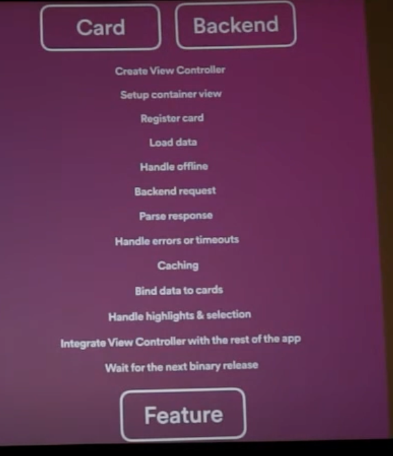
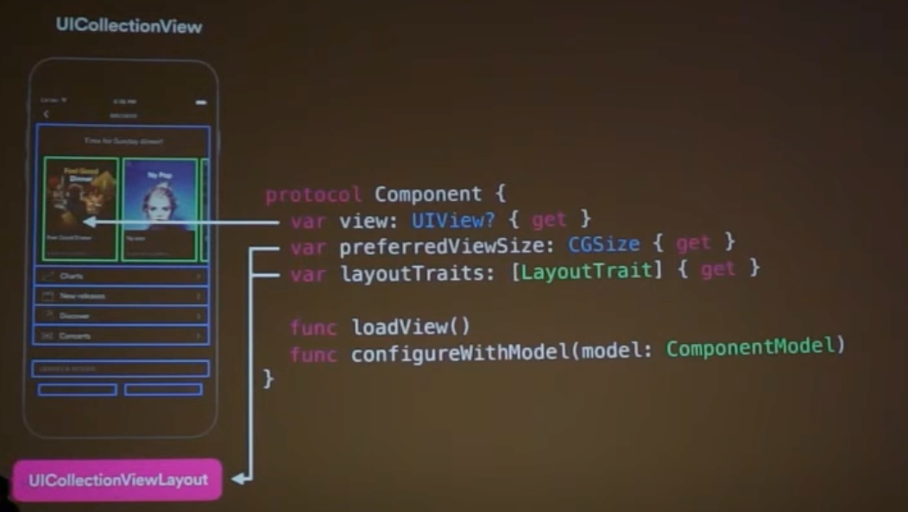
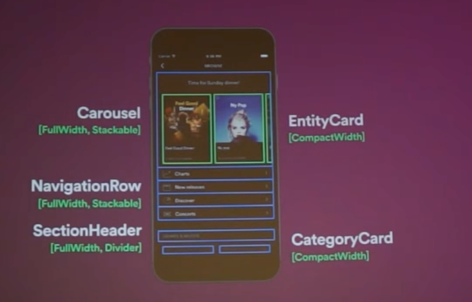

[toc]

[~May 2025] In the landscape of mobile development (esp. iOS), all of the videos that I have seen so far clearly indicate that all of this SDUI in mobile at the heart of it is still just more and more of the UI layout attributes coming from APIs, that's it. Nothing magical, its not like you'd develop and build view controllers in a remote server and somehow send that binary to devices through an API. 

So its all a matter of how well an API spec you can develop for the layouts. 

[~June 2025] Well there is the evaluat-able JS coming from server that makes it more interesting. So the API sometimes responds with JS script string in some fields (like isXYZVisible), and on client side some runtime variables can be added to it, and the JS run with the response handed to mobile and then used for the layout attribute. FWIW, the JS can even modify native code's entities if needed. So this can help reduce the orchestration needed by API (as some data may already be available in mobile).

FWIW, even user interactions can run some specific functions in native, and that mapping comes from JS. Having user interactions too run JS is supposed to be unsafe and hence inadvised.

##### Learnings from Spotify video

Some screenshots from the Spotify video below.

The kind of things that get done on client side codebase (for a collection view controller), the more here that can be cetralized into lesser source code files and then have its instanced be fetched from API the better.

| Client-side interface of a 'Component'           | A hierarchy of components in a view controller   |
| ------------------------------------------------ | ------------------------------------------------ |
|  |  |

They tried to move a lot of the specs and attributes to server, even precise layout margings but eventually decided against it and made it more generic (like fullWith, leftLeaning, etc.). 

For this to truly succeed at a large scale workplace, in my opinion there needs to be one -  1. Sufficient comprehensive in the elementary UI components library, 2. The UI components to be sufficient such that they can fully for a screen along with its interactions, 3. Ways for sufficient federation so that different teams can fully own and merge their own client and server side codebases.

##### Links

Mohammad Azam talk with BrightDigit ([Link](https://www.youtube.com/watch?v=z5JTfzBX4WM&t=534s))  [2023]  Mohammad Azam Coursera course ([Link](https://capitalone.udemy.com/course/introduction-to-server-driven-ui-in-ios-swift-swiftui/learn/lecture/31109816#overview))  SDUI Basics ApolloGraphQL ([Link](https://www.apollographql.com/docs/technotes/TN0032-sdui-basics/#adopt-sdui-incrementally))  

SDUI at Lyft Medium article ([Link](https://eng.lyft.com/the-journey-to-server-driven-ui-at-lyft-bikes-and-scooters-c19264a0378e))  [2023]  SDUI at Airbnb medium article ([Link](https://medium.com/airbnb-engineering/a-deep-dive-into-airbnbs-server-driven-ui-system-842244c5f5)) [2021]  SDUI at Spotify talk ([Link](https://www.youtube.com/watch?v=vuCfKjOwZdU)) [~2017]  