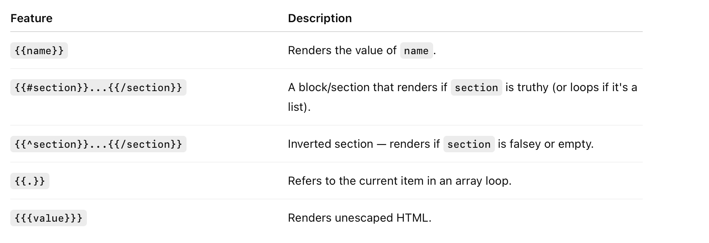

[toc]

##### Resources

Official reference ([link](https://mustache.github.io)) <br>JS library ([link](https://github.com/janl/mustache.js)) <br>NSHispter JavaScriptCore article ([link](https://nshipster.com/javascriptcore/#showing-off-with-mustache)) <br>

Test code - TestSDUI  (`testMustache()` function there)

##### What is Mustache

So the textbook definition of [Mustache](https://mustache.github.io) is that it is a **logic-less templating language**, with implementations in many languages. Parctically, what it means is that a certain DSL like template can be defined and then the Mustache function fed that template along with some data, and it will generate the desired string.

##### Syntax

The full official syntax is [here](https://mustache.github.io/mustache.5.html), but here are some of the basics (from ChatGPT). Things get encapsulated in ``.



> The reason its called logic-less is that the templates itself do not contain logic like if, else, or for loops in the traditional programming sense.

So for example, if I have a template such as this

```
{{#people}}
{{fullName}}, born {{birthYear}}
{{/people}}
```

Then for a JSON sourced data such as this

```swift
[
    { "first": "Grace", "last": "Hopper", "year": 1906 },
    { "first": "Ada", "last": "Lovelace", "year": 1815 },
    { "first": "Margaret", "last": "Hamilton", "year": 1936 }
]
```

which then gets represented in code as 

```swift
@objc public class Person : NSObject, PersonJSExports {
    // properties must be declared as `dynamic`
    public dynamic var firstName: String
    public dynamic var lastName: String
    public dynamic var birthYear: NSNumber?
  
    public var fullName: String {
        return "\(firstName) \(lastName)"
    }
}

// Person array generated and assigned to `people` variable here
let people = loadPeopleJSFunction.call(withArguments: [peopleDataJson])?.toArray()
```

The Mustache engine when run will generate the below string

```swift
Grace Hopper, born 1906
Ada Lovelace, born 1815
Margaret Hamilton, born 1936
```

##### How to use it in JS from native Swift code

A sample implementation exists in NSHispter JavaScriptCore article ([article link](https://nshipster.com/javascriptcore/#showing-off-with-mustache), [GH link](https://github.com/NSHipster/JavaScriptCore-JSExport-Example/blob/master/JavaScriptCore%20Exports%20Example.playground/Contents.swift)). 

> First, in JS populate the variables that will have data.

```swift
let context = JSContext()!

// In JS, Have the key Person represent a type
context.setObject(Person.self, forKeyedSubscript: "Person" as NSString)

// In JS, define a function named loadPeople(), that takes in a JSON and returns an array of Person objects mapped from the JSON.
context.evaluateScript(#"""
function loadPeople(json) {
    return JSON.parse(json)
               .map((attributes) => {
        let person = Person.createWithFirstNameLastName(
            attributes.first,
            attributes.last
        );
        person.birthYear = attributes.year;

        return person;
    });
}
"""#)
                       
// Pass a JSON data, call the loadPeople JS function using that and get the Person array in native
let peopleDataJson = """
[
    { "first": "Grace", "last": "Hopper", "year": 1906 },
    { "first": "Ada", "last": "Lovelace", "year": 1815 },
    { "first": "Margaret", "last": "Hamilton", "year": 1936 }
]
"""

guard let loadPeopleJSFunction = context.objectForKeyedSubscript("loadPeople"),
      let people = loadPeopleJSFunction.call(withArguments: [peopleDataJson])?.toArray()
else {
    return
}

print(people.compactMap{($0 as? Person)?.fullName})
```

> Then, load the mustache object from `mustache.js`.

```swift
// In JS, load and define all the functions from mustache.js
guard let url = Bundle.main.url(forResource: "mustache", withExtension: "js") else { return }
context.evaluateScript(try! String(contentsOf: url, encoding: .utf8), withSourceURL: url)

```

> Then, define the mustache template to use

```swift
// Define the mustache template
let template = """
{{#people}}
{{fullName}}, born {{birthYear}}
{{/people}}
"""
```

> And then render function in Mustache object, pass it the people array and get the output string as per the mustache template

```swift
let result = context.objectForKeyedSubscript("Mustache")
                    .objectForKeyedSubscript("render")
                    .call(withArguments: [template, ["people": people]])!

print(result)

/*
Prints
Grace Hopper, born 1906
Ada Lovelace, born 1815
Margaret Hamilton, born 1936
*/
```

