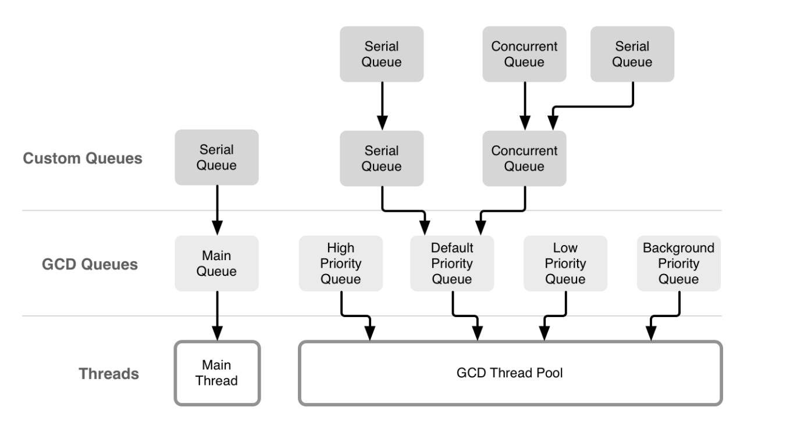
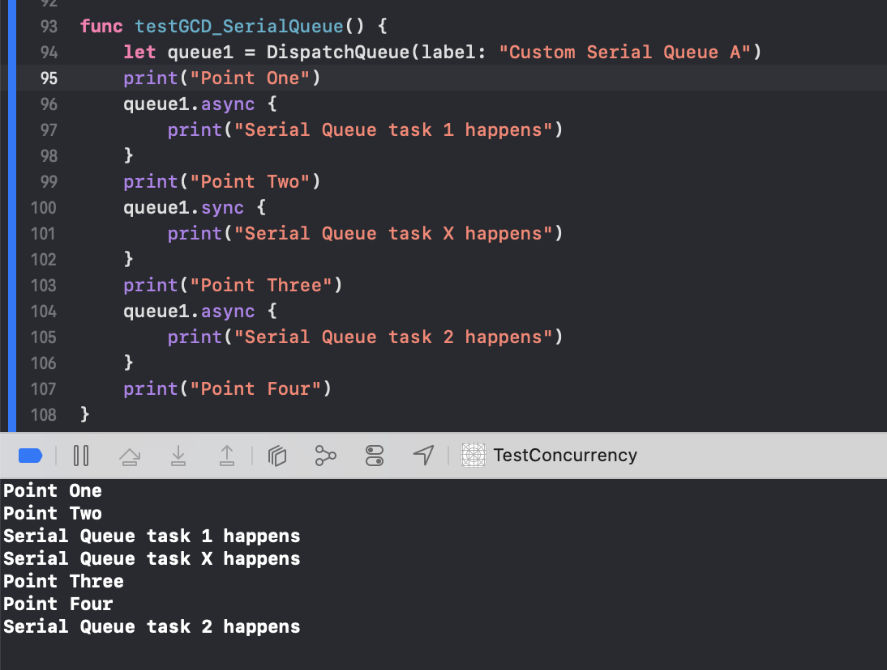
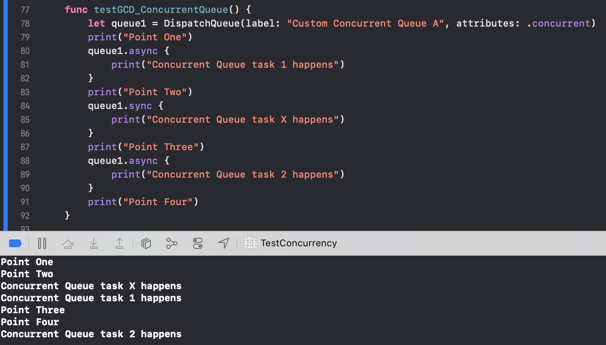
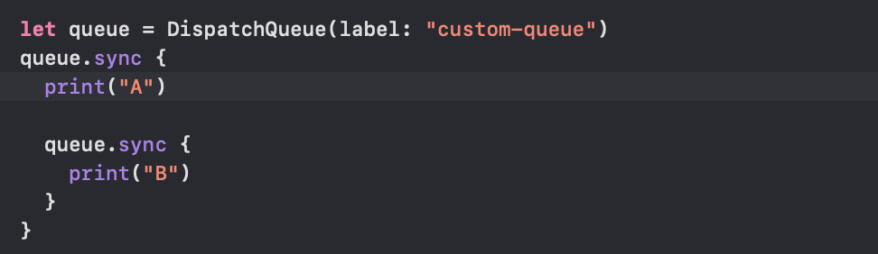
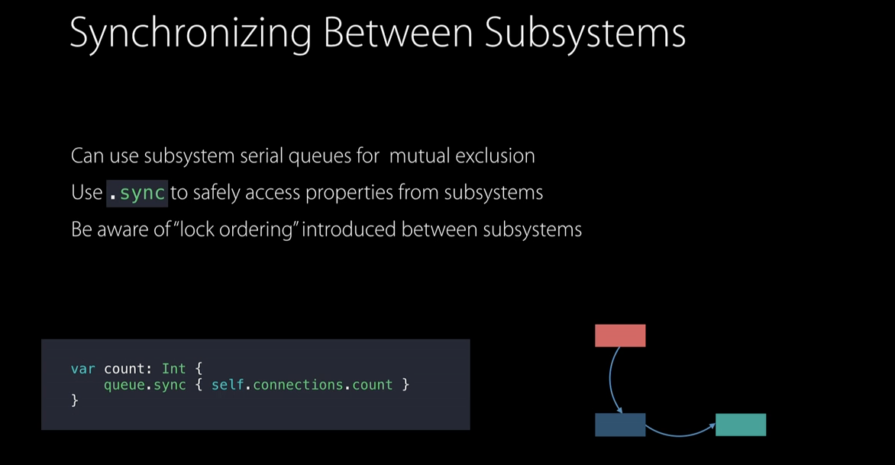

All dispatch queues are first-in first-out data structures.

GCD provides a few dispatch queues by default, but they can be created through code too as needed.

#### Types of dispatch queues

GCD exposes five different queues. The `main queue` running on the main thread, three `background queues` with different priorities, and one background queue with an even lower priority, which is I/O throttled.

Custom queues, either serial or concurrent queues can be created too. While they are a useful abstraction, all tasks that are scheduled on them ultimately trickle down to one of the system's global queues and its thread pools.

The custom queues that are created can either be serial or concurrent.

1. `Serial dispatch queue (private dispatch queues)` - They execute tasks serially. The currently executing task is run on a distinct thread that is managed by the dispatch queue. Any number of serial dispatch queues can be created and each queue operates concurrently with respect to all other queues.

2. `Concurrent dispatch queue (a type of global dispatch queue)` - They execute tasks concurrently but the tasks are still started in the order they are added (as is the case with dispatch queues in general). The exact number of tasks executing at a given point is variable and depends on system conditions. Such queues cannot be created using code, instead there are three global concurrent queues (one each for priority high, default, low) that should be used.

3. `Main dispatch queue` - It is a globally available serial queue that executes tasks on application's main thread. It is often used as a key synchronization point for an application. 

Work items can be scheduled synchronously or asynchronously. When a work item is scheduled synchronously, the current code waits until that item finishes execution. When a work item is scheduled asynchronously, the current code continues executing while the work item runs elsewhere.

Priority levels can be set for dispatch queues.

The below code snippets show the difference between how a serial queue and concurrent queue operate. In case of a serial queue, the tasks gets executed in the order in which they are submitted even if the first task is submitted as an async and the second task as a sync (the first task will still be executed first). Also, a `sync {}` task submission means the task has to first get executed before the next line is reached.

Serial queue | Concurrent queue
--- | ---
 | 

##### Be careful while using `sync {}`

Anytime a synchronous code is scheduled with `sync{}` on any dispatch queue, care must be taken to ensure a deadlock does not happen. It can happen if a sync is dispatched on the same queue as the current queue.

In the below example, the first closure has to get done before second closure can start. And yet it will come to where the second closure is and keep waiting as the first closure is not yet done. And these things actually result in a crash. Don't have such (👇) code.

The same thing will also happen if a `DispatchQueue.main.sync {}` is done from what is already the main thread.

In fact, if used properly `sync {}` can be a clever way of having thread safe code. In the below example, 'queue' (which is presumably another property) should just not the same queue as the one from which this property is called.

#### Misc.

Unlike operation objects, tasks in a queue must be ready to execute at the time they are added to the queue.

If tasks in the same dispatch queue need to share data, context pointer of the dispatch queue should be used.

Dispatch queues and other dispatch objects are reference-counted data types. Hence, it is important to retain and release dispatch objects to ensure they remain in memory while being used (probably happens on its own with ARC). 

A dispatch queue can be temporarily prevented from executing block objects by calling the `dispatch_suspend` function. It is resumed again by calling `dispatch_resume` function.

In GCD its probably not easily possible to specify the no. of concurrent operations in a concurrent queue. However it can possibly be achieved using dispatch semaphores ([link](http://stackoverflow.com/a/14555588/1135417)).

There used to be an API called `dispatch_get_current_queue` to get the current queue, but it has been deprecated a long time back.

Normally every GCD function has also got a corresponding _f function which works with specified function instead of block.

#### Associating data with a queue

GCD also allows to associate custom data (kind of key-value pairs known as context) for dispatch queues. GCD does not itself use this data in any way, but it can be used in code to identify queues and make any decisions that may be needed. 

This data is set using `dispatch_queue_set_specific` method. The custom data for the current queue is retrieved using `dispatch_get_specific` method. However the thing about `dispatch_get_specific` is that in case of nested queues, it traverses the queue targeting lineage and not the stack of nested queues.

#### dispatch_apply

`dispatch_apply` performs the mentioned block the specified no. of times in the specified queue. It provides an alternative to using for loops in cases where every iteration can be done independently of the previous iteration. In for loop, an iteration starts only once the previous iteration is over. But with `dispatch_apply`, all iterations can be done concurrently (the queue used must be a concurrent queue else it will not be of any use). Like for loop, `dispatch_apply` does not return until all iterations are complete.

However, the work during any iteration should be sizeable enough for it to justify the overhead of running multiple iterations simultaneously as it does eat up more memory (and in such cases a simple for loop is better suited).

#### Things beyong dispatch queues in GCD

In addition to dispatch queues, GCD provides some more technologies.
1. `Dispatch groups`. A way to monitor a set of block objects for completion.
2. `Dispatch semaphores`. Similar to a traditional semaphore (what is that?), but more efficient.
3. `Dispatch sources`. Dispatch sources generate notifications in response to specific types of system events.
