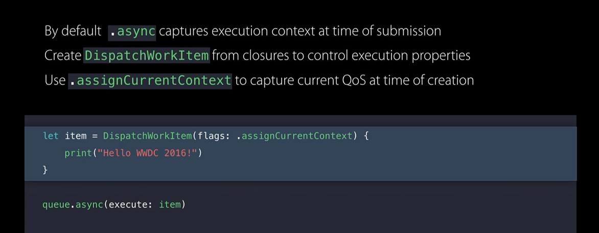

#### Dispatch Queue priority

While getting a global concurrent queue (`DispatchQueue.global(qos:)`), it is possible to specify the quality of service of the required queue. Also, its possible to specify the QoS at a task level while that task is submitted to a queue using `queue.async(qos:){}`.

Following are the possible `QoS` values. `userInteractive` and `userInitiated` automatically get higher priority. It affects things like CPU priority, different I/O scheduling priority, timer coalescing (which is a power-saving feature), whether CPU is run in through-put or in efficiency-oriented mode, energy-efficiency, etc. that the task gets.

```
userInteractive
userInitiated (DISPATCH_QUEUE_PRIORITY_HIGH in C) [meant for tasks whose completion is soon needed by the user]
`default` (DISPATCH_QUEUE_PRIORITY_DEFAULT in C)
utility (DISPATCH_QUEUE_PRIORITY_LOW in C) [meant for long running tasks, which user does not track actively]
background (DISPATCH_QUEUE_PRIORITY_BACKGROUND in C) [meant for maintenance and cleanup tasks]
unspecified
```

In fact it is even possible to create a `DispatchQoS` initialized with one of these values and having relative priorities.
```
DispatchQoS  - init(qosClass:relativePriority:)
```

In fact even private queues can have a priority. `setTarget(queue:)` method of `DispatchQueue` can be used to set the target queue of a dispatch queue. Doing so automatically assigns the target queue's priority to the receiver queue as well. So a global queue of required QoS can be used as a target queue for a private queue.

(The equivalent C function is `dispatch_set_target_queue`)

> 'WWDC 2015: Building responsive and efficient apps with GCD' is where various QoS classes are explained. QoS has ramifications for device's energy usage too.

##### QoS propagation

> Its mentioned in a 2015 WWDC video that _"dispatchAsync does automatic propagation of QoS from the submitting thread to the queue where a code is submitted to execute"_. Does this literally mean submitting thread, or does it mean submitting queue (in case the destination queue has default QoS)?

The video then also says (around 14:56 mark) that while propagating (unless destination queue is the main queue) the QoS interactive QoS is automatically transalated to userInitiated QoS.

Also, if there is a certain QoS assigned to a task (i.e. block/code) and its submitted to a queue that has another QoS, the QoS of queue is what gets used. This however can be overridden if the task is created with `DISPATCH_BLOCK_ENFORCE_QOS_CLASS` attribute ([link](https://developer.apple.com/documentation/dispatch/dispatch_block_flags_t/dispatch_block_enforce_qos_class)).

#### Target dispatch queues

All disapatch queues actually have a target queue. By default it is the global queue with default priority. And a queue inherits all properties of its target queue. In fact it also actually forwards its tasks to the target queue. So a concurrent queue with a serial queue as target will actually end up behaving serially.

```
setTarget(queue:)
```

#### DispatchWorkItem

`DispatchWorkItem` denotes a task that can be later submitted to a dispatch queue using `queue.async(execute:)`. It gives more capabilities than a simple closure would.

Specific flags can be specified. For exmaple, `assignCurrentContext` automatically applies the attributes (such as QoS) that exist at the time of work item creation, and not simply the one that exists at the time the work item is submitted.

`item.wait()` method can be used to specify that a queue must wait for the work item to complete before proceeding further. If previous tasks are not already completed, the queue even bumps up the QoS of the previous tasks (as in priority inversion),



> Also understand `DispatchSource` and `DispatchSemaphore`.

#### Dispatch groups

They allow to have a group that includes multiple tasks and then get a notification when all the tasks get completed. This allows for lot more elegant coding in situations where there are plenty of tasks and you are dealing with completion handlers otherwise. They work even when the tasks are spread across different dispatch queues.

```
let dispatchGroup = DispatchGroup()
group.enter()
.. a chunk of code and then call group.leave() once done

dispatchGroup.notify(queue: DispatchQueue.main, execute: {
    .. This chunk automatically fires when the dispatch group has completed all its tasks
})
```

`wait` function can be called on them to wait for the specified time while the tasks in its associated queue complete (how?). This probably refers to dispatch group functions wait, `wait(timeout:)` etc.

Think of dispatch groups like ARC, once the count of enter and leave becomes same there are no more tasks left and the notify is automatically fired.

> Be careful about calling a `leave` only if the task currently exists in the queue. Or else there will be a crash.

A dispatchGroup can also be specified while adding an `async()` call to a dispatch queue. Its the same thinhg as adding the task to the specified group using an `enter()`.
```
queue.async(group: dispatchGroup1) { ... }
```

In C, the corresponding type is `dispatch_group_t`.
