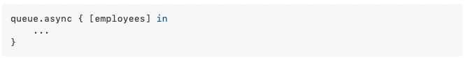

Technically speaking concurrency can cause 3 issues.

1. `Priority inversion` - Can happen when a high priority task is waiting for a low priority task to first complete. iOS does try to handle it automatically by trying to speed up the low priority task. This can occur when a high-priority and a low-priority task share a common resource. That is say a task with low QoS is submitted to a serial dispatch queue, and while its still pending another task with a higher QoS is submiited to the same queue. In such a case, GCD will automatically bump the QoS of the first task to try and have it done sooner so that the second task can start that much sooner.

2. `Race condition`/`Data race` - `Data races` occur when two separate threads concurrenty access the same data and at least one of them is a 'write'. It leads to at least one of the threads not getting the latest value back. This is what is probably also known as `race condition`, and if a code has guards to solve for this it is said to be `thread safe`. <br> <br>
`Mutually exclusive access means` that only one thread at a time gets access to a certain resource. In order to ensure this, each thread that wants to access a resource first needs to acquire a `mutex lock` on it. Once it has finished its operation, it releases the lock, so that other threads get a chance to access it. Acquiring a lock on a resource always comes with a performance cost.

> 'WWDC 2016: Concurrent Programming With GCD in Swift 3' 17:11 - 21:41 offers some GCD based tricks regarding how to avoid data races - using synchronous tasks, or using value types, or if object types have to be used then using some activation and invalidation pattern (with dispatch sources). <br> <br> 'WWDC 2015: Building Responsive and Efficient Apps with GCD' 25:09 - 28:14 too speaks about using serial queues to achieve synchronization locks and also how QoS interacts with it. <br> <br> 'WWDC 2O18: 'Understanding Crashes and Crash Logs' 48:20 onwards too uses serial dispatch queues to write thread safe code (for Swift dictionaries). Its quite nicely (and simply) explained.

3. `Deadlocks` - A deadlock can occur when the system is waiting for a resource to free up while it's logically impossible for that resource to become available. That resource can be as almost anything, a database handle, a file on the filesystem, or even time to run code on the CPU. It should be solved through code. [Donnywals Link](https://www.donnywals.com/understanding-how-dispatchqueue-sync-can-cause-deadlocks/)

4. `Thread explosion` - When too many threads are created, the system can run out of threads. In GCD, this can happen when a task scheduled by a concurrent dispatch queue blocks a thread as in such a case the system creates additional threads to run other queued concurrent tasks. It can also happen if too many private concurrent dispatch queues are created. (Also covered in 'WWDC 2015: Building responsive and efficient apps with GCD': 32:00 - 40:22. Apparently dispatch semaphores too can be used to avoid them.)

#### Thread safety and Race condition

##### Sample data race (1):

Sometimes the below snippet may print `2 1` or even `1 1`. That happens if one read access reaches the instance before the other update has happened.


> I haven't quite been able to recreate a data race with this code snippet, but this is indeed supposed to be a legit potential data race code.

> What's likely happens here during a data race is that when the first thread invokes the function and the first expression/line there, when 'value + 1' is being done 'value' was 0. Now even before the resulting 1 can be assigned to the value on left hand side, the second thread has also invoked the function and is at the same place i.e. right side 'value + 1' with a value of 0 entering there. Now both of them will end up assigning 1 to value even when theoretically the invocation from second thread should have returned 2.


##### Sample data race (2), along with a solution:

One way to avoid data races is to eliminate shared mutable state by using value semantics. With a variable of a value type, all mutation is local.

> Its a minsomer to think that using value types gurantees that every thread will get its own copy of the data. Its not true, some value types are guranteed and some (like arrays) are not. However, there exist easy ways to have every thread get its own copy of certain value types.

Capture lists help. (No need of a `weak`, etc. prefix here as its a value type.) ([Stack Overflow explanation](https://stackoverflow.com/a/41351166/1135417))

Causes crash because of non-thread-safe code  | The right way to get a copy of the value type
--- | ---
 | 

> When something is `not thread safe` what it means is that the same variable is being changed concurrently by different threads and hence the variable's value cannot be changed reliably. Say thread A writes but before it can even read it back, thread B comes and changes the variable. In such a case the value thread A will see is not what it had actually written. This is also what is also known as `race condition`. This can lead to bugs and more serious things.

##### Various ways to solve data races

###### Using value types

Where possible, as shown in an example above.

###### Using serial queues

> Serial queues can solve it to some extent. Check an example.

###### Using dispatch barriers in case of concurrent queues

Can also be solved by barrier flags in case of concurrent queues.

This can be solved by putting some boolean conditions (checks, etc.), however in iOS10 it is easily solved using something called `dispatch barrier`.

There is a a method to add an asynchronous task (and another method to add a synchronous task) to a queue which allows to specify some flags too.

`async(group:qos:flags:execute:)` (The first two arguments have default and hance can be omitted). <br>
`sync(flags:execute:)`

One of these flags is barrier, which ensures that the passed task is not executed until that queue's any currently executing tasks are completed and also once the task is started no other task is executed in the queue until this task completes.

```
isolationQueue.async(flags: .barrier) {
    ...
}
```

The C functions are `dispatch_barrier_sync` and `dispatch_barrier_async`. They submit the barrier block to the specified queue synchronously and asynchronously respectively.

So anytime there is a method or property that really needs to be thread safe, either have it in a serial queue or in a concurrent queue with barrier flag.

> All this is demonstrated well in RWDevCon 2017 Concurrency talk's source code 'TSanExample'. <br> `changeNameRace()` is not thread-safe and causes a race condition. `changeNameSafely()` whereas is thread-safe. So the thing about race condition is that even before all the tasks (or code) in a thread have finished executing, some other thread may come in and start modifying the concerned values. That's why there needs to some kind of lock that is resolved only when all the tasks in that thread concerning the relevant part of the memory have been executed.

###### Using actors

??

###### Using Atomics, Locks

> Need to understand these techniques
