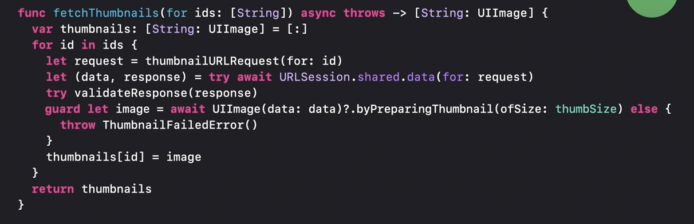
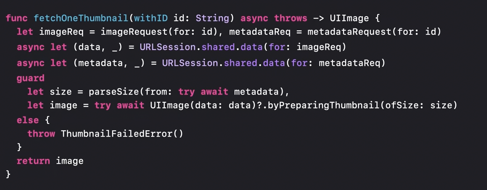
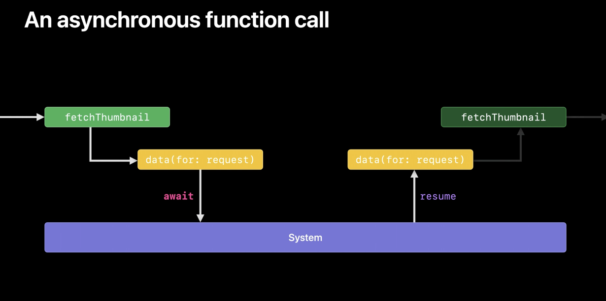
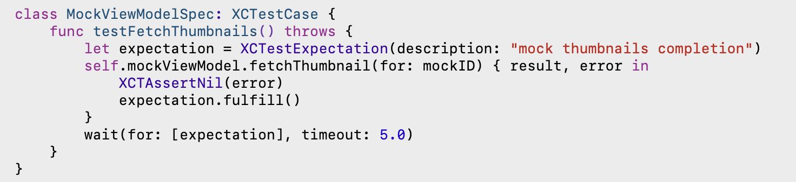
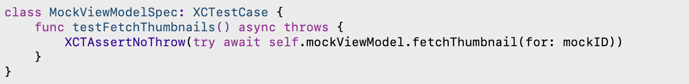

[toc]

> The gist of the entire idea - That a function's execution can be suspended indefinitely with an easy syntax.

#### The Basic Syntax

```
let result = await testMethod2()
```
testMethod2 above (☝️) is an async function and the calling code will _await_ its response before continuing. This is also known as `sequential binding`,

```
func testMethod2() async -> Bool
```
testMethod2 above (☝️) declares itself to be a function that will respond in an _async_ manner and hence anyone calling should call it using the appropriate syntax.

```
async let (data, _) = URLSession.shared.data(for: imageReq)
```

`data(for:)` above (☝️) is an async function and its _response is assigned to the left hand expression asynchronously_, i.e. the assignment itself will happen in an async manner and the calling context will not get suspended in that line (in fact it will get suspended only once the variables on left side are later needed). This is also known as `concurrent binding`.

#### More Details

##### `async` function

If a function is marked as `async` what it means is that it may not return the execution back to caller right away, and the caller should account for it.

Once an await-able (i.e. async) function is called, the caller function suspends itself and the thread is freed up for system to do other work as it sees fit.

> The recommended naming convention is to not name async functions as beginning with a verb like get, etc. This is supposed to convey that a result may not be given right away (weird, but that's what they say in WWDC video).

###### Computed read-only properties can be async too

Even computed properties can be async, but only if they are read-only. The getter needs to be qualified as `get async`, and the usual rules apply (like the body needs to call an async thing itself).
> Note that with Swift 5.5, computed properties can throw too.

```
extension UIImage {
    var thumbnail: UIImage? {
        get async {
            let size = CGSize(width: 40, height: 40)
            return await self.byPreparingThumbnail(ofSize: size)
        }
    }
}
```

##### `await` (Sequential Binding)

Consider the following code snippet. This is the sequence of messages that it will log - `A1 B1 B2 A2 C1 D1 D3 D2 C2 true`.  

`await` suspends execution of the current function until the called async function gives control back to the current function.

```
class ViewController: UIViewController {

    override func viewDidLoad() {
        super.viewDidLoad()
        print("A1")
        testMethod1()
        print("A2")
    }

    func testMethod1() {
        print("B1")
        Task { () -> Bool in
            print("C1")
            let result = await testMethod2()
            print("C2")
            print(result)
            return result
        }
        print("B2")
    }

    func testMethod2() async -> Bool {
        print("D1")
        let outcome = await withCheckedContinuation { (continuation: CheckedContinuation<Bool, Never>) in
            DispatchQueue.main.asyncAfter(deadline: .now() + 1.0) {
                print("D3")
                continuation.resume(returning: true)
            }
        }
        print("D2")
        return outcome
    }
}
```

These are not literally the same thing. The former function returns something right away, but the latter will not hand the execution back to caller right away (it will cause the calling function's execution to suspend). The latter version however does ensure that something is mandatorily returned on completion (which couldn't be enforced by compiler in the former version, as its syntactically fine to not call the completion handler at all).

Using completion handler | Using async/await
--- | ---
 | 

If the async function is a throwing function, while calling it can be handled using any varation of `try` (the `try` should prepend the `await`).
```
func func1() async throws {
    ...
    let a = try await func2()
    ...
}
```

##### Concurrent binding with `async let`

Concurrent binding overcomes one shortcoming of typical use of async await (is that called sequential binding?). Using it, when an async function is called the caller function does not suspend and yet when a point comes that something returned by the async function actually needs to be used the caller function does suspend.

```
async let (data, _) = URLSession.shared.data(for: imageReq)
```

So here when `async let (data, _) - ` is encountered, the async function gets called and yet the current thread continues execution and later when a point comes where `data` is being used its actually suspended. Also, that is where a `try` is needed to catch any error that might be thrown.

In case of concurrent binding, two tasks exist. One child task actually runs the async function and the other task is the same as the one that was executing the preceding statements.

| Sequential binding              | Concurrent binding              |
| ------------------------------- | ------------------------------- |
|  |  |


##### What does a function getting suspended mean

When an async function is called, the function hands over the control of the thread to the system and lets it do other work that may be important to it. Once that work finishes, the system hands the thread back to the function at its suspension point. Normal functions don't have a way to suspend in the middle of execution. So to put it very simply, that's what async/await mainly is - allowing system more frequent access to threads that would otherwise have sat idle for some time in a non async-await world.

In the below example data(for:) is an async function.



In fact when a function resumes, its technically possible that its resumed in an entirely different thread.

##### Testing API

Testing using XCTestExpectation | Testing using async/await
--- | ---
 | 

So one shortcoming is that a wait time cannot be specified in this way.
