[toc]

> Sequential+Concurrent Binding, Task Groups ~ Structured Concurrency/Tasks

#### Task 

`Task` acts like a closure that runs in a different thread, and it can even be assigned to a variable (for later cancellation, etc.)

It is basically a unit of asynchronous task that can be sent to the system for immediate execution on the next available thread (~execution context), like the async function on a global dispatch queue. Its a common way to put awaitable function calls in a function that otherwise is not marked as an async function. ([Reference](https://developer.apple.com/documentation/swift/task))

> TLDR - `Task` provides an easy context for including async code.

```swift
@frozen
struct Task<Success, Failure> where Success : Sendable, Failure : Error
```

Note - In the below snippet, B1, B2 will still happen before C1

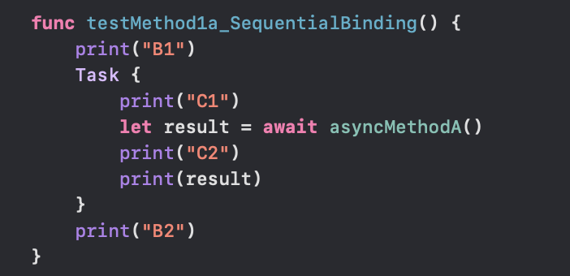

##### The Basic API

###### Initializers/Creating Tasks

Some of the initializers 👇. They run the given operation asynchronously as part of a new top-level task on behalf of the current actor. Note how a Task can return something too (if its not returning anything the return type is Void). However what it returns has to be conformant to `Sendable` protocol.

```swift
init(priority: TaskPriority?, operation: sending () async -> Success)
init(priority: TaskPriority?, operation: sending () async throws -> Success)
```

###### Accessing results

The result from a task, after it completes.

```swift
var value: Success
```

The result or error from a throwing task, after it completes.

```swift
var result: Result<Success, Failure>
```

#### Task Trees

A Task can spawn another set of Tasks. This chain of tasks is what is known as `Task Tree`  and it affects various attributes of tasks like cancellation, priority, and task-local variables.

The tree is made up of links between each parent and its child tasks. A link enforces a rule that says a parent task can be deemed 'finished' only if all of its child tasks have finished too.

The lifetime of a task can get scoped to the function that created it.

##### No new Task in sequential binding

Whenever a call is made from one async function to another (without `async let`) the same task is used to execute the call.

##### Tasks created in concurrent binding

To evaluate a concurrent binding, first a new child task is created, which is a subtask of the current task.

The right arrow (at the point of bifurcation) in this diagram is for this child task, which will immediately begin downloading the data. The second arrow is for the parent task, which will immediately bind the variable result to a placeholder value. This parent task is the same one that was executing the preceding statements. While the data is being downloaded concurrently by the child, the parent task continues to execute the statements that follow the concurrent binding. But upon reaching an expression that needs the actual value of the result, the parent will await the completion of the child task, which will fulfill the placeholder for result.

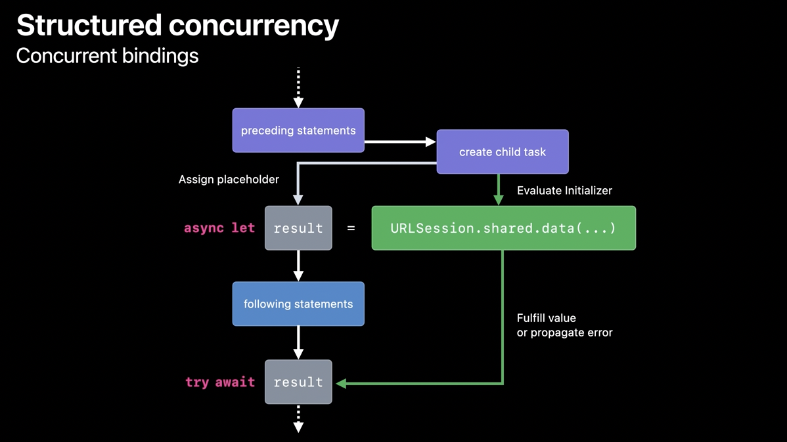

##### How an async function exits in case a concurrent binding called in it throws an error

A link enforces a rule that says a parent task can only finish its work if all of its child tasks have finished. This rule holds even in the face of abnormal control-flow which would prevent a child task from being awaited.

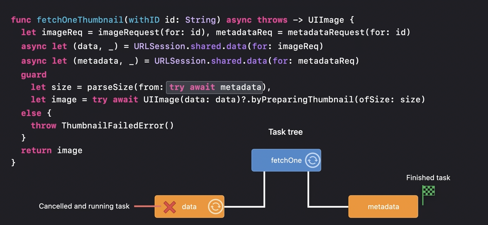

For example, say an async function (fetchOneThumbnail above) has two concurrent bindings inside it. If the first awaited task finishes by throwing an error, the fetchOneThumbnail function must immediately exit by throwing that error. But the second async function it calls is still doing its work. This is where Swift will automatically mark the 2nd awaited task as canceled and then await for it to finish before exiting the function.

So if the implementation of URLSession created its own structured tasks to download the image, those tasks will be marked for cancellation. The function fetchOneThumbnail finally exits by throwing the error once all of the structured tasks it created directly or indirectly have finished. This guarantee is fundamental to structured concurrency. It prevents you from accidentally leaking tasks by helping you manage their lifetimes, much like how ARC automatically manages the lifetime of memory.

> So say async funcA has 2 bindings (i.e. sub-tasks) task1 and task2. task1 throws an error and stops, funcA gets to know that, cancels its own task and cancels task2 too, and only then does funcA return.

#### Task Cancellation

A task can be cancelled (`cancel()` function). When a task is cancelled it doesn't mean necessarily mean the work it had started gets stopped, it simply means that its results are no longer needed.

When a task is cancelled, all its descendant subtasks get cancelled too. Consequently, the code in any asynchronous function (task) must check for cancellation explicitly and (esp. for potetially long running tasks) wind down execution in whatever way is appropriate. In doing so, a function may return partial result and the function's documentation should make that clear.

Checking the cancellation status of current task 👇. Look at how in these examples, the data is stored only if the current Task is not already cancelled.

| `if Task.isCancelled { ... }`                                | `try Task.checkCancellation()` |
| ------------------------------------------------------------ | ------------------------------ |
| 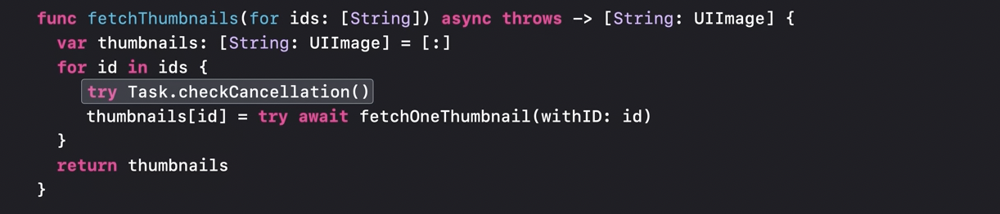 | 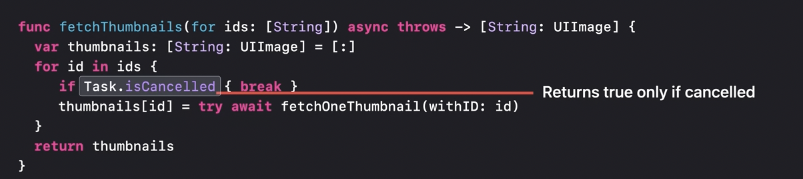  |

A [Hacking With Swift example](https://www.hackingwithswift.com/quick-start/concurrency/how-to-cancel-a-task) on how to cancel a Task, but then here because of fetchTask.cancel()  somehow the URLSession task automatically throws an error (so what is the point of Task.isCancelled here).

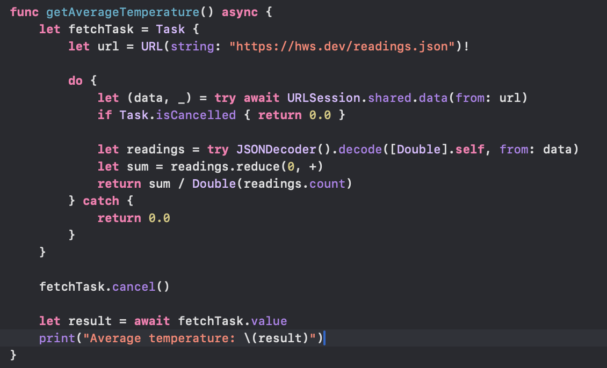

Another [example from Swift with Majid](https://swiftwithmajid.com/2025/02/11/task-cancellation-in-swift-concurrency/).

#### CheckedContinuation

`CheckedContinuation` is basically a way to implement asynchronous functions, they are what enable the function to say when the workit is doing has been done and the calling function's thread can be resumed/unsuspended. Syntactically its a generic struct. The generic type T is what the async function is supposed to return, Error takes care of the throwing part of the async function where applicable.

```swift
public struct CheckedContinuation<T, E> : Sendable where E : Error
```

`withCheckedContinuation()` is function that allows that the implementation to happen. It suspends the current function and  then calls the given closure with a checked continuation for the current task. This checked continuation however has a way to itself return something and unsuspend the execution.

If the closure can return error too, `withCheckedThrowingContinuation` needs to be used. When the closure returns the outcome, `resume` needs to be called on the Continuation exactly once. `resume` basically provides the missing link to unsuspend any calls awaiting the result of the async function.
> If however `resume` is called twice, its a runtime error.

```
let outcome = await withCheckedContinuation { (continuation: CheckedContinuation<Bool, Never>) in
    DispatchQueue.main.asyncAfter(deadline: .now() + 1.0) {
        print("D3")
        continuation.resume(returning: true)
    }
}
```

If the `continuation` is discarded without `resume` being called, the Swift runtime will log a warning since this will result in async calls never unsuspending.

| Completion Handler based code                                | Swift concurrency based code (using `CheckedContinuation`)   |
| ------------------------------------------------------------ | ------------------------------------------------------------ |
| 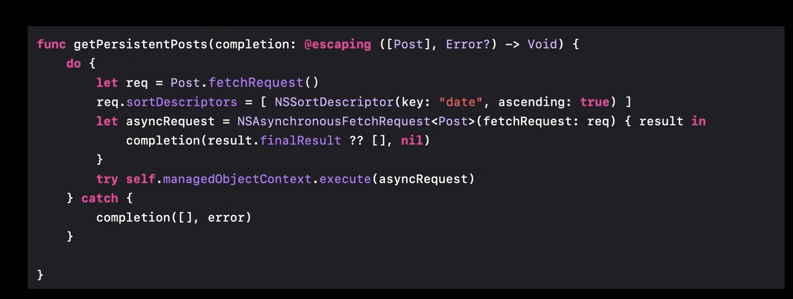 | 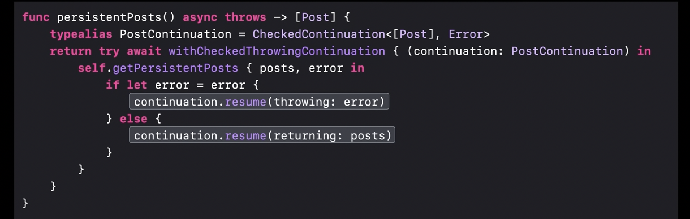 |

##### A `Task` reference need not be kept

A task runs regardless of whether you keep a reference to it. However, if you discard the reference to a task, you give up the ability to wait for that task’s result or cancel the task.

#### Task Groups

`async-let` is scoped like a variable binding. What it means is that if there are a variable number of things that should ideally be done concurrently, they can't be with `async let` as each of them need to be individually assigned to a separate variable and how many variables are needed is not known at compile time. This is where **Task Groups** help ([reference](https://developer.apple.com/documentation/swift/taskgroup)).

```swift
@frozen
struct TaskGroup<ChildTaskResult> where ChildTaskResult : Sendable
```

Using (sequential) binding | Using task group
--- | ---
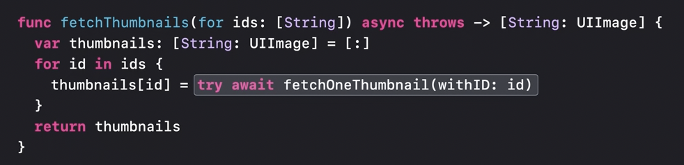 | 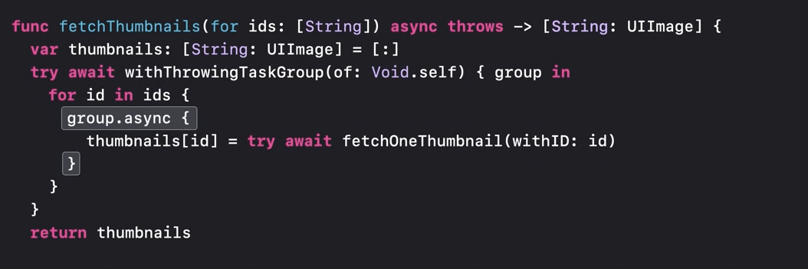

Note the even the above Task Group code is actually not quite correct as the closure inside task group should not be trying to change any mutable variable (the correct way is shown later in 'Avoiding data races (`@Sendable` closure)' section).

The below code snippet prints '_E1 > D1: 1 > D1: 2 > D3: 1 > D3: 2 > D2: 1 >
D2: 2 > E2_'.

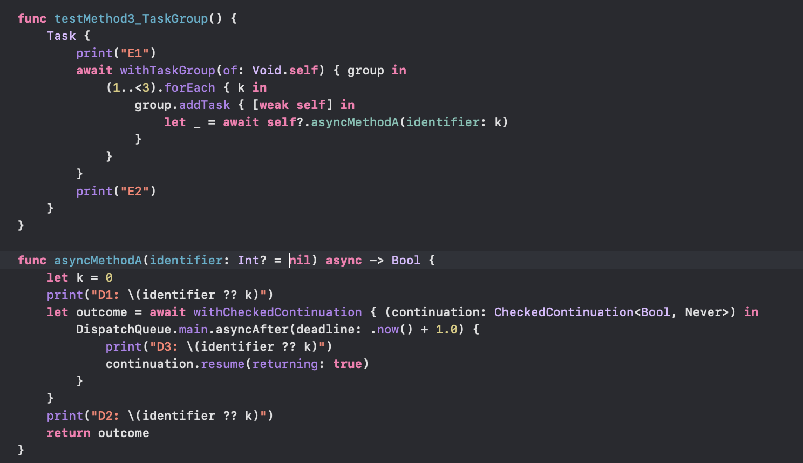

`withTaskGroup` - Starts a new scope that can contain a dynamic number of child tasks.

`withThrowingTaskGroup` is the counterpart for above in case the child tasks can throw errors.

> `addTask(priority:, operation:)` adds a child task to the group. This was previously done by `async(:)` which has now been deprecated.

##### Scope of task group

A task group waits for all of its child tasks to complete, throw an error, or be canceled before it returns.

Also, tasks added to a task group cannot outlive the scope of the group in which the task is defined. Once added to a group, child tasks begin executing immediately and in any order.

When the group goes out of scope through a normal exit from the block, the cancellation of child tasks is not implicit. Its hence a good practice at times to cancel all tasks using the group’s `cancelAll` method before existing the group.

##### More API

BTW, the precise structs denoting these groups are `TaskGroup` and `ThrowingTaskGroup`.

##### for-await-in with TaskGroup (Async Sequences)

To collect the results of the group's child tasks, `for-await-in` loop can be used. Note that this loop obtains the results from the child tasks of the group in order of their completion (not in the order of them starting).

```
var sum = 0
for await result in group {
    sum += result
}
```

If more control or only a few results is needed, `next()` can be called directly.
```
guard let first = await group.next() else {
    group.cancelAll()
    return 0
}
let second = await group.next() ?? 0
group.cancelAll()
return first + second
```

All tasks can be cancelled before exiting the block using the group’s `cancelAll()` method.

> Try the above APIs.


#### Avoiding data races (`@Sendable` closure)

The more concurrency is introduced in a code, more is the chance of a data race happening. While this has been tradtionally debugged manually, Swift now also provides a way to have static check for it.

Whenever a new task is created, internally the work that the task performs is within a new closure type called a `@Sendable` closure. A `@Sendable` closure is restricted from capturing mutable variables in its lexical context, because those variables could be modified after the task is launched. This means that the values captured in a task must be safe to share. These are usually value types, like Int and String, or are objects designed to be accessed from multiple threads, like actors, and classes that implement their own synchronization.


In the above (☝️) example, every task in the group is made to return a tuple containing the result of the nested async function and once all the tasks of the group have completed that is when all the tuples are collated and accessed. This ensures that eventually there is just one thread accessing the eventual data. 
