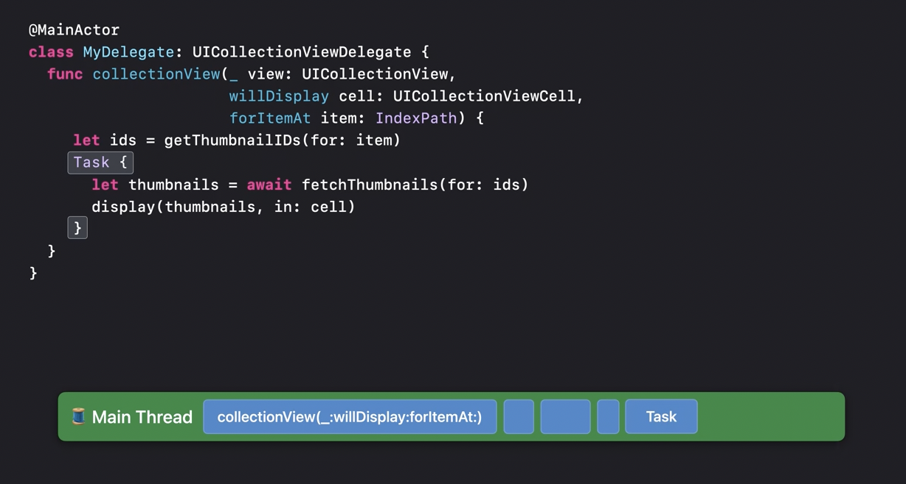
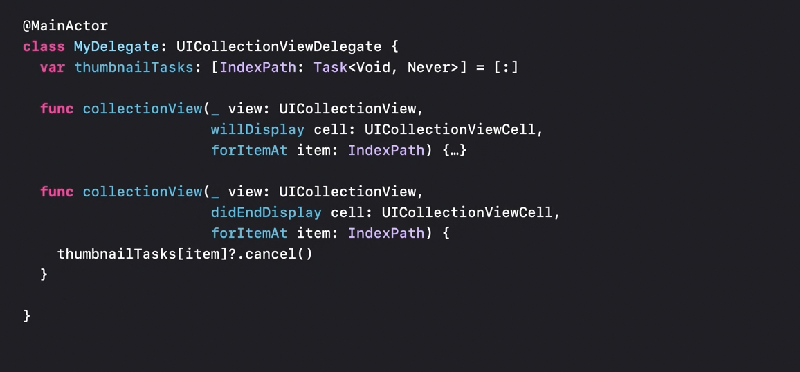
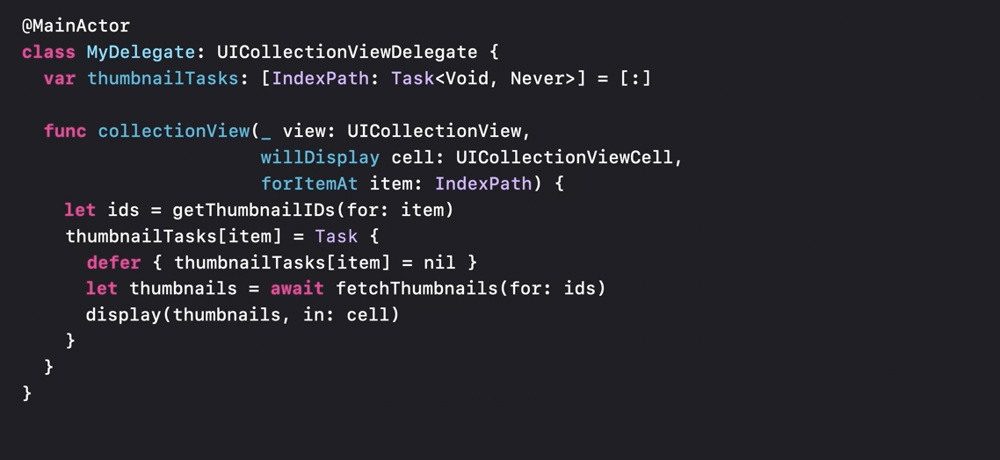
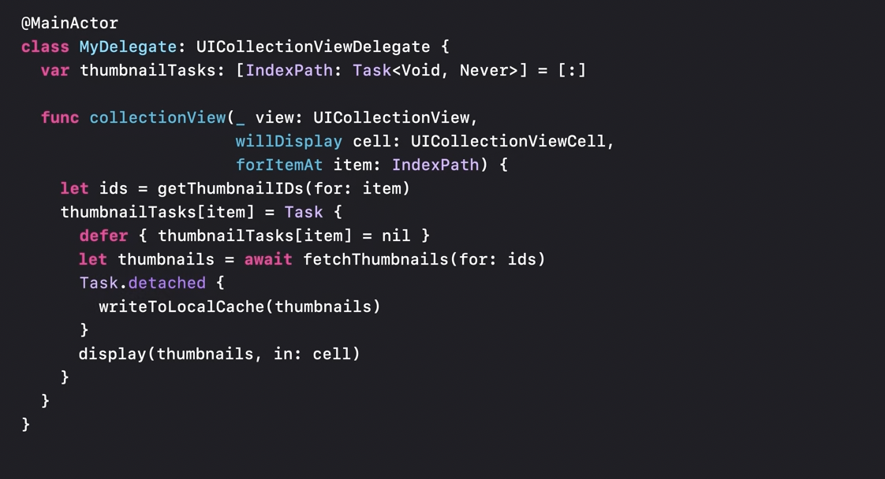
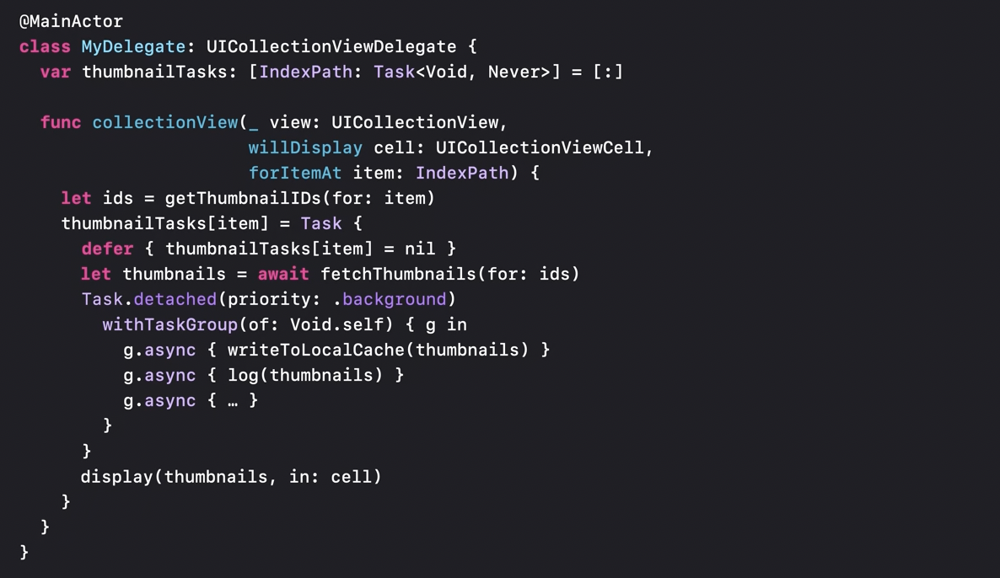

[toc]

#### Unstructured Tasks

There are times when the lifetime desired for a task might not fit the confines of a single scope or even a single function. This is where **unstructured task**, i.e. the one created by a plain vanilla `Task {}` comes in. It still inherits the originating scope's traits though (i.e. things like priority, etc.?).

In the above (☝️) example, when the code reach the point of creating the task, Swift will schedule it to run on the same actor as the originating scope, which is the main actor in this case.

A directly constructed task still inherits the actor, if any, of its launched context, and it also inherits the priority and other traits of the origin task, just like a group task or an async-let would. However, this new task is unscoped. Its lifetime is not bound by the scope of where it was launched. The origin doesn’t even need to be async.

##### Cancellation and errors don’t automatically propagate to it
Cancellation and errors don’t automatically propagate to unstructured tasks, and the task’s result is not be implicitly awaited unless there explicit action to do so.

In the above (☝️) snippet, the unstructured task is being explicitly cancelled once its not needed (in the 'didEndDisplay' method).

##### Handling possible data races

If main actor is used, the stored properties of main actor-bound classes can be safely accessed inside this task without worrying about data races.

#### Detached Tasks

Sometimes its required that a task does not inherit anything at all from its originating context. `Detached tasks` help achieve precisely that. They run independently with generic defaults for things like priority, but can also be launched with optional parameters to control how and where the new task gets executed.

##### Creating a detached task

Detached tasks are created using `detached(priority:operation:)` method.

##### Combine different type of tasks as needed

The different types of tasks (async let, task group, unstructured, detached, etc.) can be combined together as needed.

In the above example (☝️) unstructured task, task group, and detached task have all been used together. There are a number of benefits of doing so. Using a task group allows to cancel all of the child tasks just by canceling that top level detached task. That cancellation will then propagate to the child tasks automatically. The child tasks also automatically inherit the priority of their parent. To keep all of this work in the background, just the detached task alone needs to be run with a background priority.
