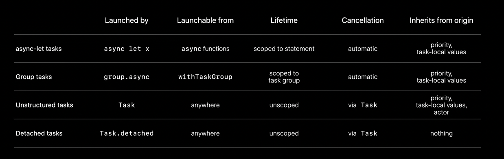

#### Summary of different types of Tasks

`async let` - Allows a fixed number of tasks to be spawned as variable bindings.

`Task groups` - When a dynamic number of child tasks are needed that are still bounded to the originating scope.

`Unstructured tasks` - When there is a need to break off some work that isn’t well scoped but which is still somewhat related to its originating task.

`Detached tasks` - Manually managed tasks that don’t inherit anything from their origin.
