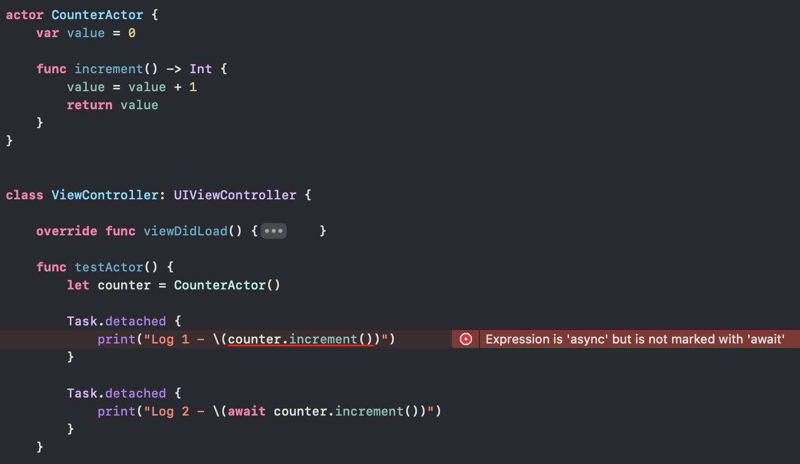
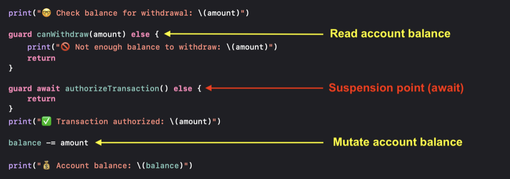
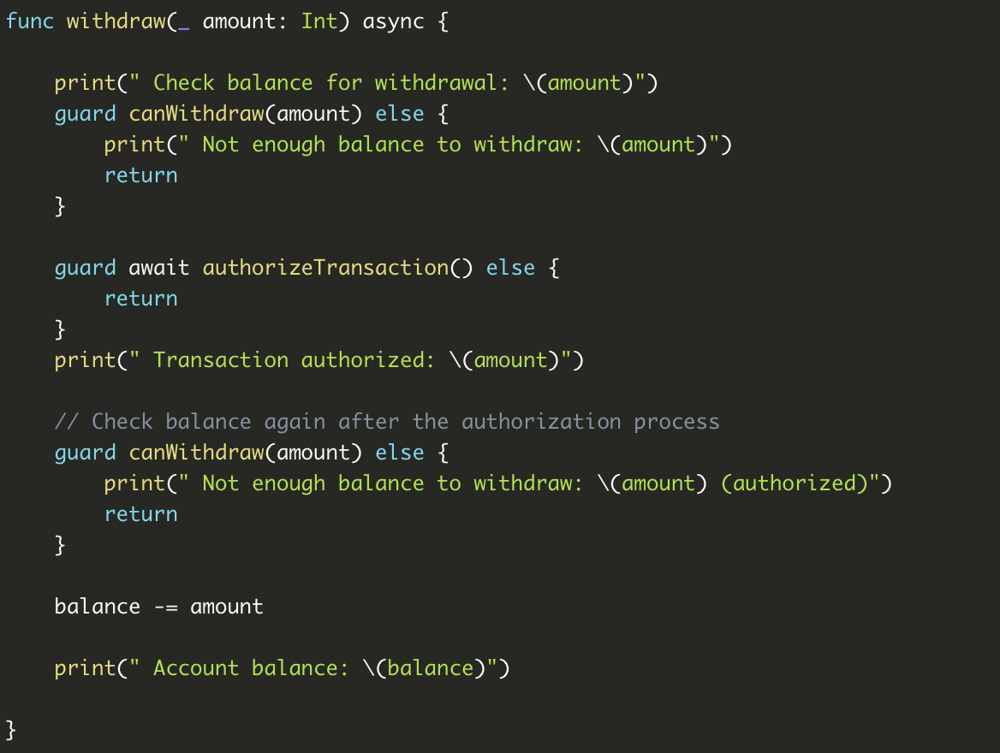
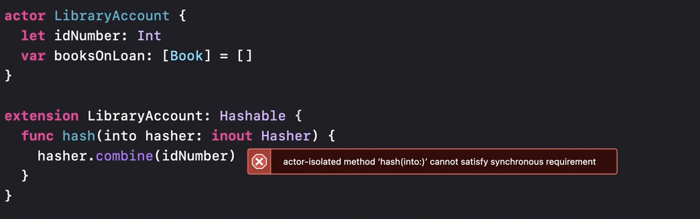
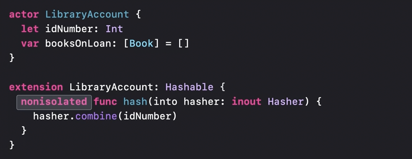
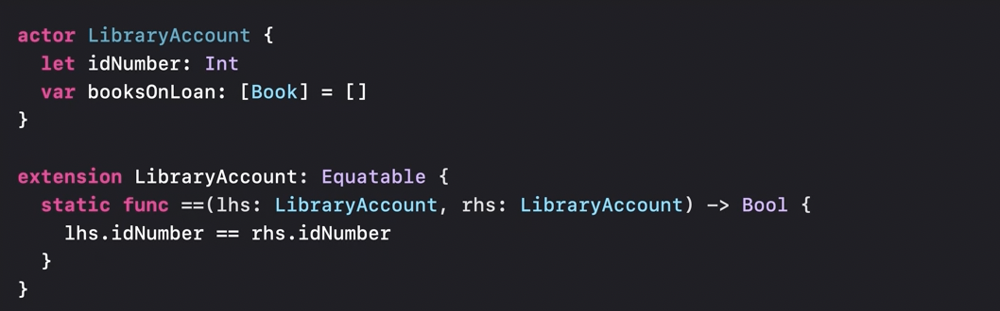
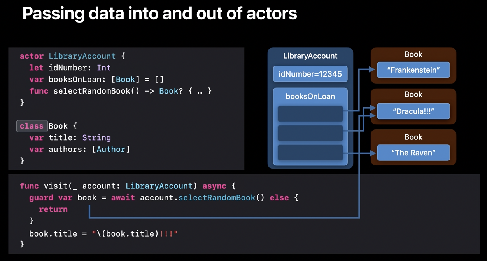
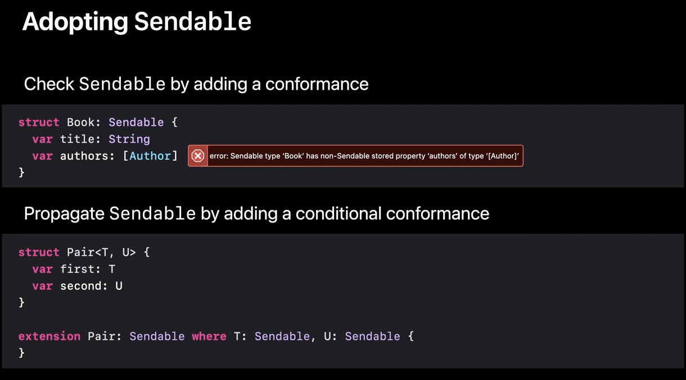
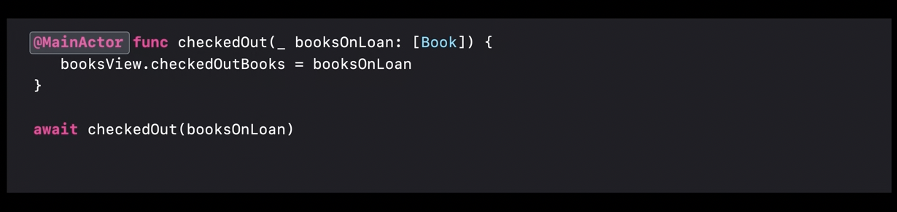
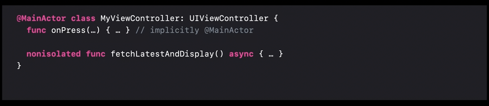

##### Basics

The idea behind actors is to provide a built-in reference types which can take care of elementary data races automatically behind the scenes. It manages its own state and that state is isolated from the rest of the program.

However what this does mean is that any interaction with an actor from the outside, must be done asynchronously by treating its functions as asynchronous functions (not doing so will give a compiler error).

Actors provide a synchronization mechanism for shared mutable state.

Like other Swift types, it too can have properties, methods, initializers,  subscripts, etc. Its a reference type. It can't participate in any inheritance though.

When the actor is busy, the code suspends so that the CPU it's running on can do other useful work.

##### Syncrhonous code within actor can run without need for `await`

Synchronous code within the actor always runs to completion without being interrupted. `await` is not needed. What it means is that if within its own implementation, an actor function can change the state as if its synchronous code (for example in above example 'value' is being changed direcrly in `increment()`).

##### Dealing with actor reentrancy

`Actor reentrancy` is just a term to refer to the situation where a function inside an actor is refering to a state in multiple points with there being a suspension point in between. This means that in the first reference there might be one value but by the time the second reference is made there is such a long pause in between the value might have changed and the second point will be working on incorrect assumptions.

To solve this the recommended approach is to not have any potentially suspending code between the places where the actor state is crucially referred to by an actor function (in other words, perform mutation of actor state in synchronous code). _As shown below._

[Swiftsenpai write-up](https://swiftsenpai.com/swift/actor-reentrancy-problem/)

##### Conformance to protocols, Actor isolation

The idea behing actor functions is that if they are accessed from outside, its done asynchronously. This can cause an issue in case of protocol conformance as the contract for those functions may not be asynchronous (even when the function is accessing only nonmutable state of the actor). This can be solved by using `nonisolated` qualifier.

Error when implemented synchronously | Compiles if `nonisolated` is used
--- | ---
 | 

> `nonisolated` means that this method is treated as being outside the actor, even though it is, syntactically, described on the actor. Literally though, what it means is that the compiler is being explicitly told that the specified property/method is actually not accessing any isolated data.

`nonisolated` can be specified only if the method is not accessing any mutable state.

[(Antoine Lee article on Actors)](https://www.avanderlee.com/swift/actors/)

The fact that an actor's state should be isolated enough for execution is probably what is also known as `Actor isolation`. Another statement is that 'actor isolation' in code means whether a code is running inside the actor or outside it.

For some reason though, if the protocol's conformance requires implementation of static functions its not an issue and `nonisolated` does not need to be specified (only if its accessing immutable state on the actor).

If however any protocol conformance requires nonmutable state of the actor to be accessed, there will be a compiler error.

[Useful link - Swift Lee](https://www.avanderlee.com/swift/nonisolated-isolated/)

##### Sendables

An example where using actors and classes can use to data races. Because the 'visit' method is not on the actor, this modification could end up being a data race.

> Value types and actors are both safe to use concurrently, but classes can still pose problems.

A `Sendable` type is one whose values can be shared across different actors. Value types, Actors are Sendable. Classes can be Sendable, but only if they are carefully implemented.

Functions aren't necessarily Sendable, so there is a new kind of function type for functions that are safe to pass across actors.

Over time, sendables are things that Swift will start checking statically.

A new protocol named `Sendable` has been introduced and its recommended to have any type that makes sense as being sendable as being specified so explicitly. They should be used in actors. Consequently, later when Swift starts enforcing sendable types across actors the code will be complying to that already.

> There is more to understand regarding sendable functions. Check in 2021 video 'Protect mutable state with actors' 21:23 to 23:30.

##### Main Actor

The main actor is an actor that represents the main thread. It performs all of its synchronization through the main dispatch queue (i.e. its interchangeable with using `DispatchQueue.main`).

If something is delcared with the `@MainActor` attribute, it will be executed on the main actor. If such a function is called from outside the main actor, it needs to be awaited, so that the call will be performed asynchronously on the main thread. Types can be declared with this attribute too, with any opt-outs specified using `nonisolated` qualifier.

`MainActor` function | `MainActor` type
--- | ---
 | 
