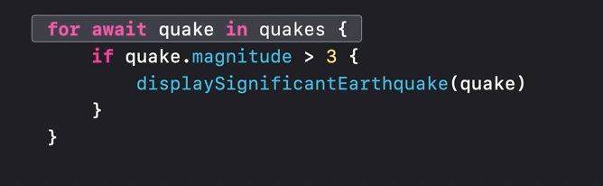
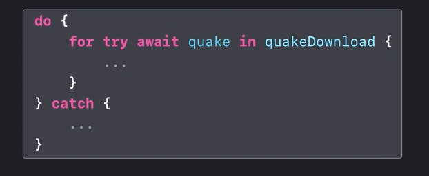
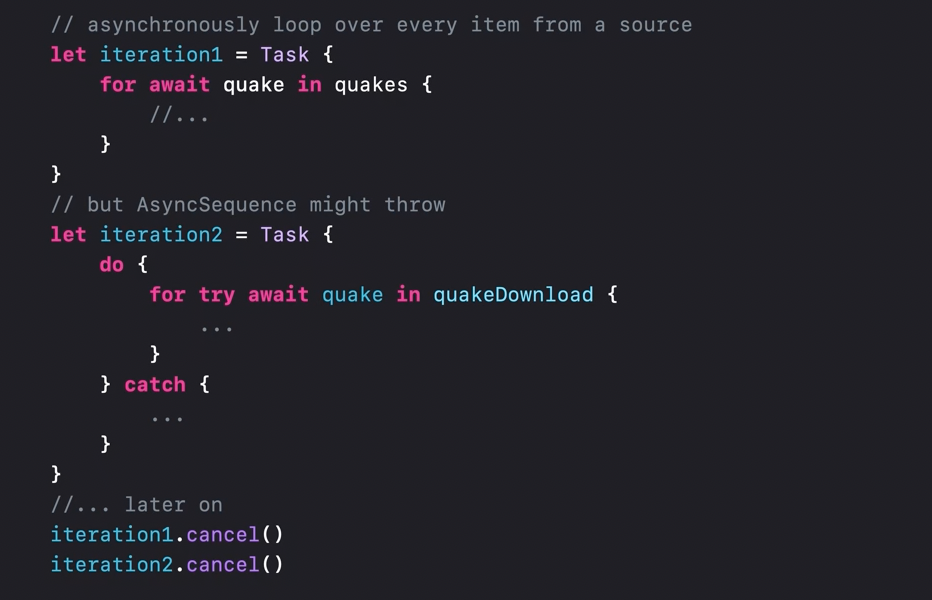
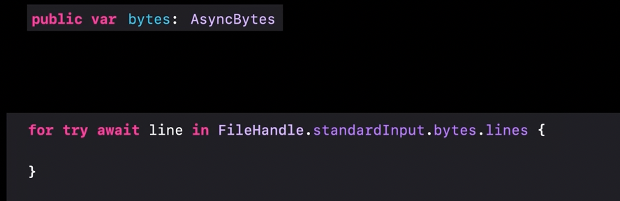
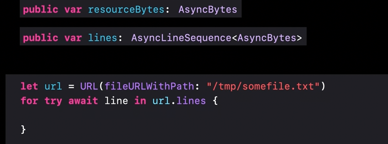
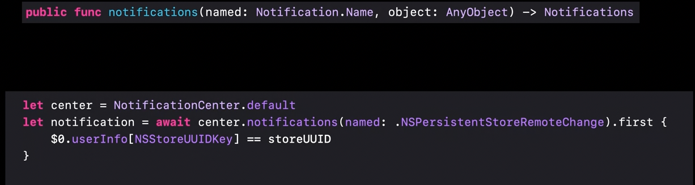
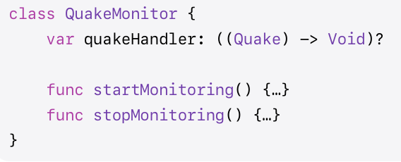
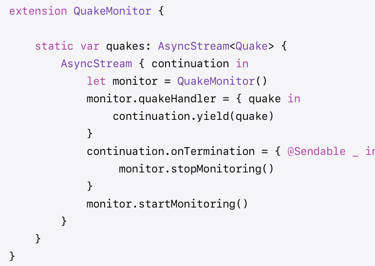

[toc]

#### What is it

To put it simply, **AsyncSequence** is like a task group with a sequence of tasks. It resembles the Sequence type - offering a list of values you can step through one at a time and suspend on each element of the sequence and resume when the underlying iterator produces a value or throws.  Technically, its a protocol ([reference](https://developer.apple.com/documentation/Swift/AsyncSequence)).

It signifies completion with returning a `nil` from its iterator, just like sequences. When an error occurs, that also return nils for any subsequent calls to next on their iterator.

Normal sequence syntax like `break` and `continue` too works just how one would expect.

#### for-await-in, for-try-await-in

It has two variants - **for-await-in** and **for-try-await-in**.

| for-await-in                                                 | for-try-await-in                                             |
| ------------------------------------------------------------ | ------------------------------------------------------------ |
|  |  |

> Note that `TaskGroup` already conforms to `AsyncSequence`.

#### Can be put in Tasks

It's also commonplace to put them in tasks. It is particularly useful when the iteration might be indefinite to the lifetime of some container. And these iterations can then also be cancelled as needed.



#### APIs that have been updated to use AsyncSequence

Several system APIs have been updated to use AsyncSequence instead of delegates/completion handlers.

| Reading bytes from a FileHandle (new `bytes` property)       | Reading lines from a URL (new `lines` property)              | Awaiting  notifications (new `notifications` property)       |
| ------------------------------------------------------------ | ------------------------------------------------------------ | ------------------------------------------------------------ |
|  |  |  |

#### Convenience functions

Several Sequence like functions exist with AsyncSequence too. Here are some of them.

> FWIW, in above screenshot of `notifications` one of them (`first`) is being used

```swift
Finding elements - 

func contains(where: (Self.Element) async throws -> Bool) async rethrows -> Bool
func first(where: (Self.Element) async throws -> Bool) async rethrows -> Self.Element?

Selecting elements -
func prefix(Int) -> AsyncPrefixSequence<Self>

Excluding Elements -
func drop(while: (Self.Element) async -> Bool) -> AsyncDropWhileSequence<Self>

Transforming a Sequence -
func map<Transformed>((Self.Element) async -> Transformed) -> AsyncMapSequence<Self, Transformed>
```

#### Converting a closure to AsyncSequence

This can be done using **AsyncStream** ([reference](https://developer.apple.com/documentation/swift/asyncstream)). Technically its a struct. It handles all of the things you would expect from an async sequence, like safety, iteration, and cancellation; but they also handle buffering.

The key function is `continuation.yield()`.

```swift
struct AsyncStream<Element>
```

| Existing closure based handler                               | Converted to AsyncSequence                                   |
| ------------------------------------------------------------ | ------------------------------------------------------------ |
|  |  |

If an error could be thrown from the async sequence, then **AsyncThrowingStream** ([reference](https://developer.apple.com/documentation/swift/asyncthrowingstream)) can be used.