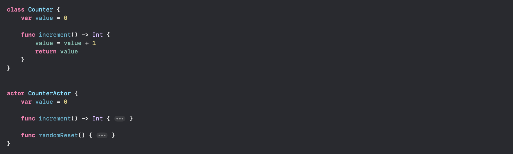
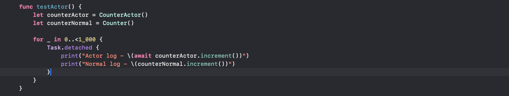
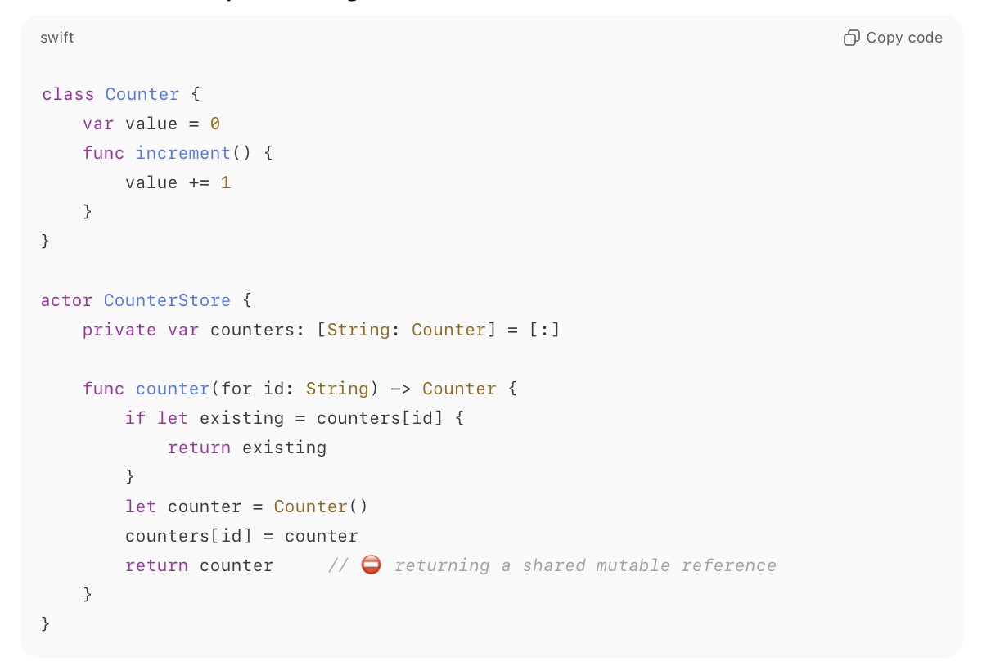
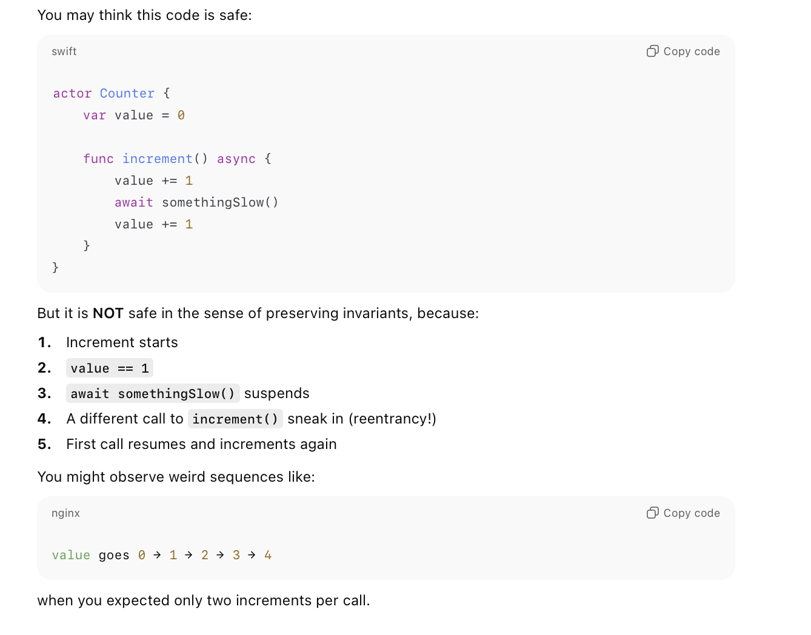

[toc]


There are a number of primitives for synchronization of shared mutable state across different execution contexts, i.e. from low-level tools like atomics and locks to higher-level constructs like serial dispatch queues. But all of them require very careful implementation. That is where actors come in.

> As for what a **race condition** even is, its shown well in this [YouTube video](https://www.youtube.com/watch?v=MqnpIwN7dz0). <br><br>Basically, if there is mutable memory somewhere then with no other checks in place its always possible that <br>1. Two different things/threads access it with the intent to modify it in relation to what it previously had (say increment) <br>2. The way increments work are that you first have to read what is there and then just overwrite with a new value that you ascertain <br>3. If both the things happen to attempt a read at about the same time (i.e. second thing reads even before first thing has done its write), then both the things will end up overwriting the same value onto the memory. And that will be incorrect, because the expectation is that the memory is incremented by as much as the number of things accessing it (whereas with this, it will be something lesser).

##### What is it

The idea behind **actors** is to provide a built-in reference types which can take care of elementary data races automatically behind the scenes. It manages its own state and that **state is isolated** from the rest of the program. Like other Swift types, it too can have properties, methods, initializers, subscripts, can coform to protocols, be augmented with extensions, etc. Its a reference type. It can't participate in any inheritance though.

They maintain data safety of the shared state even when multiple methods access that state. They ensure only one method access the state at a time, and until that method is done others will wait. Also note that, Actors guarantee mutual exclusion but only until the next suspension point (and that can happen if something pauses the method's execution in between, explained later in Actor reentrancy).

However what this does mean is that any interaction with an actor from the outside, must be done asynchronously by treating its functions as asynchronous functions (not doing so will give a compiler error).


When the actor is busy, the code suspends so that the CPU it's running on can do other useful work.

##### Synchronous code within actor can run without need for `await`

Synchronous code within the actor always runs to completion without being interrupted. `await` is not needed. What it means is that if within its own implementation, an actor function can change its own state as if its synchronous code (for example in above example 'value' is being changed direcrly in `increment()`).

##### Sample code proving actor's value prop

> For code such as this, the `counterActor` log never prints a duplicate value but the `counterNormal` log will print some duplicate values. Could totally reproduce it every single time, just that the loop has to run a high number of times such as ~1000.





##### When are actors are not safe

Actors are safe and can gurantee data safety of the property, unless the property is explicitly marked as `nonisolated` (explained later) or the property is a mutable reference type (like a class).

For example, here the counters property is reference type and if left like this the actor can't gurantee its safety.



> Value types (i.e. int, struct, etc.) however are always safe when put in actors.

##### Actor reentrancy

> **Reentrancy** is actually a more general multithreading term in computing ([link](https://en.wikipedia.org/wiki/Reentrancy_(computing))). Its the term for when a function or subroutine can be interrupted and then resumed. Swift supports fully reentrant actors, i.e. any async function can be reentered (reinvoked) at any suspension point. This point BTW is not even applicable for something like a class, because it can't even yield its thread and suspend itself (it can instead just block the thread) so there isn't even a question of someone one else invoking it while its blocked.<br><br>Reentrancy improves data throughput and allows other tasks to use the actor instead of waiting all the way through a long async call. 

`Actor reentrancy` is just a term to refer to the situation where a function inside an actor is refering to a state in multiple points with there being a suspension point in between. This means that in the first reference there might be one value but by the time the second reference is made there is such a long pause in between the value might have changed and the second point will be working on incorrect assumptions.

> Gist - While an actor is running one async function, the function can temporarily pause it the execution (for example, at an await) and allow other tasks to run on the same actor before resuming. And in such cases actor is not going to be able to inherently gurantee safety from race conditions. So write code accordingly




**To solve this** the recommended approach is to not have any potentially suspending code between the places where the actor state is crucially referred to by an actor function (in other words, perform mutation of actor state in synchronous code). _As shown below where there is no suspending code between the second 'guard(CanWithdraw)' and 'balance -= amount'.


[Swiftsenpai write-up](https://swiftsenpai.com/swift/actor-reentrancy-problem/) <br>

##### Main Actor

The main actor is an actor that represents the main thread. It performs all of its synchronization through the main dispatch queue (i.e. its interchangeable with using `DispatchQueue.main`). 

> So while Main Actor does make sure that the code runs on main thread, it probably does also make sure that the code is dispatched asynchronously to the main thread (thereby not blocking it).

If something is delcared with the `@MainActor` attribute, it will be executed on the main actor. If such a function is called from outside the main actor, it needs to be awaited, so that the call will be performed asynchronously on the main thread. Types can be declared with this attribute too, with any opt-outs specified using `nonisolated` qualifier.

`MainActor` function | `MainActor` type
--- | ---
 | 

It can in fact be used in many more ways ([link](https://www.hackingwithswift.com/quick-start/concurrency/how-to-use-mainactor-to-run-code-on-the-main-queue)).

For example, a `@MainActor` prefix before the closure's arguments ensures that the `Task` closure is only called in main thread.

```
Task { @MainActor in
    print("This is on the main actor.")
    await someAwaitableFunction()
}
```

> In the above example, I think the code with `await` line will be run on main thread only when the awaitable function it is calling has responded and main thread is not really blocked either.

##### Resources

[ChatGPT link - Actors](https://chatgpt.com/c/69220951-06e8-832b-9da6-cc3111beda65) <br>[ChatGPT link - Actor Reentrancy](https://chatgpt.com/c/691f57dc-50d8-832b-b9ea-e81f549c0973)
